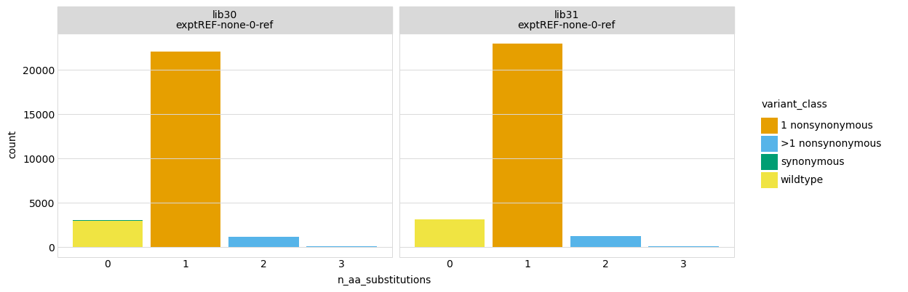
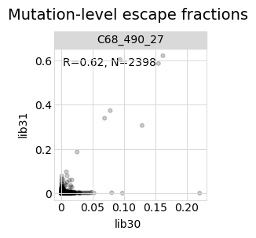
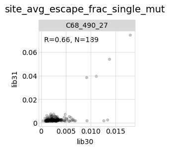
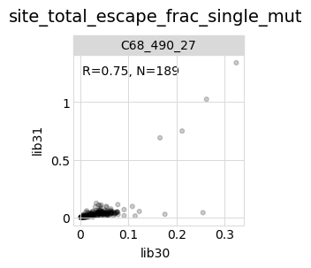

# Analyze counts and compute escape scores
This Python Jupyter notebook analyzes the variant counts and looks at mutation coverage and jackpotting.
It then computes an "escape scores" for each variant after grouping by barcode or substitutions as specified in the configuration.

## Set up analysis

This notebook primarily makes use of the Bloom lab's [dms_variants](https://jbloomlab.github.io/dms_variants) package, and uses [plotnine](https://github.com/has2k1/plotnine) for ggplot2-like plotting syntax:


```python
import collections
import math
import os
import warnings

import Bio.SeqIO

import dms_variants.codonvarianttable
from dms_variants.constants import CBPALETTE
import dms_variants.plotnine_themes

from IPython.display import display, HTML

import matplotlib.pyplot as plt

import numpy

import pandas as pd

from plotnine import *

import seaborn

import yaml

%matplotlib inline
```

Set [plotnine](https://github.com/has2k1/plotnine) theme to the gray-grid one defined in [dms_variants](https://jbloomlab.github.io/dms_variants):


```python
theme_set(dms_variants.plotnine_themes.theme_graygrid())
```

Versions of key software:


```python
print(f"Using dms_variants version {dms_variants.__version__}")
```

    Using dms_variants version 1.4.3


Ignore warnings that clutter output:


```python
warnings.simplefilter('ignore')
```

Read the configuration file:


```python
with open('config.yaml') as f:
    config = yaml.safe_load(f)
```

Create output directory:


```python
os.makedirs(config['escape_scores_dir'], exist_ok=True)
```

Read information about the samples:


```python
samples_df = pd.read_csv(config['barcode_runs_SARS1'])
```

## Initialize codon-variant table
Initialize [CodonVariantTable](https://jbloomlab.github.io/dms_variants/dms_variants.codonvarianttable.html#dms_variants.codonvarianttable.CodonVariantTable) from wildtype gene sequence and the variant counts CSV file.
We will then use the plotting functions of this variant table to analyze the counts per sample:


```python
wt_seqrecord = Bio.SeqIO.read(config['wildtype_sequence_SARS1'], 'fasta')
geneseq = str(wt_seqrecord.seq)
primary_target = wt_seqrecord.name
print(f"Read sequence of {len(geneseq)} nt for {primary_target} from {config['wildtype_sequence_SARS1']}")
      
print(f"Initializing CodonVariantTable from gene sequence and {config['variant_counts_SARS1']}")
      
variants = dms_variants.codonvarianttable.CodonVariantTable.from_variant_count_df(
                geneseq=geneseq,
                variant_count_df_file=config['variant_counts_SARS1'],
                primary_target=primary_target,
                allowgaps=True)
      
print('Done initializing CodonVariantTable.')
```

    Read sequence of 600 nt for SARS1 from data/wildtype_sequence_SARS1.fasta
    Initializing CodonVariantTable from gene sequence and results/counts/SARS1/variant_counts.csv.gz
    Done initializing CodonVariantTable.


## Sequencing counts per sample
Average counts per variant for each sample.
Note that these are the **sequencing** counts, in some cases they may outstrip the actual number of sorted cells:


```python
p = variants.plotAvgCountsPerVariant(libraries=variants.libraries,
                                     by_target=False,
                                     orientation='v')
p = p + theme(panel_grid_major_x=element_blank())  # no vertical grid lines
_ = p.draw()
```


    

    


And the numerical values plotted above:


```python
display(HTML(
 variants.avgCountsPerVariant(libraries=variants.libraries,
                               by_target=False)
 .pivot_table(index='sample',
              columns='library',
              values='avg_counts_per_variant')
 .round(1)
 .to_html()
 ))
```


<table border="1" class="dataframe">
  <thead>
    <tr style="text-align: right;">
      <th>library</th>
      <th>lib30</th>
      <th>lib31</th>
    </tr>
    <tr>
      <th>sample</th>
      <th></th>
      <th></th>
    </tr>
  </thead>
  <tbody>
    <tr>
      <th>exptREF-none-0-ref</th>
      <td>1958.7</td>
      <td>1854.3</td>
    </tr>
    <tr>
      <th>expt1-C68_490-27-abneg</th>
      <td>25.9</td>
      <td>21.0</td>
    </tr>
  </tbody>
</table>


## Mutations per variant
Average number of mutations per gene among all variants of the primary target, separately for each date:


```python
#this plotting is very slow when lots of samples, so for now plots are commented out

for date, date_df in samples_df.groupby('date', sort=False):
   p = variants.plotNumCodonMutsByType(variant_type='all',
                                       orientation='v',
                                       libraries=variants.libraries,
                                       samples=date_df['sample'].unique().tolist(),
                                       widthscale=2)
   p = p + theme(panel_grid_major_x=element_blank())  # no vertical grid lines
   fig = p.draw()
   display(fig)
   plt.close(fig)
```


    

    


Now similar plots but showing mutation frequency across the gene:


```python
# this plotting is very slow when lots of samples, so for now code commented out

for date, date_df in samples_df.groupby('date', sort=False):
   p = variants.plotMutFreqs(variant_type='all',
                             mut_type='codon',
                             orientation='v',
                             libraries=variants.libraries,
                             samples=date_df['sample'].unique().tolist(),
                             widthscale=1.5)
   fig = p.draw()
   display(fig)
   plt.close(fig)
```


    

    


## Jackpotting and mutation coverage in pre-selection libraries
We look at the distribution of counts in the "reference" (pre-selection) libraries to see if they seem jackpotted (a few variants at very high frequency):


```python
pre_samples_df = samples_df.query('selection == "reference"')
```

Distribution of mutations along the gene for the pre-selection samples; big spikes may indicate jackpotting:


```python
# this plotting is very slow when lots of samples, so for now code commented out

p = variants.plotMutFreqs(variant_type='all',
                         mut_type='codon',
                         orientation='v',
                         libraries=variants.libraries,
                         samples=pre_samples_df['sample'].unique().tolist(),
                         widthscale=1.5)
_ = p.draw()
```


    

    


How many mutations are observed frequently in pre-selection libraries?
Note that the libraries have been pre-selected for ACE2 binding, so we expect stop variants to mostly be missing.
Make the plot both for all variants and just single-mutant variants:


```python
# this plotting is very slow when lots of samples, so for now code commented out

for variant_type in ['all', 'single']:
   p = variants.plotCumulMutCoverage(
                         variant_type=variant_type,
                         mut_type='aa',
                         orientation='v',
                         libraries=variants.libraries,
                         samples=pre_samples_df['sample'].unique().tolist(),
                         widthscale=1.8,
                         heightscale=1.2)
   _ = p.draw()
```


    

    


    

    


Now make a plot showing what number and fraction of counts are for each variant in each pre-selection sample / library.
If some variants constitute a very high fraction, then that indicates extensive bottlenecking:


```python
for ystat in ['frac_counts', 'count']:
    p = variants.plotCountsPerVariant(ystat=ystat,
                                      libraries=variants.libraries,
                                      samples=pre_samples_df['sample'].unique().tolist(),
                                      orientation='v',
                                      widthscale=1.75,
                                      )
    _ = p.draw()
```


    

    


    

    


Now make the same plot breaking down by variant class, which enables determination of which types of variants are at high and low frequencies.
For this plot (unlike one above not classified by category) we only show variants of the primary target (not the homologs), and also group synonymous with wildtype in order to reduce number of plotted categories to make more interpretable:


```python
for ystat in ['frac_counts', 'count']:
    p = variants.plotCountsPerVariant(ystat=ystat,
                                      libraries=variants.libraries,
                                      samples=pre_samples_df['sample'].unique().tolist(),
                                      orientation='v',
                                      widthscale=1.75,
                                      by_variant_class=True,
                                      classifyVariants_kwargs={'syn_as_wt': True},
                                      primary_target_only=True,
                                      )
    _ = p.draw()
```


    

    


    

    


We also directly look to see what is the variant in each reference library / sample with the highest fraction counts.
Knowing if the highest frequency variant is shared helps determine **where** in the experiment the jackpotting happened:


```python
frac_counts_per_variant = (
        variants.add_frac_counts(variants.variant_count_df)
        .query(f"sample in {pre_samples_df['sample'].unique().tolist()}")
        )

display(HTML(
    frac_counts_per_variant
    .sort_values('frac_counts', ascending=False)
    .groupby(['library', 'sample'])
    .head(n=1)
    .sort_values(['library', 'sample'])
    .set_index(['library', 'sample'])
    [['frac_counts', 'target', 'barcode', 'aa_substitutions', 'codon_substitutions']]
    .round(4)
    .to_html()
    ))
```


<table border="1" class="dataframe">
  <thead>
    <tr style="text-align: right;">
      <th></th>
      <th></th>
      <th>frac_counts</th>
      <th>target</th>
      <th>barcode</th>
      <th>aa_substitutions</th>
      <th>codon_substitutions</th>
    </tr>
    <tr>
      <th>library</th>
      <th>sample</th>
      <th></th>
      <th></th>
      <th></th>
      <th></th>
      <th></th>
    </tr>
  </thead>
  <tbody>
    <tr>
      <th>lib30</th>
      <th>exptREF-none-0-ref</th>
      <td>0.0004</td>
      <td>SARS1</td>
      <td>TAATTAAGACACCTTT</td>
      <td></td>
      <td></td>
    </tr>
    <tr>
      <th>lib31</th>
      <th>exptREF-none-0-ref</th>
      <td>0.0006</td>
      <td>SARS1</td>
      <td>ACAGACGGTCTTCAAG</td>
      <td>S29D</td>
      <td>TCC29GAT</td>
    </tr>
  </tbody>
</table>


To further where the jackpotting relative to the generation of the reference samples, we plot the correlation among the fraction of counts for the different reference samples.
If the fractions are highly correlated, that indicates that the jackpotting occurred in some upstream step common to the reference samples:


```python
# this code makes a full matrix of scatter plots, but is REALLY SLOW. So for now,
# it is commented out in favor of code that just makes correlation matrix.
for lib, lib_df in frac_counts_per_variant.groupby('library'):
   wide_lib_df = lib_df.pivot_table(index=['target', 'barcode'],
                                    columns='sample',
                                    values='frac_counts')
   g = seaborn.pairplot(wide_lib_df, corner=True, plot_kws={'alpha': 0.5}, diag_kind='kde')
   _ = g.fig.suptitle(lib, size=18)
   plt.show()
```


    

    


    

    


## Examine counts for wildtype variants
The type of score we use to quantify escape depends on how well represented wildtype is in the selected libraries.
If wildtype is still well represented, we can use a more conventional functional score that gives differential selection relative to wildtype.
If wildtype is not well represented, then we need an alternative score that does not involve normalizing frequencies to wildtype.

First get average fraction of counts per variant for each variant class:


```python
counts_by_class = (
    variants.variant_count_df
    .pipe(variants.add_frac_counts)
    .pipe(variants.classifyVariants,
          primary_target=variants.primary_target,
          non_primary_target_class='homolog',
          class_as_categorical=True)
    .groupby(['library', 'sample', 'variant_class'])
    .aggregate(avg_frac_counts=pd.NamedAgg('frac_counts', 'mean'))
    .reset_index()
    .merge(samples_df[['sample', 'library', 'date', 'antibody', 'concentration', 'selection']],
           on=['sample', 'library'], validate='many_to_one')
    )

display(HTML(counts_by_class.head().to_html(index=False)))
```


<table border="1" class="dataframe">
  <thead>
    <tr style="text-align: right;">
      <th>library</th>
      <th>sample</th>
      <th>variant_class</th>
      <th>avg_frac_counts</th>
      <th>date</th>
      <th>antibody</th>
      <th>concentration</th>
      <th>selection</th>
    </tr>
  </thead>
  <tbody>
    <tr>
      <td>lib30</td>
      <td>exptREF-none-0-ref</td>
      <td>wildtype</td>
      <td>0.000027</td>
      <td>240205</td>
      <td>none</td>
      <td>0</td>
      <td>reference</td>
    </tr>
    <tr>
      <td>lib30</td>
      <td>exptREF-none-0-ref</td>
      <td>synonymous</td>
      <td>0.000035</td>
      <td>240205</td>
      <td>none</td>
      <td>0</td>
      <td>reference</td>
    </tr>
    <tr>
      <td>lib30</td>
      <td>exptREF-none-0-ref</td>
      <td>1 nonsynonymous</td>
      <td>0.000027</td>
      <td>240205</td>
      <td>none</td>
      <td>0</td>
      <td>reference</td>
    </tr>
    <tr>
      <td>lib30</td>
      <td>exptREF-none-0-ref</td>
      <td>&gt;1 nonsynonymous</td>
      <td>0.000027</td>
      <td>240205</td>
      <td>none</td>
      <td>0</td>
      <td>reference</td>
    </tr>
    <tr>
      <td>lib30</td>
      <td>exptREF-none-0-ref</td>
      <td>stop</td>
      <td>0.000027</td>
      <td>240205</td>
      <td>none</td>
      <td>0</td>
      <td>reference</td>
    </tr>
  </tbody>
</table>


Plot average fraction of all counts per variant for each variant class.
If the values for wildtype are low for the non-reference samples (such as more similar to stop the nonsynonymous), then normalizing by wildtype in calculating scores will probably not work well as wildtype is too depleted:


```python
min_frac = 1e-7  # plot values < this as this

p = (ggplot(counts_by_class
            .assign(avg_frac_counts=lambda x: numpy.clip(x['avg_frac_counts'], min_frac, None))
            ) +
     aes('avg_frac_counts', 'sample', color='selection') +
     geom_point(size=2) +
     scale_color_manual(values=CBPALETTE[1:]) +
     facet_grid('library ~ variant_class') +
     scale_x_log10() +
     theme(axis_text_x=element_text(angle=90),
           figure_size=(2.5 * counts_by_class['variant_class'].nunique(),
                        0.2 * counts_by_class['library'].nunique() * 
                        counts_by_class['sample'].nunique())
           ) +
     geom_vline(xintercept=min_frac, linetype='dotted', color=CBPALETTE[3])
     )

_ = p.draw()
```


    

    


## Compute escape scores
We use the escape score metric, which does **not** involve normalizing to wildtype and so isn't strongly affected by low wildtype counts.
We compute the scores using the method [dms_variants.codonvarianttable.CodonVariantTable.escape_scores](https://jbloomlab.github.io/dms_variants/dms_variants.codonvarianttable.html?highlight=escape_scores#dms_variants.codonvarianttable.CodonVariantTable.escape_scores).

First, define what samples to compare for each calculation, matching each post-selection (escape) to the pre-selection (reference) sample on the same date:


```python
score_sample_df = (
    samples_df
    .query('selection == "escape"')
    .rename(columns={'sample': 'post_sample',
                     'number_cells': 'pre_cells_sorted'})
    .merge(samples_df
           .query('selection == "reference"')
           [['sample', 'library', 'date', 'number_cells']]
           .rename(columns={'sample': 'pre_sample',
                            'number_cells': 'post_cells_sorted'}),
           how='left', on=['date', 'library'], validate='many_to_one',
           )
    .assign(name=lambda x: x['antibody'] + '_' + x['concentration'].astype(str))
    # add dates to names where needed to make unique
    .assign(n_libs=lambda x: x.groupby(['name', 'date'])['pre_sample'].transform('count'))
    .sort_values(['name', 'date', 'n_libs'], ascending=False)
    .assign(i_name=lambda x: x.groupby(['library', 'name'], sort=False)['pre_sample'].cumcount(),
            name=lambda x: x.apply(lambda r: r['name'] + '_' + str(r['date']) if r['i_name'] > 0 else r['name'],
                                   axis=1),
            )
    .sort_values(['antibody', 'concentration', 'library', 'i_name'])
    # get columns of interest
    [['name', 'library', 'antibody', 'concentration', 'date',
      'pre_sample', 'post_sample', 'frac_escape', 'pre_cells_sorted', 'post_cells_sorted']]
    )

assert len(score_sample_df.groupby(['name', 'library'])) == len(score_sample_df)

print(f"Writing samples used to compute escape scores to {config['escape_score_samples_SARS1']}\n")
score_sample_df.to_csv(config['escape_score_samples_SARS1'], index=False)

display(HTML(score_sample_df.to_html(index=False)))
```

    Writing samples used to compute escape scores to results/escape_scores/samples_SARS1.csv
    


<table border="1" class="dataframe">
  <thead>
    <tr style="text-align: right;">
      <th>name</th>
      <th>library</th>
      <th>antibody</th>
      <th>concentration</th>
      <th>date</th>
      <th>pre_sample</th>
      <th>post_sample</th>
      <th>frac_escape</th>
      <th>pre_cells_sorted</th>
      <th>post_cells_sorted</th>
    </tr>
  </thead>
  <tbody>
    <tr>
      <td>C68_490_27</td>
      <td>lib30</td>
      <td>C68_490</td>
      <td>27</td>
      <td>240205</td>
      <td>exptREF-none-0-ref</td>
      <td>expt1-C68_490-27-abneg</td>
      <td>0.035</td>
      <td>129874.0</td>
      <td>NaN</td>
    </tr>
    <tr>
      <td>C68_490_27</td>
      <td>lib31</td>
      <td>C68_490</td>
      <td>27</td>
      <td>240205</td>
      <td>exptREF-none-0-ref</td>
      <td>expt1-C68_490-27-abneg</td>
      <td>0.030</td>
      <td>110000.0</td>
      <td>NaN</td>
    </tr>
  </tbody>
</table>


Compute the escape scores for variants of the primary target and classify the variants:


```python
print(f"Computing escape scores for {primary_target} variants using {config['escape_score_type']} "
      f"score type with a pseudocount of {config['escape_score_pseudocount']} and "
      f"an escape fraction floor {config['escape_score_floor_E']}, an escape fraction ceiling "
      f"{config['escape_score_ceil_E']}, and grouping variants by {config['escape_score_group_by']}.")

escape_scores = (variants.escape_scores(score_sample_df,
                                        score_type=config['escape_score_type'],
                                        pseudocount=config['escape_score_pseudocount'],
                                        floor_E=config['escape_score_floor_E'],
                                        ceil_E=config['escape_score_ceil_E'],
                                        by=config['escape_score_group_by'],
                                        )
                 .query('target == @primary_target')
                 .pipe(variants.classifyVariants,
                       primary_target=variants.primary_target,
                       syn_as_wt=(config['escape_score_group_by'] == 'aa_substitutions'),
                       )
                 )
print('Here are the first few lines of the resulting escape scores:')
display(HTML(escape_scores.head().to_html(index=False)))
```

    Computing escape scores for SARS1 variants using frac_escape score type with a pseudocount of 0.5 and an escape fraction floor 0, an escape fraction ceiling 1, and grouping variants by barcode.
    Here are the first few lines of the resulting escape scores:


<table border="1" class="dataframe">
  <thead>
    <tr style="text-align: right;">
      <th>name</th>
      <th>target</th>
      <th>library</th>
      <th>pre_sample</th>
      <th>post_sample</th>
      <th>barcode</th>
      <th>score</th>
      <th>score_var</th>
      <th>pre_count</th>
      <th>post_count</th>
      <th>codon_substitutions</th>
      <th>n_codon_substitutions</th>
      <th>aa_substitutions</th>
      <th>n_aa_substitutions</th>
      <th>variant_class</th>
    </tr>
  </thead>
  <tbody>
    <tr>
      <td>C68_490_27</td>
      <td>SARS1</td>
      <td>lib30</td>
      <td>exptREF-none-0-ref</td>
      <td>expt1-C68_490-27-abneg</td>
      <td>TAATTAAGACACCTTT</td>
      <td>0.003831</td>
      <td>3.816899e-07</td>
      <td>26102</td>
      <td>38</td>
      <td></td>
      <td>0</td>
      <td></td>
      <td>0</td>
      <td>wildtype</td>
    </tr>
    <tr>
      <td>C68_490_27</td>
      <td>SARS1</td>
      <td>lib30</td>
      <td>exptREF-none-0-ref</td>
      <td>expt1-C68_490-27-abneg</td>
      <td>GTATTAGTAACGACCT</td>
      <td>0.000053</td>
      <td>5.659300e-09</td>
      <td>24412</td>
      <td>0</td>
      <td>TTC166AGA</td>
      <td>1</td>
      <td>F166R</td>
      <td>1</td>
      <td>1 nonsynonymous</td>
    </tr>
    <tr>
      <td>C68_490_27</td>
      <td>SARS1</td>
      <td>lib30</td>
      <td>exptREF-none-0-ref</td>
      <td>expt1-C68_490-27-abneg</td>
      <td>TCCTAAGCGATTACGA</td>
      <td>0.000274</td>
      <td>3.009568e-08</td>
      <td>23672</td>
      <td>2</td>
      <td></td>
      <td>0</td>
      <td></td>
      <td>0</td>
      <td>wildtype</td>
    </tr>
    <tr>
      <td>C68_490_27</td>
      <td>SARS1</td>
      <td>lib30</td>
      <td>exptREF-none-0-ref</td>
      <td>expt1-C68_490-27-abneg</td>
      <td>CGTGCTAACTGGGAGG</td>
      <td>0.000057</td>
      <td>6.506075e-09</td>
      <td>22768</td>
      <td>0</td>
      <td>CGT127GCT</td>
      <td>1</td>
      <td>R127A</td>
      <td>1</td>
      <td>1 nonsynonymous</td>
    </tr>
    <tr>
      <td>C68_490_27</td>
      <td>SARS1</td>
      <td>lib30</td>
      <td>exptREF-none-0-ref</td>
      <td>expt1-C68_490-27-abneg</td>
      <td>ACAAATAACGCAGATT</td>
      <td>0.677189</td>
      <td>1.010797e-04</td>
      <td>21732</td>
      <td>5666</td>
      <td>TAT50CCA</td>
      <td>1</td>
      <td>Y50P</td>
      <td>1</td>
      <td>1 nonsynonymous</td>
    </tr>
  </tbody>
</table>


## Apply pre-selection count filter to variant escape scores
Now determine a pre-selection count filter in order to flag for removal variants with counts that are so low that the estimated score is probably noise.
We know that stop codons should be largely purged pre-selection, and so the counts for them are a good indication of the "noise" threshold.
We therefore set the filter using the number of pre-selection counts for the stop codons.

To do this, we first compute the number of pre-selection counts for stop-codon variants at various quantiles and look at these.
We then take the number of pre-selection counts at the specified quantile as the filter cutoff, and filter scores for all variants with pre-selection counts less than this filter cutoff:

NOTE, since we didn't pre-sort this library, this is not the appropriate method. This has historically beena round 100, so we'll just apply a filter of 100.


```python
filter_precount = config['escape_score_precount_filter']

print(f"\nSetting the pre-count filter cutoff to the absolute value of {config['escape_score_precount_filter']}")
```

    
    Setting the pre-count filter cutoff to the absolute value of 100


Apply the filter to the escape scores, so that scores that fail the pre-selection count filter are now marked with `pass_pre_count_filter` of `False`:


```python
escape_scores = (
    escape_scores
    .assign(pass_pre_count_filter=lambda x: x['pre_count'] >= config['escape_score_precount_filter'])
    )
escape_scores.head()
```


<div>
<style scoped>
    .dataframe tbody tr th:only-of-type {
        vertical-align: middle;
    }

    .dataframe tbody tr th {
        vertical-align: top;
    }

    .dataframe thead th {
        text-align: right;
    }
</style>
<table border="1" class="dataframe">
  <thead>
    <tr style="text-align: right;">
      <th></th>
      <th>name</th>
      <th>target</th>
      <th>library</th>
      <th>pre_sample</th>
      <th>post_sample</th>
      <th>barcode</th>
      <th>score</th>
      <th>score_var</th>
      <th>pre_count</th>
      <th>post_count</th>
      <th>codon_substitutions</th>
      <th>n_codon_substitutions</th>
      <th>aa_substitutions</th>
      <th>n_aa_substitutions</th>
      <th>variant_class</th>
      <th>pass_pre_count_filter</th>
    </tr>
  </thead>
  <tbody>
    <tr>
      <th>0</th>
      <td>C68_490_27</td>
      <td>SARS1</td>
      <td>lib30</td>
      <td>exptREF-none-0-ref</td>
      <td>expt1-C68_490-27-abneg</td>
      <td>TAATTAAGACACCTTT</td>
      <td>0.003831</td>
      <td>3.816899e-07</td>
      <td>26102</td>
      <td>38</td>
      <td></td>
      <td>0</td>
      <td></td>
      <td>0</td>
      <td>wildtype</td>
      <td>True</td>
    </tr>
    <tr>
      <th>1</th>
      <td>C68_490_27</td>
      <td>SARS1</td>
      <td>lib30</td>
      <td>exptREF-none-0-ref</td>
      <td>expt1-C68_490-27-abneg</td>
      <td>GTATTAGTAACGACCT</td>
      <td>0.000053</td>
      <td>5.659300e-09</td>
      <td>24412</td>
      <td>0</td>
      <td>TTC166AGA</td>
      <td>1</td>
      <td>F166R</td>
      <td>1</td>
      <td>1 nonsynonymous</td>
      <td>True</td>
    </tr>
    <tr>
      <th>2</th>
      <td>C68_490_27</td>
      <td>SARS1</td>
      <td>lib30</td>
      <td>exptREF-none-0-ref</td>
      <td>expt1-C68_490-27-abneg</td>
      <td>TCCTAAGCGATTACGA</td>
      <td>0.000274</td>
      <td>3.009568e-08</td>
      <td>23672</td>
      <td>2</td>
      <td></td>
      <td>0</td>
      <td></td>
      <td>0</td>
      <td>wildtype</td>
      <td>True</td>
    </tr>
    <tr>
      <th>3</th>
      <td>C68_490_27</td>
      <td>SARS1</td>
      <td>lib30</td>
      <td>exptREF-none-0-ref</td>
      <td>expt1-C68_490-27-abneg</td>
      <td>CGTGCTAACTGGGAGG</td>
      <td>0.000057</td>
      <td>6.506075e-09</td>
      <td>22768</td>
      <td>0</td>
      <td>CGT127GCT</td>
      <td>1</td>
      <td>R127A</td>
      <td>1</td>
      <td>1 nonsynonymous</td>
      <td>True</td>
    </tr>
    <tr>
      <th>4</th>
      <td>C68_490_27</td>
      <td>SARS1</td>
      <td>lib30</td>
      <td>exptREF-none-0-ref</td>
      <td>expt1-C68_490-27-abneg</td>
      <td>ACAAATAACGCAGATT</td>
      <td>0.677189</td>
      <td>1.010797e-04</td>
      <td>21732</td>
      <td>5666</td>
      <td>TAT50CCA</td>
      <td>1</td>
      <td>Y50P</td>
      <td>1</td>
      <td>1 nonsynonymous</td>
      <td>True</td>
    </tr>
  </tbody>
</table>
</div>


## Apply ACE2-binding / expression filter to variant mutations
We also used deep mutational scanning to estimate how each mutation affected ACE2 binding and expression in the B.1.351 background.
Here we flag for removal any variants of the primary target that have (or have mutations) that were measured to decrease ACE2-binding or expression beyond a minimal threshold, in order to avoid these variants muddying the signal as spurious escape mutants.

To do this, we first determine all mutations that do / do-not having binding that exceeds the thresholds.

Note that because we are working on this serum-mapping project at the same time as we are working on the ACE2-binding / RBD-expression project, the scores will be preliminary until all final analyses have been done on the DMS project end. So, we will allow either preliminary or "final" measurements to be used. 


```python
mut_bind_expr_file = config['mut_bind_expr_SARSr']
    
print(f"Reading ACE2-binding and expression for mutations from {mut_bind_expr_file}, "
      f"and filtering for variants that have single mutations that "
      f"only have mutations with binding >={config['escape_score_min_bind_mut_SARS1']} and "
      f"expression >={config['escape_score_min_expr_mut_SARS1']}.")

mut_bind_expr = (pd.read_csv(mut_bind_expr_file)
                 .query("target == 'SARS-CoV-1_Urbani'")  # Already has removed rows where position == 482
                 .rename(columns={'site_SARS2': 'position'})
                 .rename(columns={'huACE2_delta': 'delta_bind'})
                 .rename(columns={'expression_delta': 'delta_expr'})
                 .assign(position=lambda x: pd.to_numeric(x['position'], errors='coerce'))
                 .dropna(subset=['position'])
                 .assign(position=lambda x: x['position'].astype(int))
                 .assign(RBD_site=lambda x: numpy.where(x['position'] < 483,
                                                        x['position'] - config['site_number_offset'],
                                                        x['position'] - config['site_number_offset'] - 1),
                         RBD_mutation=lambda x: x['wildtype'] + x['RBD_site'].astype(str) + x['mutant']
                        )
                )

print('Here is what that dataframe looks like:')

display(HTML(mut_bind_expr.query("position > 480 & position < 490").to_html(index=False)))
```

    Reading ACE2-binding and expression for mutations from results/prior_DMS_data/mutant_ACE2binding_expression_SARSr.csv, and filtering for variants that have single mutations that only have mutations with binding >=-2.0 and expression >=-0.95489.
    Here is what that dataframe looks like:


<table border="1" class="dataframe">
  <thead>
    <tr style="text-align: right;">
      <th>target</th>
      <th>wildtype</th>
      <th>site</th>
      <th>position</th>
      <th>mutant</th>
      <th>mutation</th>
      <th>mutation_SARS2</th>
      <th>huACE2</th>
      <th>delta_bind</th>
      <th>n_bc_huACE2</th>
      <th>Ra787ACE2</th>
      <th>Ra787ACE2_delta</th>
      <th>n_bc_Ra787ACE2</th>
      <th>Ra9479ACE2</th>
      <th>Ra9479ACE2_delta</th>
      <th>n_bc_Ra9479ACE2</th>
      <th>RlanACE2</th>
      <th>RlanACE2_delta</th>
      <th>n_bc_RlanACE2</th>
      <th>RalcACE2</th>
      <th>RalcACE2_delta</th>
      <th>n_bc_RalcACE2</th>
      <th>RshACE2</th>
      <th>RshACE2_delta</th>
      <th>n_bc_RshACE2</th>
      <th>RpearACE2</th>
      <th>RpearACE2_delta</th>
      <th>n_bc_RpearACE2</th>
      <th>expression</th>
      <th>delta_expr</th>
      <th>n_bc_expression</th>
      <th>RBD_site</th>
      <th>RBD_mutation</th>
    </tr>
  </thead>
  <tbody>
    <tr>
      <td>SARS-CoV-1_Urbani</td>
      <td>T</td>
      <td>468</td>
      <td>481</td>
      <td>A</td>
      <td>T468A</td>
      <td>T481A</td>
      <td>9.82650</td>
      <td>-0.14926</td>
      <td>9</td>
      <td>10.32056</td>
      <td>-0.14029</td>
      <td>2</td>
      <td>10.24445</td>
      <td>-0.07297</td>
      <td>2</td>
      <td>6.96362</td>
      <td>0.03052</td>
      <td>2</td>
      <td>6.00000</td>
      <td>-0.10195</td>
      <td>2</td>
      <td>6.00000</td>
      <td>0.00000</td>
      <td>2</td>
      <td>5.01678</td>
      <td>-0.16923</td>
      <td>2</td>
      <td>10.66476</td>
      <td>0.13041</td>
      <td>9</td>
      <td>151</td>
      <td>T151A</td>
    </tr>
    <tr>
      <td>SARS-CoV-1_Urbani</td>
      <td>T</td>
      <td>468</td>
      <td>481</td>
      <td>C</td>
      <td>T468C</td>
      <td>T481C</td>
      <td>9.74077</td>
      <td>-0.23500</td>
      <td>17</td>
      <td>10.30712</td>
      <td>-0.15373</td>
      <td>6</td>
      <td>10.35755</td>
      <td>0.04012</td>
      <td>5</td>
      <td>6.72616</td>
      <td>-0.20694</td>
      <td>6</td>
      <td>6.17872</td>
      <td>0.07676</td>
      <td>6</td>
      <td>6.00000</td>
      <td>0.00000</td>
      <td>6</td>
      <td>5.45944</td>
      <td>0.27343</td>
      <td>5</td>
      <td>10.67489</td>
      <td>0.14055</td>
      <td>17</td>
      <td>151</td>
      <td>T151C</td>
    </tr>
    <tr>
      <td>SARS-CoV-1_Urbani</td>
      <td>T</td>
      <td>468</td>
      <td>481</td>
      <td>D</td>
      <td>T468D</td>
      <td>T481D</td>
      <td>9.88405</td>
      <td>-0.09172</td>
      <td>29</td>
      <td>10.40944</td>
      <td>-0.05141</td>
      <td>11</td>
      <td>10.26926</td>
      <td>-0.04817</td>
      <td>9</td>
      <td>6.84682</td>
      <td>-0.08628</td>
      <td>11</td>
      <td>6.01627</td>
      <td>-0.08568</td>
      <td>10</td>
      <td>6.00000</td>
      <td>0.00000</td>
      <td>9</td>
      <td>5.34452</td>
      <td>0.15852</td>
      <td>11</td>
      <td>10.58070</td>
      <td>0.04636</td>
      <td>29</td>
      <td>151</td>
      <td>T151D</td>
    </tr>
    <tr>
      <td>SARS-CoV-1_Urbani</td>
      <td>T</td>
      <td>468</td>
      <td>481</td>
      <td>E</td>
      <td>T468E</td>
      <td>T481E</td>
      <td>9.83122</td>
      <td>-0.14455</td>
      <td>13</td>
      <td>10.35411</td>
      <td>-0.10675</td>
      <td>5</td>
      <td>10.27097</td>
      <td>-0.04646</td>
      <td>5</td>
      <td>6.81850</td>
      <td>-0.11461</td>
      <td>5</td>
      <td>6.00000</td>
      <td>-0.10195</td>
      <td>5</td>
      <td>6.00000</td>
      <td>0.00000</td>
      <td>5</td>
      <td>5.17488</td>
      <td>-0.01113</td>
      <td>4</td>
      <td>10.56938</td>
      <td>0.03503</td>
      <td>12</td>
      <td>151</td>
      <td>T151E</td>
    </tr>
    <tr>
      <td>SARS-CoV-1_Urbani</td>
      <td>T</td>
      <td>468</td>
      <td>481</td>
      <td>F</td>
      <td>T468F</td>
      <td>T481F</td>
      <td>9.92001</td>
      <td>-0.05576</td>
      <td>17</td>
      <td>10.44850</td>
      <td>-0.01236</td>
      <td>11</td>
      <td>10.35520</td>
      <td>0.03777</td>
      <td>11</td>
      <td>6.86953</td>
      <td>-0.06357</td>
      <td>10</td>
      <td>6.00000</td>
      <td>-0.10195</td>
      <td>11</td>
      <td>6.00000</td>
      <td>0.00000</td>
      <td>10</td>
      <td>5.22926</td>
      <td>0.04325</td>
      <td>12</td>
      <td>10.60041</td>
      <td>0.06607</td>
      <td>19</td>
      <td>151</td>
      <td>T151F</td>
    </tr>
    <tr>
      <td>SARS-CoV-1_Urbani</td>
      <td>T</td>
      <td>468</td>
      <td>481</td>
      <td>G</td>
      <td>T468G</td>
      <td>T481G</td>
      <td>9.63012</td>
      <td>-0.34565</td>
      <td>12</td>
      <td>10.26289</td>
      <td>-0.19796</td>
      <td>4</td>
      <td>10.00523</td>
      <td>-0.31220</td>
      <td>3</td>
      <td>6.23439</td>
      <td>-0.69871</td>
      <td>4</td>
      <td>6.00000</td>
      <td>-0.10195</td>
      <td>4</td>
      <td>6.00000</td>
      <td>0.00000</td>
      <td>4</td>
      <td>5.26516</td>
      <td>0.07915</td>
      <td>4</td>
      <td>10.49344</td>
      <td>-0.04091</td>
      <td>12</td>
      <td>151</td>
      <td>T151G</td>
    </tr>
    <tr>
      <td>SARS-CoV-1_Urbani</td>
      <td>T</td>
      <td>468</td>
      <td>481</td>
      <td>H</td>
      <td>T468H</td>
      <td>T481H</td>
      <td>9.91864</td>
      <td>-0.05713</td>
      <td>10</td>
      <td>10.54457</td>
      <td>0.08371</td>
      <td>4</td>
      <td>10.40217</td>
      <td>0.08474</td>
      <td>5</td>
      <td>6.79471</td>
      <td>-0.13839</td>
      <td>5</td>
      <td>6.04060</td>
      <td>-0.06136</td>
      <td>5</td>
      <td>6.00000</td>
      <td>0.00000</td>
      <td>5</td>
      <td>5.16750</td>
      <td>-0.01851</td>
      <td>3</td>
      <td>10.12744</td>
      <td>-0.40691</td>
      <td>11</td>
      <td>151</td>
      <td>T151H</td>
    </tr>
    <tr>
      <td>SARS-CoV-1_Urbani</td>
      <td>T</td>
      <td>468</td>
      <td>481</td>
      <td>I</td>
      <td>T468I</td>
      <td>T481I</td>
      <td>9.94640</td>
      <td>-0.02937</td>
      <td>25</td>
      <td>10.51266</td>
      <td>0.05181</td>
      <td>7</td>
      <td>10.50534</td>
      <td>0.18792</td>
      <td>7</td>
      <td>6.75392</td>
      <td>-0.17919</td>
      <td>7</td>
      <td>6.16206</td>
      <td>0.06011</td>
      <td>9</td>
      <td>6.00000</td>
      <td>0.00000</td>
      <td>7</td>
      <td>5.24378</td>
      <td>0.05777</td>
      <td>7</td>
      <td>10.55527</td>
      <td>0.02093</td>
      <td>26</td>
      <td>151</td>
      <td>T151I</td>
    </tr>
    <tr>
      <td>SARS-CoV-1_Urbani</td>
      <td>T</td>
      <td>468</td>
      <td>481</td>
      <td>K</td>
      <td>T468K</td>
      <td>T481K</td>
      <td>10.05803</td>
      <td>0.08226</td>
      <td>13</td>
      <td>10.57376</td>
      <td>0.11291</td>
      <td>4</td>
      <td>10.32454</td>
      <td>0.00711</td>
      <td>4</td>
      <td>7.13392</td>
      <td>0.20082</td>
      <td>4</td>
      <td>6.22538</td>
      <td>0.12343</td>
      <td>4</td>
      <td>6.00000</td>
      <td>0.00000</td>
      <td>4</td>
      <td>5.15805</td>
      <td>-0.02796</td>
      <td>4</td>
      <td>10.61008</td>
      <td>0.07574</td>
      <td>12</td>
      <td>151</td>
      <td>T151K</td>
    </tr>
    <tr>
      <td>SARS-CoV-1_Urbani</td>
      <td>T</td>
      <td>468</td>
      <td>481</td>
      <td>L</td>
      <td>T468L</td>
      <td>T481L</td>
      <td>10.00237</td>
      <td>0.02661</td>
      <td>18</td>
      <td>10.39068</td>
      <td>-0.07017</td>
      <td>5</td>
      <td>10.33786</td>
      <td>0.02044</td>
      <td>6</td>
      <td>6.92134</td>
      <td>-0.01177</td>
      <td>5</td>
      <td>6.00000</td>
      <td>-0.10195</td>
      <td>6</td>
      <td>6.00000</td>
      <td>0.00000</td>
      <td>5</td>
      <td>5.21583</td>
      <td>0.02983</td>
      <td>5</td>
      <td>10.55799</td>
      <td>0.02365</td>
      <td>19</td>
      <td>151</td>
      <td>T151L</td>
    </tr>
    <tr>
      <td>SARS-CoV-1_Urbani</td>
      <td>T</td>
      <td>468</td>
      <td>481</td>
      <td>M</td>
      <td>T468M</td>
      <td>T481M</td>
      <td>9.97125</td>
      <td>-0.00452</td>
      <td>24</td>
      <td>10.60684</td>
      <td>0.14599</td>
      <td>13</td>
      <td>10.43361</td>
      <td>0.11619</td>
      <td>13</td>
      <td>6.84097</td>
      <td>-0.09213</td>
      <td>13</td>
      <td>6.00000</td>
      <td>-0.10195</td>
      <td>13</td>
      <td>6.00000</td>
      <td>0.00000</td>
      <td>13</td>
      <td>5.23125</td>
      <td>0.04524</td>
      <td>13</td>
      <td>10.55883</td>
      <td>0.02448</td>
      <td>20</td>
      <td>151</td>
      <td>T151M</td>
    </tr>
    <tr>
      <td>SARS-CoV-1_Urbani</td>
      <td>T</td>
      <td>468</td>
      <td>481</td>
      <td>N</td>
      <td>T468N</td>
      <td>T481N</td>
      <td>9.99795</td>
      <td>0.02218</td>
      <td>18</td>
      <td>10.46544</td>
      <td>0.00459</td>
      <td>7</td>
      <td>10.36760</td>
      <td>0.05017</td>
      <td>7</td>
      <td>6.79259</td>
      <td>-0.14052</td>
      <td>8</td>
      <td>6.00000</td>
      <td>-0.10195</td>
      <td>7</td>
      <td>6.00000</td>
      <td>0.00000</td>
      <td>7</td>
      <td>5.30469</td>
      <td>0.11868</td>
      <td>7</td>
      <td>10.52384</td>
      <td>-0.01051</td>
      <td>19</td>
      <td>151</td>
      <td>T151N</td>
    </tr>
    <tr>
      <td>SARS-CoV-1_Urbani</td>
      <td>T</td>
      <td>468</td>
      <td>481</td>
      <td>P</td>
      <td>T468P</td>
      <td>T481P</td>
      <td>9.05032</td>
      <td>-0.92545</td>
      <td>18</td>
      <td>9.32785</td>
      <td>-1.13301</td>
      <td>6</td>
      <td>9.97365</td>
      <td>-0.34377</td>
      <td>6</td>
      <td>6.00000</td>
      <td>-0.93310</td>
      <td>6</td>
      <td>6.00000</td>
      <td>-0.10195</td>
      <td>7</td>
      <td>6.00000</td>
      <td>0.00000</td>
      <td>7</td>
      <td>5.31457</td>
      <td>0.12856</td>
      <td>7</td>
      <td>10.48123</td>
      <td>-0.05312</td>
      <td>18</td>
      <td>151</td>
      <td>T151P</td>
    </tr>
    <tr>
      <td>SARS-CoV-1_Urbani</td>
      <td>T</td>
      <td>468</td>
      <td>481</td>
      <td>Q</td>
      <td>T468Q</td>
      <td>T481Q</td>
      <td>9.95497</td>
      <td>-0.02080</td>
      <td>17</td>
      <td>10.48704</td>
      <td>0.02619</td>
      <td>7</td>
      <td>10.29101</td>
      <td>-0.02641</td>
      <td>7</td>
      <td>6.78745</td>
      <td>-0.14565</td>
      <td>7</td>
      <td>6.18810</td>
      <td>0.08615</td>
      <td>6</td>
      <td>6.00000</td>
      <td>0.00000</td>
      <td>6</td>
      <td>5.17021</td>
      <td>-0.01580</td>
      <td>6</td>
      <td>10.54270</td>
      <td>0.00836</td>
      <td>16</td>
      <td>151</td>
      <td>T151Q</td>
    </tr>
    <tr>
      <td>SARS-CoV-1_Urbani</td>
      <td>T</td>
      <td>468</td>
      <td>481</td>
      <td>R</td>
      <td>T468R</td>
      <td>T481R</td>
      <td>10.02843</td>
      <td>0.05266</td>
      <td>15</td>
      <td>10.53176</td>
      <td>0.07090</td>
      <td>5</td>
      <td>10.33272</td>
      <td>0.01530</td>
      <td>5</td>
      <td>6.84060</td>
      <td>-0.09250</td>
      <td>5</td>
      <td>6.07826</td>
      <td>-0.02370</td>
      <td>5</td>
      <td>6.00000</td>
      <td>0.00000</td>
      <td>5</td>
      <td>5.26002</td>
      <td>0.07401</td>
      <td>5</td>
      <td>10.58171</td>
      <td>0.04737</td>
      <td>15</td>
      <td>151</td>
      <td>T151R</td>
    </tr>
    <tr>
      <td>SARS-CoV-1_Urbani</td>
      <td>T</td>
      <td>468</td>
      <td>481</td>
      <td>S</td>
      <td>T468S</td>
      <td>T481S</td>
      <td>9.89451</td>
      <td>-0.08126</td>
      <td>16</td>
      <td>10.37845</td>
      <td>-0.08240</td>
      <td>7</td>
      <td>10.37063</td>
      <td>0.05321</td>
      <td>7</td>
      <td>6.92523</td>
      <td>-0.00787</td>
      <td>7</td>
      <td>6.00000</td>
      <td>-0.10195</td>
      <td>7</td>
      <td>6.00000</td>
      <td>0.00000</td>
      <td>7</td>
      <td>5.11351</td>
      <td>-0.07250</td>
      <td>7</td>
      <td>10.57343</td>
      <td>0.03908</td>
      <td>17</td>
      <td>151</td>
      <td>T151S</td>
    </tr>
    <tr>
      <td>SARS-CoV-1_Urbani</td>
      <td>T</td>
      <td>468</td>
      <td>481</td>
      <td>T</td>
      <td>T468T</td>
      <td>T481T</td>
      <td>9.97577</td>
      <td>0.00000</td>
      <td>5928</td>
      <td>10.46085</td>
      <td>0.00000</td>
      <td>2972</td>
      <td>10.31743</td>
      <td>0.00000</td>
      <td>2995</td>
      <td>6.93310</td>
      <td>0.00000</td>
      <td>3053</td>
      <td>6.10195</td>
      <td>0.00000</td>
      <td>3037</td>
      <td>6.00000</td>
      <td>0.00000</td>
      <td>3028</td>
      <td>5.18601</td>
      <td>0.00000</td>
      <td>2917</td>
      <td>10.53434</td>
      <td>0.00000</td>
      <td>5615</td>
      <td>151</td>
      <td>T151T</td>
    </tr>
    <tr>
      <td>SARS-CoV-1_Urbani</td>
      <td>T</td>
      <td>468</td>
      <td>481</td>
      <td>V</td>
      <td>T468V</td>
      <td>T481V</td>
      <td>9.96168</td>
      <td>-0.01408</td>
      <td>17</td>
      <td>10.42718</td>
      <td>-0.03367</td>
      <td>5</td>
      <td>10.30188</td>
      <td>-0.01555</td>
      <td>6</td>
      <td>6.71347</td>
      <td>-0.21963</td>
      <td>5</td>
      <td>6.00000</td>
      <td>-0.10195</td>
      <td>6</td>
      <td>6.00000</td>
      <td>0.00000</td>
      <td>5</td>
      <td>5.09435</td>
      <td>-0.09166</td>
      <td>5</td>
      <td>9.67112</td>
      <td>-0.86322</td>
      <td>18</td>
      <td>151</td>
      <td>T151V</td>
    </tr>
    <tr>
      <td>SARS-CoV-1_Urbani</td>
      <td>T</td>
      <td>468</td>
      <td>481</td>
      <td>W</td>
      <td>T468W</td>
      <td>T481W</td>
      <td>9.92646</td>
      <td>-0.04931</td>
      <td>17</td>
      <td>10.26228</td>
      <td>-0.19857</td>
      <td>11</td>
      <td>10.30603</td>
      <td>-0.01140</td>
      <td>11</td>
      <td>6.63396</td>
      <td>-0.29914</td>
      <td>10</td>
      <td>6.00000</td>
      <td>-0.10195</td>
      <td>11</td>
      <td>6.00000</td>
      <td>0.00000</td>
      <td>11</td>
      <td>5.14926</td>
      <td>-0.03675</td>
      <td>10</td>
      <td>10.46561</td>
      <td>-0.06874</td>
      <td>17</td>
      <td>151</td>
      <td>T151W</td>
    </tr>
    <tr>
      <td>SARS-CoV-1_Urbani</td>
      <td>T</td>
      <td>468</td>
      <td>481</td>
      <td>Y</td>
      <td>T468Y</td>
      <td>T481Y</td>
      <td>9.87416</td>
      <td>-0.10160</td>
      <td>20</td>
      <td>10.36876</td>
      <td>-0.09209</td>
      <td>7</td>
      <td>10.39045</td>
      <td>0.07302</td>
      <td>7</td>
      <td>6.67707</td>
      <td>-0.25603</td>
      <td>7</td>
      <td>6.00000</td>
      <td>-0.10195</td>
      <td>7</td>
      <td>6.00000</td>
      <td>0.00000</td>
      <td>7</td>
      <td>5.20727</td>
      <td>0.02127</td>
      <td>7</td>
      <td>10.54450</td>
      <td>0.01016</td>
      <td>19</td>
      <td>151</td>
      <td>T151Y</td>
    </tr>
    <tr>
      <td>SARS-CoV-1_Urbani</td>
      <td>P</td>
      <td>469</td>
      <td>483</td>
      <td>A</td>
      <td>P469A</td>
      <td>P483A</td>
      <td>9.69841</td>
      <td>-0.27736</td>
      <td>21</td>
      <td>10.26268</td>
      <td>-0.19817</td>
      <td>15</td>
      <td>10.08719</td>
      <td>-0.23024</td>
      <td>15</td>
      <td>7.58339</td>
      <td>0.65029</td>
      <td>15</td>
      <td>7.58036</td>
      <td>1.47840</td>
      <td>15</td>
      <td>6.00000</td>
      <td>0.00000</td>
      <td>15</td>
      <td>5.22328</td>
      <td>0.03727</td>
      <td>15</td>
      <td>10.56429</td>
      <td>0.02995</td>
      <td>21</td>
      <td>152</td>
      <td>P152A</td>
    </tr>
    <tr>
      <td>SARS-CoV-1_Urbani</td>
      <td>P</td>
      <td>469</td>
      <td>483</td>
      <td>C</td>
      <td>P469C</td>
      <td>P483C</td>
      <td>8.85464</td>
      <td>-1.12113</td>
      <td>24</td>
      <td>9.00759</td>
      <td>-1.45326</td>
      <td>13</td>
      <td>9.18420</td>
      <td>-1.13322</td>
      <td>13</td>
      <td>6.05690</td>
      <td>-0.87620</td>
      <td>13</td>
      <td>6.14515</td>
      <td>0.04319</td>
      <td>13</td>
      <td>6.00000</td>
      <td>0.00000</td>
      <td>12</td>
      <td>5.92169</td>
      <td>0.73568</td>
      <td>12</td>
      <td>10.43735</td>
      <td>-0.09700</td>
      <td>25</td>
      <td>152</td>
      <td>P152C</td>
    </tr>
    <tr>
      <td>SARS-CoV-1_Urbani</td>
      <td>P</td>
      <td>469</td>
      <td>483</td>
      <td>D</td>
      <td>P469D</td>
      <td>P483D</td>
      <td>8.70640</td>
      <td>-1.26936</td>
      <td>17</td>
      <td>6.91467</td>
      <td>-3.54618</td>
      <td>5</td>
      <td>8.49712</td>
      <td>-1.82031</td>
      <td>8</td>
      <td>6.00000</td>
      <td>-0.93310</td>
      <td>9</td>
      <td>6.00000</td>
      <td>-0.10195</td>
      <td>8</td>
      <td>6.00000</td>
      <td>0.00000</td>
      <td>6</td>
      <td>5.13135</td>
      <td>-0.05465</td>
      <td>8</td>
      <td>10.49051</td>
      <td>-0.04383</td>
      <td>17</td>
      <td>152</td>
      <td>P152D</td>
    </tr>
    <tr>
      <td>SARS-CoV-1_Urbani</td>
      <td>P</td>
      <td>469</td>
      <td>483</td>
      <td>E</td>
      <td>P469E</td>
      <td>P483E</td>
      <td>8.84549</td>
      <td>-1.13028</td>
      <td>25</td>
      <td>7.94342</td>
      <td>-2.51743</td>
      <td>12</td>
      <td>8.79530</td>
      <td>-1.52213</td>
      <td>13</td>
      <td>6.00000</td>
      <td>-0.93310</td>
      <td>14</td>
      <td>6.00000</td>
      <td>-0.10195</td>
      <td>14</td>
      <td>6.00000</td>
      <td>0.00000</td>
      <td>14</td>
      <td>5.15760</td>
      <td>-0.02840</td>
      <td>14</td>
      <td>10.46639</td>
      <td>-0.06796</td>
      <td>26</td>
      <td>152</td>
      <td>P152E</td>
    </tr>
    <tr>
      <td>SARS-CoV-1_Urbani</td>
      <td>P</td>
      <td>469</td>
      <td>483</td>
      <td>F</td>
      <td>P469F</td>
      <td>P483F</td>
      <td>9.33510</td>
      <td>-0.64066</td>
      <td>31</td>
      <td>9.86865</td>
      <td>-0.59220</td>
      <td>11</td>
      <td>9.60056</td>
      <td>-0.71687</td>
      <td>10</td>
      <td>6.04223</td>
      <td>-0.89087</td>
      <td>11</td>
      <td>6.00000</td>
      <td>-0.10195</td>
      <td>11</td>
      <td>6.00000</td>
      <td>0.00000</td>
      <td>11</td>
      <td>5.24678</td>
      <td>0.06077</td>
      <td>10</td>
      <td>10.53038</td>
      <td>-0.00396</td>
      <td>32</td>
      <td>152</td>
      <td>P152F</td>
    </tr>
    <tr>
      <td>SARS-CoV-1_Urbani</td>
      <td>P</td>
      <td>469</td>
      <td>483</td>
      <td>G</td>
      <td>P469G</td>
      <td>P483G</td>
      <td>9.00174</td>
      <td>-0.97403</td>
      <td>22</td>
      <td>8.74199</td>
      <td>-1.71886</td>
      <td>5</td>
      <td>9.37770</td>
      <td>-0.93973</td>
      <td>5</td>
      <td>6.00000</td>
      <td>-0.93310</td>
      <td>7</td>
      <td>6.00000</td>
      <td>-0.10195</td>
      <td>5</td>
      <td>6.00000</td>
      <td>0.00000</td>
      <td>6</td>
      <td>5.10705</td>
      <td>-0.07896</td>
      <td>4</td>
      <td>10.48547</td>
      <td>-0.04888</td>
      <td>24</td>
      <td>152</td>
      <td>P152G</td>
    </tr>
    <tr>
      <td>SARS-CoV-1_Urbani</td>
      <td>P</td>
      <td>469</td>
      <td>483</td>
      <td>H</td>
      <td>P469H</td>
      <td>P483H</td>
      <td>9.23298</td>
      <td>-0.74279</td>
      <td>25</td>
      <td>9.73261</td>
      <td>-0.72824</td>
      <td>12</td>
      <td>9.67680</td>
      <td>-0.64062</td>
      <td>14</td>
      <td>6.00000</td>
      <td>-0.93310</td>
      <td>13</td>
      <td>6.00000</td>
      <td>-0.10195</td>
      <td>14</td>
      <td>6.00000</td>
      <td>0.00000</td>
      <td>14</td>
      <td>5.30357</td>
      <td>0.11756</td>
      <td>14</td>
      <td>10.52674</td>
      <td>-0.00760</td>
      <td>26</td>
      <td>152</td>
      <td>P152H</td>
    </tr>
    <tr>
      <td>SARS-CoV-1_Urbani</td>
      <td>P</td>
      <td>469</td>
      <td>483</td>
      <td>I</td>
      <td>P469I</td>
      <td>P483I</td>
      <td>9.61846</td>
      <td>-0.35730</td>
      <td>22</td>
      <td>10.14486</td>
      <td>-0.31599</td>
      <td>7</td>
      <td>9.98821</td>
      <td>-0.32922</td>
      <td>6</td>
      <td>6.64908</td>
      <td>-0.28402</td>
      <td>6</td>
      <td>6.00000</td>
      <td>-0.10195</td>
      <td>6</td>
      <td>6.00000</td>
      <td>0.00000</td>
      <td>6</td>
      <td>5.24798</td>
      <td>0.06198</td>
      <td>7</td>
      <td>10.50698</td>
      <td>-0.02736</td>
      <td>23</td>
      <td>152</td>
      <td>P152I</td>
    </tr>
    <tr>
      <td>SARS-CoV-1_Urbani</td>
      <td>P</td>
      <td>469</td>
      <td>483</td>
      <td>K</td>
      <td>P469K</td>
      <td>P483K</td>
      <td>9.20024</td>
      <td>-0.77553</td>
      <td>26</td>
      <td>9.78226</td>
      <td>-0.67859</td>
      <td>11</td>
      <td>9.70828</td>
      <td>-0.60915</td>
      <td>11</td>
      <td>6.29265</td>
      <td>-0.64046</td>
      <td>11</td>
      <td>6.00000</td>
      <td>-0.10195</td>
      <td>11</td>
      <td>6.00000</td>
      <td>0.00000</td>
      <td>12</td>
      <td>5.28155</td>
      <td>0.09555</td>
      <td>8</td>
      <td>10.45328</td>
      <td>-0.08106</td>
      <td>25</td>
      <td>152</td>
      <td>P152K</td>
    </tr>
    <tr>
      <td>SARS-CoV-1_Urbani</td>
      <td>P</td>
      <td>469</td>
      <td>483</td>
      <td>L</td>
      <td>P469L</td>
      <td>P483L</td>
      <td>9.57106</td>
      <td>-0.40471</td>
      <td>22</td>
      <td>10.13472</td>
      <td>-0.32613</td>
      <td>10</td>
      <td>9.93438</td>
      <td>-0.38305</td>
      <td>11</td>
      <td>6.39627</td>
      <td>-0.53683</td>
      <td>9</td>
      <td>6.00000</td>
      <td>-0.10195</td>
      <td>10</td>
      <td>6.00000</td>
      <td>0.00000</td>
      <td>9</td>
      <td>5.16897</td>
      <td>-0.01704</td>
      <td>9</td>
      <td>10.51435</td>
      <td>-0.01999</td>
      <td>23</td>
      <td>152</td>
      <td>P152L</td>
    </tr>
    <tr>
      <td>SARS-CoV-1_Urbani</td>
      <td>P</td>
      <td>469</td>
      <td>483</td>
      <td>M</td>
      <td>P469M</td>
      <td>P483M</td>
      <td>9.61925</td>
      <td>-0.35651</td>
      <td>21</td>
      <td>10.35308</td>
      <td>-0.10777</td>
      <td>4</td>
      <td>9.99073</td>
      <td>-0.32669</td>
      <td>4</td>
      <td>6.21071</td>
      <td>-0.72239</td>
      <td>4</td>
      <td>6.00000</td>
      <td>-0.10195</td>
      <td>3</td>
      <td>6.00000</td>
      <td>0.00000</td>
      <td>4</td>
      <td>5.27908</td>
      <td>0.09308</td>
      <td>3</td>
      <td>10.35146</td>
      <td>-0.18289</td>
      <td>22</td>
      <td>152</td>
      <td>P152M</td>
    </tr>
    <tr>
      <td>SARS-CoV-1_Urbani</td>
      <td>P</td>
      <td>469</td>
      <td>483</td>
      <td>N</td>
      <td>P469N</td>
      <td>P483N</td>
      <td>8.85475</td>
      <td>-1.12101</td>
      <td>16</td>
      <td>8.88931</td>
      <td>-1.57154</td>
      <td>9</td>
      <td>9.43871</td>
      <td>-0.87871</td>
      <td>10</td>
      <td>6.00000</td>
      <td>-0.93310</td>
      <td>11</td>
      <td>6.00000</td>
      <td>-0.10195</td>
      <td>11</td>
      <td>6.00000</td>
      <td>0.00000</td>
      <td>10</td>
      <td>5.16503</td>
      <td>-0.02097</td>
      <td>8</td>
      <td>10.52637</td>
      <td>-0.00797</td>
      <td>16</td>
      <td>152</td>
      <td>P152N</td>
    </tr>
    <tr>
      <td>SARS-CoV-1_Urbani</td>
      <td>P</td>
      <td>469</td>
      <td>483</td>
      <td>P</td>
      <td>P469P</td>
      <td>P483P</td>
      <td>9.97577</td>
      <td>0.00000</td>
      <td>5928</td>
      <td>10.46085</td>
      <td>0.00000</td>
      <td>2972</td>
      <td>10.31743</td>
      <td>0.00000</td>
      <td>2995</td>
      <td>6.93310</td>
      <td>0.00000</td>
      <td>3053</td>
      <td>6.10195</td>
      <td>0.00000</td>
      <td>3037</td>
      <td>6.00000</td>
      <td>0.00000</td>
      <td>3028</td>
      <td>5.18601</td>
      <td>0.00000</td>
      <td>2917</td>
      <td>10.53434</td>
      <td>0.00000</td>
      <td>5615</td>
      <td>152</td>
      <td>P152P</td>
    </tr>
    <tr>
      <td>SARS-CoV-1_Urbani</td>
      <td>P</td>
      <td>469</td>
      <td>483</td>
      <td>Q</td>
      <td>P469Q</td>
      <td>P483Q</td>
      <td>9.28161</td>
      <td>-0.69416</td>
      <td>17</td>
      <td>9.60624</td>
      <td>-0.85461</td>
      <td>7</td>
      <td>9.51632</td>
      <td>-0.80111</td>
      <td>8</td>
      <td>6.00000</td>
      <td>-0.93310</td>
      <td>8</td>
      <td>6.00000</td>
      <td>-0.10195</td>
      <td>8</td>
      <td>6.00000</td>
      <td>0.00000</td>
      <td>8</td>
      <td>5.01075</td>
      <td>-0.17525</td>
      <td>7</td>
      <td>10.48643</td>
      <td>-0.04791</td>
      <td>16</td>
      <td>152</td>
      <td>P152Q</td>
    </tr>
    <tr>
      <td>SARS-CoV-1_Urbani</td>
      <td>P</td>
      <td>469</td>
      <td>483</td>
      <td>R</td>
      <td>P469R</td>
      <td>P483R</td>
      <td>9.31674</td>
      <td>-0.65902</td>
      <td>14</td>
      <td>9.73273</td>
      <td>-0.72812</td>
      <td>10</td>
      <td>10.01964</td>
      <td>-0.29779</td>
      <td>10</td>
      <td>6.84786</td>
      <td>-0.08524</td>
      <td>8</td>
      <td>6.00000</td>
      <td>-0.10195</td>
      <td>10</td>
      <td>6.00000</td>
      <td>0.00000</td>
      <td>10</td>
      <td>5.22584</td>
      <td>0.03983</td>
      <td>10</td>
      <td>10.42641</td>
      <td>-0.10794</td>
      <td>15</td>
      <td>152</td>
      <td>P152R</td>
    </tr>
    <tr>
      <td>SARS-CoV-1_Urbani</td>
      <td>P</td>
      <td>469</td>
      <td>483</td>
      <td>S</td>
      <td>P469S</td>
      <td>P483S</td>
      <td>9.14706</td>
      <td>-0.82870</td>
      <td>24</td>
      <td>9.45871</td>
      <td>-1.00215</td>
      <td>13</td>
      <td>9.50075</td>
      <td>-0.81668</td>
      <td>15</td>
      <td>6.00000</td>
      <td>-0.93310</td>
      <td>13</td>
      <td>6.00000</td>
      <td>-0.10195</td>
      <td>13</td>
      <td>6.00000</td>
      <td>0.00000</td>
      <td>14</td>
      <td>5.22383</td>
      <td>0.03782</td>
      <td>13</td>
      <td>10.57507</td>
      <td>0.04073</td>
      <td>25</td>
      <td>152</td>
      <td>P152S</td>
    </tr>
    <tr>
      <td>SARS-CoV-1_Urbani</td>
      <td>P</td>
      <td>469</td>
      <td>483</td>
      <td>T</td>
      <td>P469T</td>
      <td>P483T</td>
      <td>9.39626</td>
      <td>-0.57950</td>
      <td>30</td>
      <td>9.89985</td>
      <td>-0.56100</td>
      <td>15</td>
      <td>9.81075</td>
      <td>-0.50668</td>
      <td>16</td>
      <td>6.30008</td>
      <td>-0.63303</td>
      <td>16</td>
      <td>6.00000</td>
      <td>-0.10195</td>
      <td>16</td>
      <td>6.00000</td>
      <td>0.00000</td>
      <td>15</td>
      <td>5.29514</td>
      <td>0.10914</td>
      <td>16</td>
      <td>10.41967</td>
      <td>-0.11467</td>
      <td>29</td>
      <td>152</td>
      <td>P152T</td>
    </tr>
    <tr>
      <td>SARS-CoV-1_Urbani</td>
      <td>P</td>
      <td>469</td>
      <td>483</td>
      <td>V</td>
      <td>P469V</td>
      <td>P483V</td>
      <td>9.66889</td>
      <td>-0.30687</td>
      <td>27</td>
      <td>10.27665</td>
      <td>-0.18421</td>
      <td>13</td>
      <td>10.28719</td>
      <td>-0.03024</td>
      <td>13</td>
      <td>6.49850</td>
      <td>-0.43461</td>
      <td>14</td>
      <td>6.00000</td>
      <td>-0.10195</td>
      <td>13</td>
      <td>6.00000</td>
      <td>0.00000</td>
      <td>13</td>
      <td>5.29040</td>
      <td>0.10440</td>
      <td>13</td>
      <td>10.59589</td>
      <td>0.06155</td>
      <td>24</td>
      <td>152</td>
      <td>P152V</td>
    </tr>
    <tr>
      <td>SARS-CoV-1_Urbani</td>
      <td>P</td>
      <td>469</td>
      <td>483</td>
      <td>W</td>
      <td>P469W</td>
      <td>P483W</td>
      <td>9.36693</td>
      <td>-0.60883</td>
      <td>23</td>
      <td>9.64968</td>
      <td>-0.81117</td>
      <td>13</td>
      <td>9.79264</td>
      <td>-0.52479</td>
      <td>13</td>
      <td>6.18379</td>
      <td>-0.74931</td>
      <td>13</td>
      <td>6.00000</td>
      <td>-0.10195</td>
      <td>13</td>
      <td>6.00000</td>
      <td>0.00000</td>
      <td>13</td>
      <td>5.48104</td>
      <td>0.29503</td>
      <td>11</td>
      <td>10.47731</td>
      <td>-0.05704</td>
      <td>23</td>
      <td>152</td>
      <td>P152W</td>
    </tr>
    <tr>
      <td>SARS-CoV-1_Urbani</td>
      <td>P</td>
      <td>469</td>
      <td>483</td>
      <td>Y</td>
      <td>P469Y</td>
      <td>P483Y</td>
      <td>9.33273</td>
      <td>-0.64304</td>
      <td>18</td>
      <td>9.89245</td>
      <td>-0.56840</td>
      <td>16</td>
      <td>9.81812</td>
      <td>-0.49930</td>
      <td>16</td>
      <td>6.58709</td>
      <td>-0.34601</td>
      <td>17</td>
      <td>6.00000</td>
      <td>-0.10195</td>
      <td>16</td>
      <td>6.00000</td>
      <td>0.00000</td>
      <td>16</td>
      <td>5.26801</td>
      <td>0.08201</td>
      <td>14</td>
      <td>10.63553</td>
      <td>0.10118</td>
      <td>18</td>
      <td>152</td>
      <td>P152Y</td>
    </tr>
    <tr>
      <td>SARS-CoV-1_Urbani</td>
      <td>P</td>
      <td>470</td>
      <td>484</td>
      <td>A</td>
      <td>P470A</td>
      <td>P484A</td>
      <td>9.39972</td>
      <td>-0.57604</td>
      <td>13</td>
      <td>10.02777</td>
      <td>-0.43308</td>
      <td>5</td>
      <td>10.06327</td>
      <td>-0.25416</td>
      <td>5</td>
      <td>6.61941</td>
      <td>-0.31369</td>
      <td>5</td>
      <td>6.00000</td>
      <td>-0.10195</td>
      <td>5</td>
      <td>6.00000</td>
      <td>0.00000</td>
      <td>5</td>
      <td>5.10638</td>
      <td>-0.07963</td>
      <td>5</td>
      <td>10.58902</td>
      <td>0.05467</td>
      <td>14</td>
      <td>153</td>
      <td>P153A</td>
    </tr>
    <tr>
      <td>SARS-CoV-1_Urbani</td>
      <td>P</td>
      <td>470</td>
      <td>484</td>
      <td>C</td>
      <td>P470C</td>
      <td>P484C</td>
      <td>8.74819</td>
      <td>-1.22758</td>
      <td>16</td>
      <td>9.17277</td>
      <td>-1.28808</td>
      <td>10</td>
      <td>9.50815</td>
      <td>-0.80927</td>
      <td>10</td>
      <td>6.50806</td>
      <td>-0.42505</td>
      <td>8</td>
      <td>6.05768</td>
      <td>-0.04427</td>
      <td>10</td>
      <td>6.00000</td>
      <td>0.00000</td>
      <td>10</td>
      <td>5.91424</td>
      <td>0.72823</td>
      <td>8</td>
      <td>10.42479</td>
      <td>-0.10955</td>
      <td>16</td>
      <td>153</td>
      <td>P153C</td>
    </tr>
    <tr>
      <td>SARS-CoV-1_Urbani</td>
      <td>P</td>
      <td>470</td>
      <td>484</td>
      <td>D</td>
      <td>P470D</td>
      <td>P484D</td>
      <td>8.91815</td>
      <td>-1.05761</td>
      <td>19</td>
      <td>9.59818</td>
      <td>-0.86267</td>
      <td>6</td>
      <td>9.62647</td>
      <td>-0.69096</td>
      <td>5</td>
      <td>6.00000</td>
      <td>-0.93310</td>
      <td>6</td>
      <td>6.00000</td>
      <td>-0.10195</td>
      <td>6</td>
      <td>6.00000</td>
      <td>0.00000</td>
      <td>5</td>
      <td>5.09986</td>
      <td>-0.08615</td>
      <td>5</td>
      <td>9.95655</td>
      <td>-0.57779</td>
      <td>18</td>
      <td>153</td>
      <td>P153D</td>
    </tr>
    <tr>
      <td>SARS-CoV-1_Urbani</td>
      <td>P</td>
      <td>470</td>
      <td>484</td>
      <td>E</td>
      <td>P470E</td>
      <td>P484E</td>
      <td>9.05292</td>
      <td>-0.92285</td>
      <td>10</td>
      <td>9.72956</td>
      <td>-0.73129</td>
      <td>6</td>
      <td>9.65481</td>
      <td>-0.66261</td>
      <td>6</td>
      <td>6.00000</td>
      <td>-0.93310</td>
      <td>7</td>
      <td>6.00000</td>
      <td>-0.10195</td>
      <td>7</td>
      <td>6.00000</td>
      <td>0.00000</td>
      <td>6</td>
      <td>5.14237</td>
      <td>-0.04363</td>
      <td>6</td>
      <td>10.34432</td>
      <td>-0.19002</td>
      <td>11</td>
      <td>153</td>
      <td>P153E</td>
    </tr>
    <tr>
      <td>SARS-CoV-1_Urbani</td>
      <td>P</td>
      <td>470</td>
      <td>484</td>
      <td>F</td>
      <td>P470F</td>
      <td>P484F</td>
      <td>9.27063</td>
      <td>-0.70514</td>
      <td>16</td>
      <td>9.88734</td>
      <td>-0.57352</td>
      <td>8</td>
      <td>9.86968</td>
      <td>-0.44774</td>
      <td>8</td>
      <td>6.06085</td>
      <td>-0.87226</td>
      <td>8</td>
      <td>6.00000</td>
      <td>-0.10195</td>
      <td>8</td>
      <td>6.00000</td>
      <td>0.00000</td>
      <td>8</td>
      <td>5.25190</td>
      <td>0.06589</td>
      <td>8</td>
      <td>10.54037</td>
      <td>0.00602</td>
      <td>15</td>
      <td>153</td>
      <td>P153F</td>
    </tr>
    <tr>
      <td>SARS-CoV-1_Urbani</td>
      <td>P</td>
      <td>470</td>
      <td>484</td>
      <td>G</td>
      <td>P470G</td>
      <td>P484G</td>
      <td>9.72120</td>
      <td>-0.25456</td>
      <td>16</td>
      <td>10.27989</td>
      <td>-0.18096</td>
      <td>8</td>
      <td>10.28929</td>
      <td>-0.02814</td>
      <td>8</td>
      <td>6.74121</td>
      <td>-0.19190</td>
      <td>8</td>
      <td>6.00000</td>
      <td>-0.10195</td>
      <td>8</td>
      <td>6.00000</td>
      <td>0.00000</td>
      <td>8</td>
      <td>5.26509</td>
      <td>0.07908</td>
      <td>8</td>
      <td>10.28959</td>
      <td>-0.24475</td>
      <td>16</td>
      <td>153</td>
      <td>P153G</td>
    </tr>
    <tr>
      <td>SARS-CoV-1_Urbani</td>
      <td>P</td>
      <td>470</td>
      <td>484</td>
      <td>H</td>
      <td>P470H</td>
      <td>P484H</td>
      <td>8.90886</td>
      <td>-1.06691</td>
      <td>16</td>
      <td>9.31242</td>
      <td>-1.14844</td>
      <td>7</td>
      <td>9.48041</td>
      <td>-0.83702</td>
      <td>8</td>
      <td>6.00000</td>
      <td>-0.93310</td>
      <td>7</td>
      <td>6.00000</td>
      <td>-0.10195</td>
      <td>8</td>
      <td>6.00000</td>
      <td>0.00000</td>
      <td>8</td>
      <td>5.24251</td>
      <td>0.05650</td>
      <td>8</td>
      <td>10.50668</td>
      <td>-0.02766</td>
      <td>14</td>
      <td>153</td>
      <td>P153H</td>
    </tr>
    <tr>
      <td>SARS-CoV-1_Urbani</td>
      <td>P</td>
      <td>470</td>
      <td>484</td>
      <td>I</td>
      <td>P470I</td>
      <td>P484I</td>
      <td>9.41641</td>
      <td>-0.55936</td>
      <td>20</td>
      <td>10.06508</td>
      <td>-0.39578</td>
      <td>8</td>
      <td>9.96999</td>
      <td>-0.34744</td>
      <td>8</td>
      <td>6.71998</td>
      <td>-0.21312</td>
      <td>7</td>
      <td>6.00000</td>
      <td>-0.10195</td>
      <td>9</td>
      <td>6.00000</td>
      <td>0.00000</td>
      <td>7</td>
      <td>5.40655</td>
      <td>0.22054</td>
      <td>10</td>
      <td>10.42271</td>
      <td>-0.11163</td>
      <td>23</td>
      <td>153</td>
      <td>P153I</td>
    </tr>
    <tr>
      <td>SARS-CoV-1_Urbani</td>
      <td>P</td>
      <td>470</td>
      <td>484</td>
      <td>K</td>
      <td>P470K</td>
      <td>P484K</td>
      <td>9.88980</td>
      <td>-0.08597</td>
      <td>12</td>
      <td>10.56757</td>
      <td>0.10672</td>
      <td>11</td>
      <td>10.41887</td>
      <td>0.10144</td>
      <td>7</td>
      <td>7.11535</td>
      <td>0.18225</td>
      <td>10</td>
      <td>6.53843</td>
      <td>0.43648</td>
      <td>10</td>
      <td>6.00000</td>
      <td>0.00000</td>
      <td>11</td>
      <td>5.21481</td>
      <td>0.02880</td>
      <td>8</td>
      <td>10.61532</td>
      <td>0.08098</td>
      <td>13</td>
      <td>153</td>
      <td>P153K</td>
    </tr>
    <tr>
      <td>SARS-CoV-1_Urbani</td>
      <td>P</td>
      <td>470</td>
      <td>484</td>
      <td>L</td>
      <td>P470L</td>
      <td>P484L</td>
      <td>9.28795</td>
      <td>-0.68782</td>
      <td>17</td>
      <td>9.94091</td>
      <td>-0.51995</td>
      <td>9</td>
      <td>9.72711</td>
      <td>-0.59032</td>
      <td>10</td>
      <td>6.47043</td>
      <td>-0.46268</td>
      <td>11</td>
      <td>6.00000</td>
      <td>-0.10195</td>
      <td>10</td>
      <td>6.00000</td>
      <td>0.00000</td>
      <td>10</td>
      <td>5.14351</td>
      <td>-0.04250</td>
      <td>10</td>
      <td>10.56697</td>
      <td>0.03263</td>
      <td>18</td>
      <td>153</td>
      <td>P153L</td>
    </tr>
    <tr>
      <td>SARS-CoV-1_Urbani</td>
      <td>P</td>
      <td>470</td>
      <td>484</td>
      <td>M</td>
      <td>P470M</td>
      <td>P484M</td>
      <td>9.35601</td>
      <td>-0.61976</td>
      <td>14</td>
      <td>10.01404</td>
      <td>-0.44682</td>
      <td>6</td>
      <td>9.75860</td>
      <td>-0.55883</td>
      <td>6</td>
      <td>6.37685</td>
      <td>-0.55625</td>
      <td>6</td>
      <td>6.00000</td>
      <td>-0.10195</td>
      <td>6</td>
      <td>6.00000</td>
      <td>0.00000</td>
      <td>6</td>
      <td>5.16831</td>
      <td>-0.01770</td>
      <td>6</td>
      <td>10.48447</td>
      <td>-0.04988</td>
      <td>14</td>
      <td>153</td>
      <td>P153M</td>
    </tr>
    <tr>
      <td>SARS-CoV-1_Urbani</td>
      <td>P</td>
      <td>470</td>
      <td>484</td>
      <td>N</td>
      <td>P470N</td>
      <td>P484N</td>
      <td>9.24612</td>
      <td>-0.72965</td>
      <td>17</td>
      <td>9.46572</td>
      <td>-0.99513</td>
      <td>7</td>
      <td>9.62200</td>
      <td>-0.69543</td>
      <td>7</td>
      <td>6.00000</td>
      <td>-0.93310</td>
      <td>7</td>
      <td>6.00000</td>
      <td>-0.10195</td>
      <td>6</td>
      <td>6.00000</td>
      <td>0.00000</td>
      <td>7</td>
      <td>5.16565</td>
      <td>-0.02035</td>
      <td>7</td>
      <td>10.34194</td>
      <td>-0.19241</td>
      <td>19</td>
      <td>153</td>
      <td>P153N</td>
    </tr>
    <tr>
      <td>SARS-CoV-1_Urbani</td>
      <td>P</td>
      <td>470</td>
      <td>484</td>
      <td>P</td>
      <td>P470P</td>
      <td>P484P</td>
      <td>9.97577</td>
      <td>0.00000</td>
      <td>5928</td>
      <td>10.46085</td>
      <td>0.00000</td>
      <td>2972</td>
      <td>10.31743</td>
      <td>0.00000</td>
      <td>2995</td>
      <td>6.93310</td>
      <td>0.00000</td>
      <td>3053</td>
      <td>6.10195</td>
      <td>0.00000</td>
      <td>3037</td>
      <td>6.00000</td>
      <td>0.00000</td>
      <td>3028</td>
      <td>5.18601</td>
      <td>0.00000</td>
      <td>2917</td>
      <td>10.53434</td>
      <td>0.00000</td>
      <td>5615</td>
      <td>153</td>
      <td>P153P</td>
    </tr>
    <tr>
      <td>SARS-CoV-1_Urbani</td>
      <td>P</td>
      <td>470</td>
      <td>484</td>
      <td>Q</td>
      <td>P470Q</td>
      <td>P484Q</td>
      <td>9.36964</td>
      <td>-0.60612</td>
      <td>12</td>
      <td>9.86045</td>
      <td>-0.60040</td>
      <td>6</td>
      <td>9.94444</td>
      <td>-0.37299</td>
      <td>5</td>
      <td>6.25784</td>
      <td>-0.67527</td>
      <td>6</td>
      <td>6.00000</td>
      <td>-0.10195</td>
      <td>7</td>
      <td>6.00000</td>
      <td>0.00000</td>
      <td>4</td>
      <td>5.11130</td>
      <td>-0.07471</td>
      <td>4</td>
      <td>10.57821</td>
      <td>0.04387</td>
      <td>13</td>
      <td>153</td>
      <td>P153Q</td>
    </tr>
    <tr>
      <td>SARS-CoV-1_Urbani</td>
      <td>P</td>
      <td>470</td>
      <td>484</td>
      <td>R</td>
      <td>P470R</td>
      <td>P484R</td>
      <td>9.95719</td>
      <td>-0.01857</td>
      <td>15</td>
      <td>10.65122</td>
      <td>0.19036</td>
      <td>6</td>
      <td>10.43610</td>
      <td>0.11867</td>
      <td>5</td>
      <td>7.35802</td>
      <td>0.42491</td>
      <td>6</td>
      <td>6.86535</td>
      <td>0.76340</td>
      <td>6</td>
      <td>6.00000</td>
      <td>0.00000</td>
      <td>6</td>
      <td>5.16949</td>
      <td>-0.01652</td>
      <td>6</td>
      <td>10.49889</td>
      <td>-0.03545</td>
      <td>15</td>
      <td>153</td>
      <td>P153R</td>
    </tr>
    <tr>
      <td>SARS-CoV-1_Urbani</td>
      <td>P</td>
      <td>470</td>
      <td>484</td>
      <td>S</td>
      <td>P470S</td>
      <td>P484S</td>
      <td>9.47189</td>
      <td>-0.50388</td>
      <td>16</td>
      <td>10.03596</td>
      <td>-0.42489</td>
      <td>9</td>
      <td>10.03101</td>
      <td>-0.28642</td>
      <td>9</td>
      <td>6.53697</td>
      <td>-0.39614</td>
      <td>9</td>
      <td>6.00000</td>
      <td>-0.10195</td>
      <td>9</td>
      <td>6.00000</td>
      <td>0.00000</td>
      <td>9</td>
      <td>5.32035</td>
      <td>0.13434</td>
      <td>9</td>
      <td>10.53829</td>
      <td>0.00395</td>
      <td>16</td>
      <td>153</td>
      <td>P153S</td>
    </tr>
    <tr>
      <td>SARS-CoV-1_Urbani</td>
      <td>P</td>
      <td>470</td>
      <td>484</td>
      <td>T</td>
      <td>P470T</td>
      <td>P484T</td>
      <td>9.47361</td>
      <td>-0.50216</td>
      <td>21</td>
      <td>10.02946</td>
      <td>-0.43140</td>
      <td>12</td>
      <td>10.06181</td>
      <td>-0.25561</td>
      <td>12</td>
      <td>6.56731</td>
      <td>-0.36579</td>
      <td>11</td>
      <td>6.00000</td>
      <td>-0.10195</td>
      <td>11</td>
      <td>6.00000</td>
      <td>0.00000</td>
      <td>11</td>
      <td>5.32336</td>
      <td>0.13736</td>
      <td>11</td>
      <td>10.55564</td>
      <td>0.02130</td>
      <td>23</td>
      <td>153</td>
      <td>P153T</td>
    </tr>
    <tr>
      <td>SARS-CoV-1_Urbani</td>
      <td>P</td>
      <td>470</td>
      <td>484</td>
      <td>V</td>
      <td>P470V</td>
      <td>P484V</td>
      <td>9.50393</td>
      <td>-0.47183</td>
      <td>15</td>
      <td>10.20974</td>
      <td>-0.25111</td>
      <td>6</td>
      <td>9.84144</td>
      <td>-0.47599</td>
      <td>4</td>
      <td>6.79663</td>
      <td>-0.13647</td>
      <td>6</td>
      <td>6.00263</td>
      <td>-0.09932</td>
      <td>6</td>
      <td>6.00000</td>
      <td>0.00000</td>
      <td>6</td>
      <td>5.10091</td>
      <td>-0.08509</td>
      <td>6</td>
      <td>10.60938</td>
      <td>0.07503</td>
      <td>14</td>
      <td>153</td>
      <td>P153V</td>
    </tr>
    <tr>
      <td>SARS-CoV-1_Urbani</td>
      <td>P</td>
      <td>470</td>
      <td>484</td>
      <td>W</td>
      <td>P470W</td>
      <td>P484W</td>
      <td>9.42478</td>
      <td>-0.55099</td>
      <td>15</td>
      <td>9.60889</td>
      <td>-0.85196</td>
      <td>3</td>
      <td>9.65196</td>
      <td>-0.66547</td>
      <td>4</td>
      <td>6.29001</td>
      <td>-0.64310</td>
      <td>4</td>
      <td>6.00000</td>
      <td>-0.10195</td>
      <td>4</td>
      <td>6.00000</td>
      <td>0.00000</td>
      <td>3</td>
      <td>5.96841</td>
      <td>0.78240</td>
      <td>3</td>
      <td>10.48911</td>
      <td>-0.04523</td>
      <td>15</td>
      <td>153</td>
      <td>P153W</td>
    </tr>
    <tr>
      <td>SARS-CoV-1_Urbani</td>
      <td>P</td>
      <td>470</td>
      <td>484</td>
      <td>Y</td>
      <td>P470Y</td>
      <td>P484Y</td>
      <td>9.40424</td>
      <td>-0.57152</td>
      <td>11</td>
      <td>9.92071</td>
      <td>-0.54014</td>
      <td>4</td>
      <td>9.91676</td>
      <td>-0.40067</td>
      <td>5</td>
      <td>6.32016</td>
      <td>-0.61294</td>
      <td>4</td>
      <td>6.00000</td>
      <td>-0.10195</td>
      <td>5</td>
      <td>6.00000</td>
      <td>0.00000</td>
      <td>5</td>
      <td>5.54003</td>
      <td>0.35402</td>
      <td>4</td>
      <td>10.57250</td>
      <td>0.03816</td>
      <td>13</td>
      <td>153</td>
      <td>P153Y</td>
    </tr>
    <tr>
      <td>SARS-CoV-1_Urbani</td>
      <td>A</td>
      <td>471</td>
      <td>485</td>
      <td>A</td>
      <td>A471A</td>
      <td>A485A</td>
      <td>9.97577</td>
      <td>0.00000</td>
      <td>5928</td>
      <td>10.46085</td>
      <td>0.00000</td>
      <td>2972</td>
      <td>10.31743</td>
      <td>0.00000</td>
      <td>2995</td>
      <td>6.93310</td>
      <td>0.00000</td>
      <td>3053</td>
      <td>6.10195</td>
      <td>0.00000</td>
      <td>3037</td>
      <td>6.00000</td>
      <td>0.00000</td>
      <td>3028</td>
      <td>5.18601</td>
      <td>0.00000</td>
      <td>2917</td>
      <td>10.53434</td>
      <td>0.00000</td>
      <td>5615</td>
      <td>154</td>
      <td>A154A</td>
    </tr>
    <tr>
      <td>SARS-CoV-1_Urbani</td>
      <td>A</td>
      <td>471</td>
      <td>485</td>
      <td>C</td>
      <td>A471C</td>
      <td>A485C</td>
      <td>9.72230</td>
      <td>-0.25347</td>
      <td>13</td>
      <td>10.41900</td>
      <td>-0.04186</td>
      <td>5</td>
      <td>10.26577</td>
      <td>-0.05165</td>
      <td>5</td>
      <td>7.02821</td>
      <td>0.09511</td>
      <td>4</td>
      <td>6.33671</td>
      <td>0.23475</td>
      <td>4</td>
      <td>6.00000</td>
      <td>0.00000</td>
      <td>4</td>
      <td>5.68277</td>
      <td>0.49676</td>
      <td>3</td>
      <td>10.52650</td>
      <td>-0.00784</td>
      <td>13</td>
      <td>154</td>
      <td>A154C</td>
    </tr>
    <tr>
      <td>SARS-CoV-1_Urbani</td>
      <td>A</td>
      <td>471</td>
      <td>485</td>
      <td>D</td>
      <td>A471D</td>
      <td>A485D</td>
      <td>9.85756</td>
      <td>-0.11821</td>
      <td>19</td>
      <td>10.60079</td>
      <td>0.13993</td>
      <td>8</td>
      <td>10.36136</td>
      <td>0.04393</td>
      <td>8</td>
      <td>6.56013</td>
      <td>-0.37297</td>
      <td>8</td>
      <td>6.00000</td>
      <td>-0.10195</td>
      <td>9</td>
      <td>6.00000</td>
      <td>0.00000</td>
      <td>8</td>
      <td>5.17446</td>
      <td>-0.01155</td>
      <td>9</td>
      <td>10.59332</td>
      <td>0.05897</td>
      <td>17</td>
      <td>154</td>
      <td>A154D</td>
    </tr>
    <tr>
      <td>SARS-CoV-1_Urbani</td>
      <td>A</td>
      <td>471</td>
      <td>485</td>
      <td>E</td>
      <td>A471E</td>
      <td>A485E</td>
      <td>9.99728</td>
      <td>0.02151</td>
      <td>22</td>
      <td>10.94005</td>
      <td>0.47920</td>
      <td>9</td>
      <td>10.42112</td>
      <td>0.10369</td>
      <td>11</td>
      <td>6.68210</td>
      <td>-0.25100</td>
      <td>11</td>
      <td>6.00000</td>
      <td>-0.10195</td>
      <td>9</td>
      <td>6.00000</td>
      <td>0.00000</td>
      <td>11</td>
      <td>5.19264</td>
      <td>0.00663</td>
      <td>8</td>
      <td>10.50446</td>
      <td>-0.02989</td>
      <td>22</td>
      <td>154</td>
      <td>A154E</td>
    </tr>
    <tr>
      <td>SARS-CoV-1_Urbani</td>
      <td>A</td>
      <td>471</td>
      <td>485</td>
      <td>F</td>
      <td>A471F</td>
      <td>A485F</td>
      <td>9.39662</td>
      <td>-0.57915</td>
      <td>19</td>
      <td>9.79479</td>
      <td>-0.66606</td>
      <td>5</td>
      <td>9.74257</td>
      <td>-0.57486</td>
      <td>7</td>
      <td>6.00000</td>
      <td>-0.93310</td>
      <td>9</td>
      <td>6.00000</td>
      <td>-0.10195</td>
      <td>8</td>
      <td>6.00000</td>
      <td>0.00000</td>
      <td>6</td>
      <td>5.34302</td>
      <td>0.15701</td>
      <td>9</td>
      <td>10.43487</td>
      <td>-0.09947</td>
      <td>20</td>
      <td>154</td>
      <td>A154F</td>
    </tr>
    <tr>
      <td>SARS-CoV-1_Urbani</td>
      <td>A</td>
      <td>471</td>
      <td>485</td>
      <td>G</td>
      <td>A471G</td>
      <td>A485G</td>
      <td>9.81960</td>
      <td>-0.15616</td>
      <td>20</td>
      <td>10.31738</td>
      <td>-0.14348</td>
      <td>9</td>
      <td>10.20165</td>
      <td>-0.11577</td>
      <td>8</td>
      <td>6.91977</td>
      <td>-0.01333</td>
      <td>8</td>
      <td>6.40109</td>
      <td>0.29913</td>
      <td>9</td>
      <td>6.00000</td>
      <td>0.00000</td>
      <td>9</td>
      <td>5.20686</td>
      <td>0.02085</td>
      <td>9</td>
      <td>10.54219</td>
      <td>0.00785</td>
      <td>21</td>
      <td>154</td>
      <td>A154G</td>
    </tr>
    <tr>
      <td>SARS-CoV-1_Urbani</td>
      <td>A</td>
      <td>471</td>
      <td>485</td>
      <td>H</td>
      <td>A471H</td>
      <td>A485H</td>
      <td>9.71989</td>
      <td>-0.25587</td>
      <td>24</td>
      <td>10.33937</td>
      <td>-0.12148</td>
      <td>6</td>
      <td>10.26797</td>
      <td>-0.04945</td>
      <td>7</td>
      <td>6.54674</td>
      <td>-0.38637</td>
      <td>7</td>
      <td>6.00000</td>
      <td>-0.10195</td>
      <td>6</td>
      <td>6.00000</td>
      <td>0.00000</td>
      <td>7</td>
      <td>5.18896</td>
      <td>0.00295</td>
      <td>6</td>
      <td>10.49512</td>
      <td>-0.03923</td>
      <td>24</td>
      <td>154</td>
      <td>A154H</td>
    </tr>
    <tr>
      <td>SARS-CoV-1_Urbani</td>
      <td>A</td>
      <td>471</td>
      <td>485</td>
      <td>I</td>
      <td>A471I</td>
      <td>A485I</td>
      <td>9.84708</td>
      <td>-0.12868</td>
      <td>22</td>
      <td>10.43835</td>
      <td>-0.02250</td>
      <td>13</td>
      <td>10.28204</td>
      <td>-0.03539</td>
      <td>13</td>
      <td>6.66886</td>
      <td>-0.26424</td>
      <td>13</td>
      <td>6.00000</td>
      <td>-0.10195</td>
      <td>12</td>
      <td>6.00000</td>
      <td>0.00000</td>
      <td>13</td>
      <td>5.26895</td>
      <td>0.08294</td>
      <td>12</td>
      <td>10.42933</td>
      <td>-0.10501</td>
      <td>21</td>
      <td>154</td>
      <td>A154I</td>
    </tr>
    <tr>
      <td>SARS-CoV-1_Urbani</td>
      <td>A</td>
      <td>471</td>
      <td>485</td>
      <td>K</td>
      <td>A471K</td>
      <td>A485K</td>
      <td>10.02217</td>
      <td>0.04640</td>
      <td>18</td>
      <td>10.33608</td>
      <td>-0.12477</td>
      <td>8</td>
      <td>10.18658</td>
      <td>-0.13084</td>
      <td>8</td>
      <td>7.44056</td>
      <td>0.50746</td>
      <td>8</td>
      <td>7.08428</td>
      <td>0.98232</td>
      <td>8</td>
      <td>6.00000</td>
      <td>0.00000</td>
      <td>8</td>
      <td>5.21018</td>
      <td>0.02417</td>
      <td>7</td>
      <td>10.65725</td>
      <td>0.12291</td>
      <td>17</td>
      <td>154</td>
      <td>A154K</td>
    </tr>
    <tr>
      <td>SARS-CoV-1_Urbani</td>
      <td>A</td>
      <td>471</td>
      <td>485</td>
      <td>L</td>
      <td>A471L</td>
      <td>A485L</td>
      <td>9.76518</td>
      <td>-0.21059</td>
      <td>19</td>
      <td>10.26269</td>
      <td>-0.19816</td>
      <td>11</td>
      <td>10.24390</td>
      <td>-0.07353</td>
      <td>11</td>
      <td>6.78073</td>
      <td>-0.15237</td>
      <td>12</td>
      <td>6.00000</td>
      <td>-0.10195</td>
      <td>11</td>
      <td>6.00000</td>
      <td>0.00000</td>
      <td>11</td>
      <td>5.17364</td>
      <td>-0.01236</td>
      <td>12</td>
      <td>10.42728</td>
      <td>-0.10706</td>
      <td>20</td>
      <td>154</td>
      <td>A154L</td>
    </tr>
    <tr>
      <td>SARS-CoV-1_Urbani</td>
      <td>A</td>
      <td>471</td>
      <td>485</td>
      <td>M</td>
      <td>A471M</td>
      <td>A485M</td>
      <td>9.85849</td>
      <td>-0.11727</td>
      <td>17</td>
      <td>10.46423</td>
      <td>0.00338</td>
      <td>6</td>
      <td>10.33564</td>
      <td>0.01821</td>
      <td>5</td>
      <td>6.67588</td>
      <td>-0.25723</td>
      <td>5</td>
      <td>6.00000</td>
      <td>-0.10195</td>
      <td>4</td>
      <td>6.00000</td>
      <td>0.00000</td>
      <td>4</td>
      <td>5.21025</td>
      <td>0.02424</td>
      <td>6</td>
      <td>10.67050</td>
      <td>0.13615</td>
      <td>16</td>
      <td>154</td>
      <td>A154M</td>
    </tr>
    <tr>
      <td>SARS-CoV-1_Urbani</td>
      <td>A</td>
      <td>471</td>
      <td>485</td>
      <td>N</td>
      <td>A471N</td>
      <td>A485N</td>
      <td>9.80982</td>
      <td>-0.16595</td>
      <td>14</td>
      <td>10.47029</td>
      <td>0.00944</td>
      <td>10</td>
      <td>10.24829</td>
      <td>-0.06913</td>
      <td>11</td>
      <td>7.11489</td>
      <td>0.18178</td>
      <td>11</td>
      <td>6.53173</td>
      <td>0.42977</td>
      <td>11</td>
      <td>6.00000</td>
      <td>0.00000</td>
      <td>10</td>
      <td>5.19019</td>
      <td>0.00418</td>
      <td>10</td>
      <td>10.49399</td>
      <td>-0.04035</td>
      <td>11</td>
      <td>154</td>
      <td>A154N</td>
    </tr>
    <tr>
      <td>SARS-CoV-1_Urbani</td>
      <td>A</td>
      <td>471</td>
      <td>485</td>
      <td>P</td>
      <td>A471P</td>
      <td>A485P</td>
      <td>8.63196</td>
      <td>-1.34381</td>
      <td>17</td>
      <td>6.45533</td>
      <td>-4.00552</td>
      <td>5</td>
      <td>8.75485</td>
      <td>-1.56257</td>
      <td>5</td>
      <td>6.00000</td>
      <td>-0.93310</td>
      <td>5</td>
      <td>6.00000</td>
      <td>-0.10195</td>
      <td>6</td>
      <td>6.00000</td>
      <td>0.00000</td>
      <td>5</td>
      <td>5.28390</td>
      <td>0.09789</td>
      <td>6</td>
      <td>10.14505</td>
      <td>-0.38929</td>
      <td>16</td>
      <td>154</td>
      <td>A154P</td>
    </tr>
    <tr>
      <td>SARS-CoV-1_Urbani</td>
      <td>A</td>
      <td>471</td>
      <td>485</td>
      <td>Q</td>
      <td>A471Q</td>
      <td>A485Q</td>
      <td>9.96399</td>
      <td>-0.01178</td>
      <td>16</td>
      <td>10.58615</td>
      <td>0.12530</td>
      <td>10</td>
      <td>10.29361</td>
      <td>-0.02382</td>
      <td>10</td>
      <td>6.83676</td>
      <td>-0.09634</td>
      <td>10</td>
      <td>6.00000</td>
      <td>-0.10195</td>
      <td>10</td>
      <td>6.00000</td>
      <td>0.00000</td>
      <td>10</td>
      <td>5.14184</td>
      <td>-0.04416</td>
      <td>10</td>
      <td>10.61140</td>
      <td>0.07705</td>
      <td>16</td>
      <td>154</td>
      <td>A154Q</td>
    </tr>
    <tr>
      <td>SARS-CoV-1_Urbani</td>
      <td>A</td>
      <td>471</td>
      <td>485</td>
      <td>R</td>
      <td>A471R</td>
      <td>A485R</td>
      <td>9.91762</td>
      <td>-0.05814</td>
      <td>22</td>
      <td>10.07913</td>
      <td>-0.38172</td>
      <td>10</td>
      <td>10.11605</td>
      <td>-0.20138</td>
      <td>10</td>
      <td>7.05789</td>
      <td>0.12479</td>
      <td>10</td>
      <td>6.22682</td>
      <td>0.12487</td>
      <td>8</td>
      <td>6.00000</td>
      <td>0.00000</td>
      <td>9</td>
      <td>5.25776</td>
      <td>0.07175</td>
      <td>10</td>
      <td>10.52154</td>
      <td>-0.01280</td>
      <td>22</td>
      <td>154</td>
      <td>A154R</td>
    </tr>
    <tr>
      <td>SARS-CoV-1_Urbani</td>
      <td>A</td>
      <td>471</td>
      <td>485</td>
      <td>S</td>
      <td>A471S</td>
      <td>A485S</td>
      <td>9.98811</td>
      <td>0.01234</td>
      <td>32</td>
      <td>10.44724</td>
      <td>-0.01361</td>
      <td>10</td>
      <td>10.36542</td>
      <td>0.04799</td>
      <td>10</td>
      <td>6.92786</td>
      <td>-0.00524</td>
      <td>10</td>
      <td>6.00000</td>
      <td>-0.10195</td>
      <td>10</td>
      <td>6.00000</td>
      <td>0.00000</td>
      <td>11</td>
      <td>5.13659</td>
      <td>-0.04942</td>
      <td>11</td>
      <td>10.55626</td>
      <td>0.02192</td>
      <td>32</td>
      <td>154</td>
      <td>A154S</td>
    </tr>
    <tr>
      <td>SARS-CoV-1_Urbani</td>
      <td>A</td>
      <td>471</td>
      <td>485</td>
      <td>T</td>
      <td>A471T</td>
      <td>A485T</td>
      <td>9.89075</td>
      <td>-0.08501</td>
      <td>13</td>
      <td>10.56674</td>
      <td>0.10588</td>
      <td>7</td>
      <td>10.38631</td>
      <td>0.06888</td>
      <td>7</td>
      <td>6.85347</td>
      <td>-0.07963</td>
      <td>8</td>
      <td>6.32035</td>
      <td>0.21840</td>
      <td>5</td>
      <td>6.00000</td>
      <td>0.00000</td>
      <td>7</td>
      <td>5.33449</td>
      <td>0.14849</td>
      <td>7</td>
      <td>10.56243</td>
      <td>0.02809</td>
      <td>16</td>
      <td>154</td>
      <td>A154T</td>
    </tr>
    <tr>
      <td>SARS-CoV-1_Urbani</td>
      <td>A</td>
      <td>471</td>
      <td>485</td>
      <td>V</td>
      <td>A471V</td>
      <td>A485V</td>
      <td>9.92803</td>
      <td>-0.04774</td>
      <td>24</td>
      <td>10.46741</td>
      <td>0.00656</td>
      <td>12</td>
      <td>10.27834</td>
      <td>-0.03909</td>
      <td>12</td>
      <td>6.92198</td>
      <td>-0.01112</td>
      <td>12</td>
      <td>6.00000</td>
      <td>-0.10195</td>
      <td>12</td>
      <td>6.00000</td>
      <td>0.00000</td>
      <td>12</td>
      <td>5.14549</td>
      <td>-0.04052</td>
      <td>10</td>
      <td>10.46213</td>
      <td>-0.07221</td>
      <td>24</td>
      <td>154</td>
      <td>A154V</td>
    </tr>
    <tr>
      <td>SARS-CoV-1_Urbani</td>
      <td>A</td>
      <td>471</td>
      <td>485</td>
      <td>W</td>
      <td>A471W</td>
      <td>A485W</td>
      <td>9.26625</td>
      <td>-0.70951</td>
      <td>17</td>
      <td>9.66564</td>
      <td>-0.79521</td>
      <td>8</td>
      <td>9.61271</td>
      <td>-0.70472</td>
      <td>10</td>
      <td>6.00000</td>
      <td>-0.93310</td>
      <td>10</td>
      <td>6.00000</td>
      <td>-0.10195</td>
      <td>12</td>
      <td>6.00000</td>
      <td>0.00000</td>
      <td>10</td>
      <td>5.17581</td>
      <td>-0.01020</td>
      <td>10</td>
      <td>10.48770</td>
      <td>-0.04664</td>
      <td>19</td>
      <td>154</td>
      <td>A154W</td>
    </tr>
    <tr>
      <td>SARS-CoV-1_Urbani</td>
      <td>A</td>
      <td>471</td>
      <td>485</td>
      <td>Y</td>
      <td>A471Y</td>
      <td>A485Y</td>
      <td>9.19996</td>
      <td>-0.77580</td>
      <td>19</td>
      <td>9.50539</td>
      <td>-0.95546</td>
      <td>10</td>
      <td>9.75761</td>
      <td>-0.55982</td>
      <td>12</td>
      <td>6.00000</td>
      <td>-0.93310</td>
      <td>12</td>
      <td>6.00000</td>
      <td>-0.10195</td>
      <td>12</td>
      <td>6.00000</td>
      <td>0.00000</td>
      <td>12</td>
      <td>5.22452</td>
      <td>0.03851</td>
      <td>12</td>
      <td>10.49183</td>
      <td>-0.04252</td>
      <td>19</td>
      <td>154</td>
      <td>A154Y</td>
    </tr>
    <tr>
      <td>SARS-CoV-1_Urbani</td>
      <td>L</td>
      <td>472</td>
      <td>486</td>
      <td>A</td>
      <td>L472A</td>
      <td>L486A</td>
      <td>9.68619</td>
      <td>-0.28958</td>
      <td>17</td>
      <td>10.00887</td>
      <td>-0.45198</td>
      <td>14</td>
      <td>9.96624</td>
      <td>-0.35119</td>
      <td>14</td>
      <td>6.02394</td>
      <td>-0.90917</td>
      <td>14</td>
      <td>6.00000</td>
      <td>-0.10195</td>
      <td>12</td>
      <td>6.00000</td>
      <td>0.00000</td>
      <td>12</td>
      <td>5.24361</td>
      <td>0.05760</td>
      <td>12</td>
      <td>10.51573</td>
      <td>-0.01862</td>
      <td>5</td>
      <td>155</td>
      <td>L155A</td>
    </tr>
    <tr>
      <td>SARS-CoV-1_Urbani</td>
      <td>L</td>
      <td>472</td>
      <td>486</td>
      <td>C</td>
      <td>L472C</td>
      <td>L486C</td>
      <td>8.69767</td>
      <td>-1.24248</td>
      <td>15</td>
      <td>8.64843</td>
      <td>-1.81242</td>
      <td>15</td>
      <td>9.06937</td>
      <td>-1.24806</td>
      <td>16</td>
      <td>6.57668</td>
      <td>-0.35643</td>
      <td>17</td>
      <td>6.36122</td>
      <td>0.25927</td>
      <td>17</td>
      <td>6.00000</td>
      <td>0.00000</td>
      <td>16</td>
      <td>5.40491</td>
      <td>0.21890</td>
      <td>12</td>
      <td>10.59462</td>
      <td>0.06760</td>
      <td>3</td>
      <td>155</td>
      <td>L155C</td>
    </tr>
    <tr>
      <td>SARS-CoV-1_Urbani</td>
      <td>L</td>
      <td>472</td>
      <td>486</td>
      <td>D</td>
      <td>L472D</td>
      <td>L486D</td>
      <td>8.85758</td>
      <td>-1.11818</td>
      <td>14</td>
      <td>9.50622</td>
      <td>-0.95464</td>
      <td>11</td>
      <td>9.44269</td>
      <td>-0.87474</td>
      <td>10</td>
      <td>6.00000</td>
      <td>-0.93310</td>
      <td>10</td>
      <td>6.00000</td>
      <td>-0.10195</td>
      <td>11</td>
      <td>6.00000</td>
      <td>0.00000</td>
      <td>10</td>
      <td>5.12843</td>
      <td>-0.05758</td>
      <td>9</td>
      <td>10.61676</td>
      <td>0.08241</td>
      <td>4</td>
      <td>155</td>
      <td>L155D</td>
    </tr>
    <tr>
      <td>SARS-CoV-1_Urbani</td>
      <td>L</td>
      <td>472</td>
      <td>486</td>
      <td>E</td>
      <td>L472E</td>
      <td>L486E</td>
      <td>8.84193</td>
      <td>-1.13384</td>
      <td>19</td>
      <td>9.65038</td>
      <td>-0.81047</td>
      <td>16</td>
      <td>9.69977</td>
      <td>-0.61766</td>
      <td>16</td>
      <td>6.00000</td>
      <td>-0.93310</td>
      <td>16</td>
      <td>6.00000</td>
      <td>-0.10195</td>
      <td>16</td>
      <td>6.00000</td>
      <td>0.00000</td>
      <td>15</td>
      <td>5.20798</td>
      <td>0.02197</td>
      <td>16</td>
      <td>10.58980</td>
      <td>0.05546</td>
      <td>4</td>
      <td>155</td>
      <td>L155E</td>
    </tr>
    <tr>
      <td>SARS-CoV-1_Urbani</td>
      <td>L</td>
      <td>472</td>
      <td>486</td>
      <td>F</td>
      <td>L472F</td>
      <td>L486F</td>
      <td>10.18815</td>
      <td>0.21238</td>
      <td>17</td>
      <td>10.02660</td>
      <td>-0.43426</td>
      <td>15</td>
      <td>10.05619</td>
      <td>-0.26124</td>
      <td>14</td>
      <td>6.73843</td>
      <td>-0.19467</td>
      <td>14</td>
      <td>6.52491</td>
      <td>0.42295</td>
      <td>14</td>
      <td>6.00000</td>
      <td>0.00000</td>
      <td>15</td>
      <td>5.17174</td>
      <td>-0.01426</td>
      <td>14</td>
      <td>10.60034</td>
      <td>0.06600</td>
      <td>4</td>
      <td>155</td>
      <td>L155F</td>
    </tr>
    <tr>
      <td>SARS-CoV-1_Urbani</td>
      <td>L</td>
      <td>472</td>
      <td>486</td>
      <td>G</td>
      <td>L472G</td>
      <td>L486G</td>
      <td>9.39409</td>
      <td>-0.58167</td>
      <td>18</td>
      <td>9.59223</td>
      <td>-0.86863</td>
      <td>16</td>
      <td>9.65909</td>
      <td>-0.65834</td>
      <td>16</td>
      <td>6.00000</td>
      <td>-0.93310</td>
      <td>16</td>
      <td>6.00000</td>
      <td>-0.10195</td>
      <td>16</td>
      <td>6.00000</td>
      <td>0.00000</td>
      <td>16</td>
      <td>5.12484</td>
      <td>-0.06117</td>
      <td>15</td>
      <td>10.50067</td>
      <td>-0.03368</td>
      <td>3</td>
      <td>155</td>
      <td>L155G</td>
    </tr>
    <tr>
      <td>SARS-CoV-1_Urbani</td>
      <td>L</td>
      <td>472</td>
      <td>486</td>
      <td>H</td>
      <td>L472H</td>
      <td>L486H</td>
      <td>9.82628</td>
      <td>-0.14949</td>
      <td>19</td>
      <td>9.73337</td>
      <td>-0.72748</td>
      <td>16</td>
      <td>9.78290</td>
      <td>-0.53453</td>
      <td>17</td>
      <td>6.00000</td>
      <td>-0.93310</td>
      <td>16</td>
      <td>6.00000</td>
      <td>-0.10195</td>
      <td>16</td>
      <td>6.00000</td>
      <td>0.00000</td>
      <td>16</td>
      <td>5.14170</td>
      <td>-0.04431</td>
      <td>15</td>
      <td>10.51827</td>
      <td>-0.01607</td>
      <td>4</td>
      <td>155</td>
      <td>L155H</td>
    </tr>
    <tr>
      <td>SARS-CoV-1_Urbani</td>
      <td>L</td>
      <td>472</td>
      <td>486</td>
      <td>I</td>
      <td>L472I</td>
      <td>L486I</td>
      <td>9.66045</td>
      <td>-0.31532</td>
      <td>17</td>
      <td>10.21907</td>
      <td>-0.24178</td>
      <td>14</td>
      <td>10.07437</td>
      <td>-0.24306</td>
      <td>14</td>
      <td>6.29423</td>
      <td>-0.63887</td>
      <td>13</td>
      <td>6.00000</td>
      <td>-0.10195</td>
      <td>14</td>
      <td>6.00000</td>
      <td>0.00000</td>
      <td>14</td>
      <td>5.28042</td>
      <td>0.09441</td>
      <td>14</td>
      <td>10.56534</td>
      <td>0.03099</td>
      <td>5</td>
      <td>155</td>
      <td>L155I</td>
    </tr>
    <tr>
      <td>SARS-CoV-1_Urbani</td>
      <td>L</td>
      <td>472</td>
      <td>486</td>
      <td>K</td>
      <td>L472K</td>
      <td>L486K</td>
      <td>9.42334</td>
      <td>-0.55243</td>
      <td>17</td>
      <td>9.49386</td>
      <td>-0.96700</td>
      <td>13</td>
      <td>9.62491</td>
      <td>-0.69252</td>
      <td>14</td>
      <td>6.00000</td>
      <td>-0.93310</td>
      <td>15</td>
      <td>6.00000</td>
      <td>-0.10195</td>
      <td>15</td>
      <td>6.00000</td>
      <td>0.00000</td>
      <td>14</td>
      <td>5.15529</td>
      <td>-0.03072</td>
      <td>15</td>
      <td>10.68331</td>
      <td>0.14897</td>
      <td>5</td>
      <td>155</td>
      <td>L155K</td>
    </tr>
    <tr>
      <td>SARS-CoV-1_Urbani</td>
      <td>L</td>
      <td>472</td>
      <td>486</td>
      <td>L</td>
      <td>L472L</td>
      <td>L486L</td>
      <td>9.97577</td>
      <td>0.00000</td>
      <td>5928</td>
      <td>10.46085</td>
      <td>0.00000</td>
      <td>2972</td>
      <td>10.31743</td>
      <td>0.00000</td>
      <td>2995</td>
      <td>6.93310</td>
      <td>0.00000</td>
      <td>3053</td>
      <td>6.10195</td>
      <td>0.00000</td>
      <td>3037</td>
      <td>6.00000</td>
      <td>0.00000</td>
      <td>3028</td>
      <td>5.18601</td>
      <td>0.00000</td>
      <td>2917</td>
      <td>10.53434</td>
      <td>0.00000</td>
      <td>5615</td>
      <td>155</td>
      <td>L155L</td>
    </tr>
    <tr>
      <td>SARS-CoV-1_Urbani</td>
      <td>L</td>
      <td>472</td>
      <td>486</td>
      <td>M</td>
      <td>L472M</td>
      <td>L486M</td>
      <td>9.56018</td>
      <td>-0.41559</td>
      <td>18</td>
      <td>10.10513</td>
      <td>-0.35572</td>
      <td>15</td>
      <td>10.00129</td>
      <td>-0.31614</td>
      <td>15</td>
      <td>6.80976</td>
      <td>-0.12334</td>
      <td>15</td>
      <td>6.00000</td>
      <td>-0.10195</td>
      <td>15</td>
      <td>6.00000</td>
      <td>0.00000</td>
      <td>14</td>
      <td>5.18001</td>
      <td>-0.00600</td>
      <td>15</td>
      <td>10.59552</td>
      <td>0.06117</td>
      <td>4</td>
      <td>155</td>
      <td>L155M</td>
    </tr>
    <tr>
      <td>SARS-CoV-1_Urbani</td>
      <td>L</td>
      <td>472</td>
      <td>486</td>
      <td>N</td>
      <td>L472N</td>
      <td>L486N</td>
      <td>9.38772</td>
      <td>-0.58805</td>
      <td>15</td>
      <td>9.78654</td>
      <td>-0.67431</td>
      <td>10</td>
      <td>9.81231</td>
      <td>-0.50512</td>
      <td>10</td>
      <td>6.00000</td>
      <td>-0.93310</td>
      <td>9</td>
      <td>6.00000</td>
      <td>-0.10195</td>
      <td>9</td>
      <td>6.00000</td>
      <td>0.00000</td>
      <td>10</td>
      <td>5.19641</td>
      <td>0.01041</td>
      <td>7</td>
      <td>10.49033</td>
      <td>-0.04401</td>
      <td>7</td>
      <td>155</td>
      <td>L155N</td>
    </tr>
    <tr>
      <td>SARS-CoV-1_Urbani</td>
      <td>L</td>
      <td>472</td>
      <td>486</td>
      <td>P</td>
      <td>L472P</td>
      <td>L486P</td>
      <td>9.37559</td>
      <td>-0.60018</td>
      <td>19</td>
      <td>10.09129</td>
      <td>-0.36956</td>
      <td>18</td>
      <td>10.07095</td>
      <td>-0.24648</td>
      <td>18</td>
      <td>6.11028</td>
      <td>-0.82282</td>
      <td>18</td>
      <td>6.00000</td>
      <td>-0.10195</td>
      <td>17</td>
      <td>6.00000</td>
      <td>0.00000</td>
      <td>18</td>
      <td>5.13153</td>
      <td>-0.05448</td>
      <td>18</td>
      <td>10.77227</td>
      <td>0.24525</td>
      <td>3</td>
      <td>155</td>
      <td>L155P</td>
    </tr>
    <tr>
      <td>SARS-CoV-1_Urbani</td>
      <td>L</td>
      <td>472</td>
      <td>486</td>
      <td>Q</td>
      <td>L472Q</td>
      <td>L486Q</td>
      <td>9.36904</td>
      <td>-0.60673</td>
      <td>8</td>
      <td>9.85994</td>
      <td>-0.60091</td>
      <td>6</td>
      <td>9.74616</td>
      <td>-0.57127</td>
      <td>6</td>
      <td>6.15510</td>
      <td>-0.77800</td>
      <td>5</td>
      <td>6.00000</td>
      <td>-0.10195</td>
      <td>6</td>
      <td>6.00000</td>
      <td>0.00000</td>
      <td>5</td>
      <td>5.11196</td>
      <td>-0.07405</td>
      <td>5</td>
      <td>10.65820</td>
      <td>0.12385</td>
      <td>2</td>
      <td>155</td>
      <td>L155Q</td>
    </tr>
    <tr>
      <td>SARS-CoV-1_Urbani</td>
      <td>L</td>
      <td>472</td>
      <td>486</td>
      <td>R</td>
      <td>L472R</td>
      <td>L486R</td>
      <td>9.57538</td>
      <td>-0.36477</td>
      <td>17</td>
      <td>9.60918</td>
      <td>-0.85167</td>
      <td>16</td>
      <td>9.48847</td>
      <td>-0.82896</td>
      <td>16</td>
      <td>6.15453</td>
      <td>-0.77858</td>
      <td>15</td>
      <td>6.00000</td>
      <td>-0.10195</td>
      <td>15</td>
      <td>6.00000</td>
      <td>0.00000</td>
      <td>15</td>
      <td>5.24694</td>
      <td>0.06093</td>
      <td>14</td>
      <td>10.69647</td>
      <td>0.16945</td>
      <td>1</td>
      <td>155</td>
      <td>L155R</td>
    </tr>
    <tr>
      <td>SARS-CoV-1_Urbani</td>
      <td>L</td>
      <td>472</td>
      <td>486</td>
      <td>S</td>
      <td>L472S</td>
      <td>L486S</td>
      <td>9.54407</td>
      <td>-0.43169</td>
      <td>16</td>
      <td>9.64568</td>
      <td>-0.81518</td>
      <td>14</td>
      <td>9.73564</td>
      <td>-0.58178</td>
      <td>13</td>
      <td>6.00000</td>
      <td>-0.93310</td>
      <td>14</td>
      <td>6.00000</td>
      <td>-0.10195</td>
      <td>14</td>
      <td>6.00000</td>
      <td>0.00000</td>
      <td>14</td>
      <td>5.06020</td>
      <td>-0.12580</td>
      <td>13</td>
      <td>10.55900</td>
      <td>0.02466</td>
      <td>3</td>
      <td>155</td>
      <td>L155S</td>
    </tr>
    <tr>
      <td>SARS-CoV-1_Urbani</td>
      <td>L</td>
      <td>472</td>
      <td>486</td>
      <td>T</td>
      <td>L472T</td>
      <td>L486T</td>
      <td>9.23492</td>
      <td>-0.70523</td>
      <td>11</td>
      <td>9.59153</td>
      <td>-0.86933</td>
      <td>11</td>
      <td>9.55808</td>
      <td>-0.75935</td>
      <td>11</td>
      <td>6.00000</td>
      <td>-0.93310</td>
      <td>9</td>
      <td>6.00000</td>
      <td>-0.10195</td>
      <td>11</td>
      <td>6.00000</td>
      <td>0.00000</td>
      <td>10</td>
      <td>5.32193</td>
      <td>0.13593</td>
      <td>11</td>
      <td>NaN</td>
      <td>NaN</td>
      <td>0</td>
      <td>155</td>
      <td>L155T</td>
    </tr>
    <tr>
      <td>SARS-CoV-1_Urbani</td>
      <td>L</td>
      <td>472</td>
      <td>486</td>
      <td>V</td>
      <td>L472V</td>
      <td>L486V</td>
      <td>9.47427</td>
      <td>-0.50149</td>
      <td>16</td>
      <td>10.11214</td>
      <td>-0.34872</td>
      <td>15</td>
      <td>10.06540</td>
      <td>-0.25203</td>
      <td>15</td>
      <td>6.00000</td>
      <td>-0.93310</td>
      <td>14</td>
      <td>6.00000</td>
      <td>-0.10195</td>
      <td>14</td>
      <td>6.00000</td>
      <td>0.00000</td>
      <td>13</td>
      <td>5.12717</td>
      <td>-0.05884</td>
      <td>14</td>
      <td>10.68424</td>
      <td>0.14990</td>
      <td>5</td>
      <td>155</td>
      <td>L155V</td>
    </tr>
    <tr>
      <td>SARS-CoV-1_Urbani</td>
      <td>L</td>
      <td>472</td>
      <td>486</td>
      <td>W</td>
      <td>L472W</td>
      <td>L486W</td>
      <td>9.95054</td>
      <td>-0.02523</td>
      <td>21</td>
      <td>9.64200</td>
      <td>-0.81886</td>
      <td>17</td>
      <td>9.84513</td>
      <td>-0.47229</td>
      <td>18</td>
      <td>7.35362</td>
      <td>0.42052</td>
      <td>17</td>
      <td>6.81201</td>
      <td>0.71005</td>
      <td>17</td>
      <td>6.00000</td>
      <td>0.00000</td>
      <td>17</td>
      <td>5.22628</td>
      <td>0.04027</td>
      <td>17</td>
      <td>10.28869</td>
      <td>-0.24565</td>
      <td>7</td>
      <td>155</td>
      <td>L155W</td>
    </tr>
    <tr>
      <td>SARS-CoV-1_Urbani</td>
      <td>L</td>
      <td>472</td>
      <td>486</td>
      <td>Y</td>
      <td>L472Y</td>
      <td>L486Y</td>
      <td>9.52857</td>
      <td>-0.44720</td>
      <td>16</td>
      <td>9.56029</td>
      <td>-0.90056</td>
      <td>14</td>
      <td>9.68305</td>
      <td>-0.63438</td>
      <td>13</td>
      <td>6.00000</td>
      <td>-0.93310</td>
      <td>13</td>
      <td>6.00000</td>
      <td>-0.10195</td>
      <td>13</td>
      <td>6.00000</td>
      <td>0.00000</td>
      <td>13</td>
      <td>5.15685</td>
      <td>-0.02916</td>
      <td>13</td>
      <td>10.45740</td>
      <td>-0.07694</td>
      <td>5</td>
      <td>155</td>
      <td>L155Y</td>
    </tr>
    <tr>
      <td>SARS-CoV-1_Urbani</td>
      <td>N</td>
      <td>473</td>
      <td>487</td>
      <td>A</td>
      <td>N473A</td>
      <td>N487A</td>
      <td>8.81670</td>
      <td>-1.15907</td>
      <td>9</td>
      <td>9.03469</td>
      <td>-1.42617</td>
      <td>6</td>
      <td>9.25219</td>
      <td>-1.06523</td>
      <td>6</td>
      <td>6.00000</td>
      <td>-0.93310</td>
      <td>6</td>
      <td>6.00000</td>
      <td>-0.10195</td>
      <td>6</td>
      <td>6.00000</td>
      <td>0.00000</td>
      <td>6</td>
      <td>5.20443</td>
      <td>0.01842</td>
      <td>6</td>
      <td>10.45602</td>
      <td>-0.07833</td>
      <td>9</td>
      <td>156</td>
      <td>N156A</td>
    </tr>
    <tr>
      <td>SARS-CoV-1_Urbani</td>
      <td>N</td>
      <td>473</td>
      <td>487</td>
      <td>C</td>
      <td>N473C</td>
      <td>N487C</td>
      <td>8.33002</td>
      <td>-1.64575</td>
      <td>14</td>
      <td>8.09544</td>
      <td>-2.36541</td>
      <td>9</td>
      <td>8.57562</td>
      <td>-1.74180</td>
      <td>9</td>
      <td>6.00000</td>
      <td>-0.93310</td>
      <td>9</td>
      <td>6.22737</td>
      <td>0.12542</td>
      <td>9</td>
      <td>6.00000</td>
      <td>0.00000</td>
      <td>9</td>
      <td>6.19176</td>
      <td>1.00575</td>
      <td>9</td>
      <td>10.35853</td>
      <td>-0.17581</td>
      <td>14</td>
      <td>156</td>
      <td>N156C</td>
    </tr>
    <tr>
      <td>SARS-CoV-1_Urbani</td>
      <td>N</td>
      <td>473</td>
      <td>487</td>
      <td>D</td>
      <td>N473D</td>
      <td>N487D</td>
      <td>9.26545</td>
      <td>-0.71032</td>
      <td>12</td>
      <td>11.30862</td>
      <td>0.84777</td>
      <td>2</td>
      <td>11.04983</td>
      <td>0.73241</td>
      <td>4</td>
      <td>6.00000</td>
      <td>-0.93310</td>
      <td>6</td>
      <td>6.00000</td>
      <td>-0.10195</td>
      <td>6</td>
      <td>7.88758</td>
      <td>1.88758</td>
      <td>6</td>
      <td>5.34906</td>
      <td>0.16306</td>
      <td>6</td>
      <td>10.77217</td>
      <td>0.23783</td>
      <td>10</td>
      <td>156</td>
      <td>N156D</td>
    </tr>
    <tr>
      <td>SARS-CoV-1_Urbani</td>
      <td>N</td>
      <td>473</td>
      <td>487</td>
      <td>E</td>
      <td>N473E</td>
      <td>N487E</td>
      <td>8.78398</td>
      <td>-1.19179</td>
      <td>14</td>
      <td>11.09533</td>
      <td>0.63448</td>
      <td>7</td>
      <td>10.42785</td>
      <td>0.11042</td>
      <td>9</td>
      <td>6.00000</td>
      <td>-0.93310</td>
      <td>9</td>
      <td>6.00000</td>
      <td>-0.10195</td>
      <td>9</td>
      <td>6.84823</td>
      <td>0.84823</td>
      <td>9</td>
      <td>5.21593</td>
      <td>0.02992</td>
      <td>8</td>
      <td>10.59717</td>
      <td>0.06283</td>
      <td>13</td>
      <td>156</td>
      <td>N156E</td>
    </tr>
    <tr>
      <td>SARS-CoV-1_Urbani</td>
      <td>N</td>
      <td>473</td>
      <td>487</td>
      <td>F</td>
      <td>N473F</td>
      <td>N487F</td>
      <td>8.82865</td>
      <td>-1.14712</td>
      <td>12</td>
      <td>8.93811</td>
      <td>-1.52274</td>
      <td>6</td>
      <td>9.51138</td>
      <td>-0.80605</td>
      <td>6</td>
      <td>6.11856</td>
      <td>-0.81455</td>
      <td>6</td>
      <td>7.68915</td>
      <td>1.58720</td>
      <td>6</td>
      <td>6.00000</td>
      <td>0.00000</td>
      <td>6</td>
      <td>5.36927</td>
      <td>0.18326</td>
      <td>6</td>
      <td>10.46794</td>
      <td>-0.06640</td>
      <td>12</td>
      <td>156</td>
      <td>N156F</td>
    </tr>
    <tr>
      <td>SARS-CoV-1_Urbani</td>
      <td>N</td>
      <td>473</td>
      <td>487</td>
      <td>G</td>
      <td>N473G</td>
      <td>N487G</td>
      <td>9.03650</td>
      <td>-0.93926</td>
      <td>18</td>
      <td>9.54127</td>
      <td>-0.91958</td>
      <td>9</td>
      <td>9.64215</td>
      <td>-0.67528</td>
      <td>9</td>
      <td>6.61174</td>
      <td>-0.32136</td>
      <td>9</td>
      <td>7.07559</td>
      <td>0.97363</td>
      <td>9</td>
      <td>6.00000</td>
      <td>0.00000</td>
      <td>9</td>
      <td>5.14861</td>
      <td>-0.03740</td>
      <td>8</td>
      <td>10.61232</td>
      <td>0.07798</td>
      <td>18</td>
      <td>156</td>
      <td>N156G</td>
    </tr>
    <tr>
      <td>SARS-CoV-1_Urbani</td>
      <td>N</td>
      <td>473</td>
      <td>487</td>
      <td>H</td>
      <td>N473H</td>
      <td>N487H</td>
      <td>9.25446</td>
      <td>-0.72131</td>
      <td>13</td>
      <td>9.71730</td>
      <td>-0.74355</td>
      <td>3</td>
      <td>9.86403</td>
      <td>-0.45340</td>
      <td>3</td>
      <td>8.19734</td>
      <td>1.26424</td>
      <td>3</td>
      <td>8.22003</td>
      <td>2.11808</td>
      <td>3</td>
      <td>6.00000</td>
      <td>0.00000</td>
      <td>2</td>
      <td>5.04202</td>
      <td>-0.14399</td>
      <td>3</td>
      <td>10.57035</td>
      <td>0.03600</td>
      <td>13</td>
      <td>156</td>
      <td>N156H</td>
    </tr>
    <tr>
      <td>SARS-CoV-1_Urbani</td>
      <td>N</td>
      <td>473</td>
      <td>487</td>
      <td>I</td>
      <td>N473I</td>
      <td>N487I</td>
      <td>8.64668</td>
      <td>-1.32909</td>
      <td>20</td>
      <td>6.02310</td>
      <td>-4.43775</td>
      <td>8</td>
      <td>8.02702</td>
      <td>-2.29041</td>
      <td>7</td>
      <td>6.00000</td>
      <td>-0.93310</td>
      <td>8</td>
      <td>6.00000</td>
      <td>-0.10195</td>
      <td>9</td>
      <td>6.00000</td>
      <td>0.00000</td>
      <td>8</td>
      <td>5.48061</td>
      <td>0.29460</td>
      <td>7</td>
      <td>9.87769</td>
      <td>-0.65666</td>
      <td>18</td>
      <td>156</td>
      <td>N156I</td>
    </tr>
    <tr>
      <td>SARS-CoV-1_Urbani</td>
      <td>N</td>
      <td>473</td>
      <td>487</td>
      <td>K</td>
      <td>N473K</td>
      <td>N487K</td>
      <td>8.75170</td>
      <td>-1.22407</td>
      <td>7</td>
      <td>6.00000</td>
      <td>-4.46085</td>
      <td>4</td>
      <td>6.00000</td>
      <td>-4.31743</td>
      <td>4</td>
      <td>6.00000</td>
      <td>-0.93310</td>
      <td>5</td>
      <td>6.00000</td>
      <td>-0.10195</td>
      <td>5</td>
      <td>6.00000</td>
      <td>0.00000</td>
      <td>5</td>
      <td>5.31553</td>
      <td>0.12953</td>
      <td>5</td>
      <td>10.72431</td>
      <td>0.18996</td>
      <td>7</td>
      <td>156</td>
      <td>N156K</td>
    </tr>
    <tr>
      <td>SARS-CoV-1_Urbani</td>
      <td>N</td>
      <td>473</td>
      <td>487</td>
      <td>L</td>
      <td>N473L</td>
      <td>N487L</td>
      <td>8.70641</td>
      <td>-1.26936</td>
      <td>12</td>
      <td>8.91189</td>
      <td>-1.54897</td>
      <td>10</td>
      <td>9.02567</td>
      <td>-1.29176</td>
      <td>10</td>
      <td>6.76729</td>
      <td>-0.16581</td>
      <td>10</td>
      <td>8.55388</td>
      <td>2.45192</td>
      <td>10</td>
      <td>6.00000</td>
      <td>0.00000</td>
      <td>10</td>
      <td>5.22848</td>
      <td>0.04247</td>
      <td>9</td>
      <td>10.35039</td>
      <td>-0.18396</td>
      <td>12</td>
      <td>156</td>
      <td>N156L</td>
    </tr>
    <tr>
      <td>SARS-CoV-1_Urbani</td>
      <td>N</td>
      <td>473</td>
      <td>487</td>
      <td>M</td>
      <td>N473M</td>
      <td>N487M</td>
      <td>8.91417</td>
      <td>-1.06159</td>
      <td>15</td>
      <td>9.43732</td>
      <td>-1.02353</td>
      <td>10</td>
      <td>9.46827</td>
      <td>-0.84916</td>
      <td>10</td>
      <td>6.00000</td>
      <td>-0.93310</td>
      <td>11</td>
      <td>6.85230</td>
      <td>0.75034</td>
      <td>9</td>
      <td>6.00000</td>
      <td>0.00000</td>
      <td>10</td>
      <td>5.31779</td>
      <td>0.13178</td>
      <td>11</td>
      <td>10.46479</td>
      <td>-0.06955</td>
      <td>18</td>
      <td>156</td>
      <td>N156M</td>
    </tr>
    <tr>
      <td>SARS-CoV-1_Urbani</td>
      <td>N</td>
      <td>473</td>
      <td>487</td>
      <td>N</td>
      <td>N473N</td>
      <td>N487N</td>
      <td>9.97577</td>
      <td>0.00000</td>
      <td>5928</td>
      <td>10.46085</td>
      <td>0.00000</td>
      <td>2972</td>
      <td>10.31743</td>
      <td>0.00000</td>
      <td>2995</td>
      <td>6.93310</td>
      <td>0.00000</td>
      <td>3053</td>
      <td>6.10195</td>
      <td>0.00000</td>
      <td>3037</td>
      <td>6.00000</td>
      <td>0.00000</td>
      <td>3028</td>
      <td>5.18601</td>
      <td>0.00000</td>
      <td>2917</td>
      <td>10.53434</td>
      <td>0.00000</td>
      <td>5615</td>
      <td>156</td>
      <td>N156N</td>
    </tr>
    <tr>
      <td>SARS-CoV-1_Urbani</td>
      <td>N</td>
      <td>473</td>
      <td>487</td>
      <td>P</td>
      <td>N473P</td>
      <td>N487P</td>
      <td>8.82529</td>
      <td>-1.15048</td>
      <td>11</td>
      <td>6.13308</td>
      <td>-4.32777</td>
      <td>4</td>
      <td>8.45469</td>
      <td>-1.86274</td>
      <td>5</td>
      <td>6.00000</td>
      <td>-0.93310</td>
      <td>5</td>
      <td>6.00000</td>
      <td>-0.10195</td>
      <td>5</td>
      <td>6.00000</td>
      <td>0.00000</td>
      <td>5</td>
      <td>5.03266</td>
      <td>-0.15335</td>
      <td>4</td>
      <td>10.35956</td>
      <td>-0.17479</td>
      <td>10</td>
      <td>156</td>
      <td>N156P</td>
    </tr>
    <tr>
      <td>SARS-CoV-1_Urbani</td>
      <td>N</td>
      <td>473</td>
      <td>487</td>
      <td>Q</td>
      <td>N473Q</td>
      <td>N487Q</td>
      <td>9.09311</td>
      <td>-0.88266</td>
      <td>11</td>
      <td>9.37600</td>
      <td>-1.08485</td>
      <td>2</td>
      <td>9.75659</td>
      <td>-0.56084</td>
      <td>2</td>
      <td>6.00000</td>
      <td>-0.93310</td>
      <td>2</td>
      <td>6.00000</td>
      <td>-0.10195</td>
      <td>3</td>
      <td>6.00000</td>
      <td>0.00000</td>
      <td>2</td>
      <td>5.08723</td>
      <td>-0.09877</td>
      <td>3</td>
      <td>10.55786</td>
      <td>0.02352</td>
      <td>10</td>
      <td>156</td>
      <td>N156Q</td>
    </tr>
    <tr>
      <td>SARS-CoV-1_Urbani</td>
      <td>N</td>
      <td>473</td>
      <td>487</td>
      <td>R</td>
      <td>N473R</td>
      <td>N487R</td>
      <td>8.78742</td>
      <td>-1.18835</td>
      <td>19</td>
      <td>6.00000</td>
      <td>-4.46085</td>
      <td>9</td>
      <td>6.08597</td>
      <td>-4.23146</td>
      <td>9</td>
      <td>6.00000</td>
      <td>-0.93310</td>
      <td>10</td>
      <td>6.00000</td>
      <td>-0.10195</td>
      <td>10</td>
      <td>6.00000</td>
      <td>0.00000</td>
      <td>10</td>
      <td>5.23575</td>
      <td>0.04975</td>
      <td>10</td>
      <td>10.49949</td>
      <td>-0.03485</td>
      <td>19</td>
      <td>156</td>
      <td>N156R</td>
    </tr>
    <tr>
      <td>SARS-CoV-1_Urbani</td>
      <td>N</td>
      <td>473</td>
      <td>487</td>
      <td>S</td>
      <td>N473S</td>
      <td>N487S</td>
      <td>8.95756</td>
      <td>-1.01820</td>
      <td>14</td>
      <td>9.45459</td>
      <td>-1.00626</td>
      <td>7</td>
      <td>9.34163</td>
      <td>-0.97580</td>
      <td>7</td>
      <td>6.00000</td>
      <td>-0.93310</td>
      <td>7</td>
      <td>6.00000</td>
      <td>-0.10195</td>
      <td>6</td>
      <td>6.00000</td>
      <td>0.00000</td>
      <td>7</td>
      <td>5.28812</td>
      <td>0.10211</td>
      <td>6</td>
      <td>10.52623</td>
      <td>-0.00811</td>
      <td>14</td>
      <td>156</td>
      <td>N156S</td>
    </tr>
    <tr>
      <td>SARS-CoV-1_Urbani</td>
      <td>N</td>
      <td>473</td>
      <td>487</td>
      <td>T</td>
      <td>N473T</td>
      <td>N487T</td>
      <td>8.74501</td>
      <td>-1.23075</td>
      <td>16</td>
      <td>8.58809</td>
      <td>-1.87277</td>
      <td>8</td>
      <td>9.09192</td>
      <td>-1.22550</td>
      <td>8</td>
      <td>6.00000</td>
      <td>-0.93310</td>
      <td>8</td>
      <td>6.00000</td>
      <td>-0.10195</td>
      <td>8</td>
      <td>6.00000</td>
      <td>0.00000</td>
      <td>7</td>
      <td>5.16125</td>
      <td>-0.02476</td>
      <td>8</td>
      <td>10.36275</td>
      <td>-0.17160</td>
      <td>15</td>
      <td>156</td>
      <td>N156T</td>
    </tr>
    <tr>
      <td>SARS-CoV-1_Urbani</td>
      <td>N</td>
      <td>473</td>
      <td>487</td>
      <td>V</td>
      <td>N473V</td>
      <td>N487V</td>
      <td>8.59012</td>
      <td>-1.38565</td>
      <td>11</td>
      <td>6.61914</td>
      <td>-3.84171</td>
      <td>7</td>
      <td>8.46833</td>
      <td>-1.84910</td>
      <td>7</td>
      <td>6.00000</td>
      <td>-0.93310</td>
      <td>7</td>
      <td>6.00000</td>
      <td>-0.10195</td>
      <td>7</td>
      <td>6.00000</td>
      <td>0.00000</td>
      <td>7</td>
      <td>5.32777</td>
      <td>0.14176</td>
      <td>7</td>
      <td>10.04063</td>
      <td>-0.49371</td>
      <td>11</td>
      <td>156</td>
      <td>N156V</td>
    </tr>
    <tr>
      <td>SARS-CoV-1_Urbani</td>
      <td>N</td>
      <td>473</td>
      <td>487</td>
      <td>W</td>
      <td>N473W</td>
      <td>N487W</td>
      <td>8.94626</td>
      <td>-1.02950</td>
      <td>21</td>
      <td>9.31125</td>
      <td>-1.14960</td>
      <td>11</td>
      <td>9.24784</td>
      <td>-1.06959</td>
      <td>11</td>
      <td>6.16567</td>
      <td>-0.76744</td>
      <td>12</td>
      <td>6.00000</td>
      <td>-0.10195</td>
      <td>12</td>
      <td>6.00000</td>
      <td>0.00000</td>
      <td>12</td>
      <td>5.42290</td>
      <td>0.23689</td>
      <td>11</td>
      <td>10.27066</td>
      <td>-0.26368</td>
      <td>20</td>
      <td>156</td>
      <td>N156W</td>
    </tr>
    <tr>
      <td>SARS-CoV-1_Urbani</td>
      <td>N</td>
      <td>473</td>
      <td>487</td>
      <td>Y</td>
      <td>N473Y</td>
      <td>N487Y</td>
      <td>8.85386</td>
      <td>-1.12190</td>
      <td>14</td>
      <td>9.33171</td>
      <td>-1.12914</td>
      <td>6</td>
      <td>9.65915</td>
      <td>-0.65828</td>
      <td>6</td>
      <td>6.00000</td>
      <td>-0.93310</td>
      <td>6</td>
      <td>6.00000</td>
      <td>-0.10195</td>
      <td>5</td>
      <td>6.00000</td>
      <td>0.00000</td>
      <td>5</td>
      <td>5.29752</td>
      <td>0.11151</td>
      <td>6</td>
      <td>10.46920</td>
      <td>-0.06515</td>
      <td>14</td>
      <td>156</td>
      <td>N156Y</td>
    </tr>
    <tr>
      <td>SARS-CoV-1_Urbani</td>
      <td>C</td>
      <td>474</td>
      <td>488</td>
      <td>A</td>
      <td>C474A</td>
      <td>C488A</td>
      <td>8.49853</td>
      <td>-1.47723</td>
      <td>12</td>
      <td>7.29725</td>
      <td>-3.16360</td>
      <td>9</td>
      <td>7.89445</td>
      <td>-2.42298</td>
      <td>9</td>
      <td>6.02742</td>
      <td>-0.90568</td>
      <td>8</td>
      <td>6.00000</td>
      <td>-0.10195</td>
      <td>7</td>
      <td>6.00000</td>
      <td>0.00000</td>
      <td>8</td>
      <td>5.85898</td>
      <td>0.67297</td>
      <td>7</td>
      <td>9.69441</td>
      <td>-0.83993</td>
      <td>15</td>
      <td>157</td>
      <td>C157A</td>
    </tr>
    <tr>
      <td>SARS-CoV-1_Urbani</td>
      <td>C</td>
      <td>474</td>
      <td>488</td>
      <td>C</td>
      <td>C474C</td>
      <td>C488C</td>
      <td>9.97577</td>
      <td>0.00000</td>
      <td>5928</td>
      <td>10.46085</td>
      <td>0.00000</td>
      <td>2972</td>
      <td>10.31743</td>
      <td>0.00000</td>
      <td>2995</td>
      <td>6.93310</td>
      <td>0.00000</td>
      <td>3053</td>
      <td>6.10195</td>
      <td>0.00000</td>
      <td>3037</td>
      <td>6.00000</td>
      <td>0.00000</td>
      <td>3028</td>
      <td>5.18601</td>
      <td>0.00000</td>
      <td>2917</td>
      <td>10.53434</td>
      <td>0.00000</td>
      <td>5615</td>
      <td>157</td>
      <td>C157C</td>
    </tr>
    <tr>
      <td>SARS-CoV-1_Urbani</td>
      <td>C</td>
      <td>474</td>
      <td>488</td>
      <td>D</td>
      <td>C474D</td>
      <td>C488D</td>
      <td>7.54594</td>
      <td>-2.42983</td>
      <td>27</td>
      <td>6.00000</td>
      <td>-4.46085</td>
      <td>20</td>
      <td>6.00000</td>
      <td>-4.31743</td>
      <td>22</td>
      <td>6.06611</td>
      <td>-0.86699</td>
      <td>23</td>
      <td>6.00000</td>
      <td>-0.10195</td>
      <td>25</td>
      <td>6.00000</td>
      <td>0.00000</td>
      <td>21</td>
      <td>5.59470</td>
      <td>0.40869</td>
      <td>16</td>
      <td>9.35123</td>
      <td>-1.18311</td>
      <td>33</td>
      <td>157</td>
      <td>C157D</td>
    </tr>
    <tr>
      <td>SARS-CoV-1_Urbani</td>
      <td>C</td>
      <td>474</td>
      <td>488</td>
      <td>E</td>
      <td>C474E</td>
      <td>C488E</td>
      <td>8.01524</td>
      <td>-1.96052</td>
      <td>15</td>
      <td>6.23627</td>
      <td>-4.22458</td>
      <td>8</td>
      <td>6.35374</td>
      <td>-3.96368</td>
      <td>8</td>
      <td>6.02656</td>
      <td>-0.90654</td>
      <td>9</td>
      <td>6.00000</td>
      <td>-0.10195</td>
      <td>9</td>
      <td>6.00000</td>
      <td>0.00000</td>
      <td>9</td>
      <td>5.62878</td>
      <td>0.44277</td>
      <td>7</td>
      <td>9.47951</td>
      <td>-1.05483</td>
      <td>17</td>
      <td>157</td>
      <td>C157E</td>
    </tr>
    <tr>
      <td>SARS-CoV-1_Urbani</td>
      <td>C</td>
      <td>474</td>
      <td>488</td>
      <td>F</td>
      <td>C474F</td>
      <td>C488F</td>
      <td>7.64124</td>
      <td>-2.33452</td>
      <td>18</td>
      <td>6.21551</td>
      <td>-4.24534</td>
      <td>15</td>
      <td>6.24275</td>
      <td>-4.07468</td>
      <td>17</td>
      <td>6.07070</td>
      <td>-0.86240</td>
      <td>17</td>
      <td>6.00000</td>
      <td>-0.10195</td>
      <td>17</td>
      <td>6.00000</td>
      <td>0.00000</td>
      <td>17</td>
      <td>5.52966</td>
      <td>0.34365</td>
      <td>13</td>
      <td>9.30452</td>
      <td>-1.22983</td>
      <td>24</td>
      <td>157</td>
      <td>C157F</td>
    </tr>
    <tr>
      <td>SARS-CoV-1_Urbani</td>
      <td>C</td>
      <td>474</td>
      <td>488</td>
      <td>G</td>
      <td>C474G</td>
      <td>C488G</td>
      <td>7.76471</td>
      <td>-2.21106</td>
      <td>22</td>
      <td>6.05889</td>
      <td>-4.40196</td>
      <td>11</td>
      <td>6.00000</td>
      <td>-4.31743</td>
      <td>12</td>
      <td>6.17685</td>
      <td>-0.75625</td>
      <td>13</td>
      <td>6.00000</td>
      <td>-0.10195</td>
      <td>13</td>
      <td>6.00000</td>
      <td>0.00000</td>
      <td>13</td>
      <td>5.66092</td>
      <td>0.47491</td>
      <td>12</td>
      <td>9.45228</td>
      <td>-1.08206</td>
      <td>25</td>
      <td>157</td>
      <td>C157G</td>
    </tr>
    <tr>
      <td>SARS-CoV-1_Urbani</td>
      <td>C</td>
      <td>474</td>
      <td>488</td>
      <td>H</td>
      <td>C474H</td>
      <td>C488H</td>
      <td>8.21384</td>
      <td>-1.76193</td>
      <td>19</td>
      <td>6.26793</td>
      <td>-4.19293</td>
      <td>11</td>
      <td>6.45343</td>
      <td>-3.86399</td>
      <td>11</td>
      <td>6.20854</td>
      <td>-0.72456</td>
      <td>12</td>
      <td>6.00000</td>
      <td>-0.10195</td>
      <td>11</td>
      <td>6.00000</td>
      <td>0.00000</td>
      <td>11</td>
      <td>5.67008</td>
      <td>0.48407</td>
      <td>10</td>
      <td>9.41054</td>
      <td>-1.12380</td>
      <td>19</td>
      <td>157</td>
      <td>C157H</td>
    </tr>
    <tr>
      <td>SARS-CoV-1_Urbani</td>
      <td>C</td>
      <td>474</td>
      <td>488</td>
      <td>I</td>
      <td>C474I</td>
      <td>C488I</td>
      <td>7.78600</td>
      <td>-2.18977</td>
      <td>14</td>
      <td>6.65716</td>
      <td>-3.80369</td>
      <td>11</td>
      <td>6.65386</td>
      <td>-3.66357</td>
      <td>11</td>
      <td>6.07950</td>
      <td>-0.85360</td>
      <td>12</td>
      <td>6.00000</td>
      <td>-0.10195</td>
      <td>12</td>
      <td>6.00000</td>
      <td>0.00000</td>
      <td>12</td>
      <td>5.75451</td>
      <td>0.56851</td>
      <td>10</td>
      <td>9.03129</td>
      <td>-1.50306</td>
      <td>18</td>
      <td>157</td>
      <td>C157I</td>
    </tr>
    <tr>
      <td>SARS-CoV-1_Urbani</td>
      <td>C</td>
      <td>474</td>
      <td>488</td>
      <td>K</td>
      <td>C474K</td>
      <td>C488K</td>
      <td>7.97954</td>
      <td>-1.99623</td>
      <td>16</td>
      <td>6.00000</td>
      <td>-4.46085</td>
      <td>12</td>
      <td>6.00000</td>
      <td>-4.31743</td>
      <td>11</td>
      <td>6.12199</td>
      <td>-0.81111</td>
      <td>12</td>
      <td>6.00000</td>
      <td>-0.10195</td>
      <td>12</td>
      <td>6.00000</td>
      <td>0.00000</td>
      <td>12</td>
      <td>5.76514</td>
      <td>0.57913</td>
      <td>10</td>
      <td>9.59858</td>
      <td>-0.93576</td>
      <td>17</td>
      <td>157</td>
      <td>C157K</td>
    </tr>
    <tr>
      <td>SARS-CoV-1_Urbani</td>
      <td>C</td>
      <td>474</td>
      <td>488</td>
      <td>L</td>
      <td>C474L</td>
      <td>C488L</td>
      <td>7.81620</td>
      <td>-2.15957</td>
      <td>17</td>
      <td>6.77591</td>
      <td>-3.68495</td>
      <td>7</td>
      <td>6.07243</td>
      <td>-4.24500</td>
      <td>7</td>
      <td>6.07958</td>
      <td>-0.85352</td>
      <td>7</td>
      <td>6.00000</td>
      <td>-0.10195</td>
      <td>8</td>
      <td>6.00000</td>
      <td>0.00000</td>
      <td>8</td>
      <td>5.89743</td>
      <td>0.71143</td>
      <td>7</td>
      <td>9.45068</td>
      <td>-1.08367</td>
      <td>21</td>
      <td>157</td>
      <td>C157L</td>
    </tr>
    <tr>
      <td>SARS-CoV-1_Urbani</td>
      <td>C</td>
      <td>474</td>
      <td>488</td>
      <td>M</td>
      <td>C474M</td>
      <td>C488M</td>
      <td>8.28835</td>
      <td>-1.68742</td>
      <td>26</td>
      <td>6.41238</td>
      <td>-4.04847</td>
      <td>16</td>
      <td>6.00000</td>
      <td>-4.31743</td>
      <td>17</td>
      <td>6.00885</td>
      <td>-0.92425</td>
      <td>17</td>
      <td>6.00000</td>
      <td>-0.10195</td>
      <td>17</td>
      <td>6.00000</td>
      <td>0.00000</td>
      <td>17</td>
      <td>5.72008</td>
      <td>0.53407</td>
      <td>11</td>
      <td>9.51948</td>
      <td>-1.01487</td>
      <td>28</td>
      <td>157</td>
      <td>C157M</td>
    </tr>
    <tr>
      <td>SARS-CoV-1_Urbani</td>
      <td>C</td>
      <td>474</td>
      <td>488</td>
      <td>N</td>
      <td>C474N</td>
      <td>C488N</td>
      <td>8.30276</td>
      <td>-1.67301</td>
      <td>24</td>
      <td>7.05806</td>
      <td>-3.40279</td>
      <td>14</td>
      <td>7.09328</td>
      <td>-3.22415</td>
      <td>14</td>
      <td>6.07335</td>
      <td>-0.85975</td>
      <td>14</td>
      <td>6.00000</td>
      <td>-0.10195</td>
      <td>14</td>
      <td>6.00000</td>
      <td>0.00000</td>
      <td>13</td>
      <td>5.61441</td>
      <td>0.42840</td>
      <td>13</td>
      <td>9.57541</td>
      <td>-0.95893</td>
      <td>24</td>
      <td>157</td>
      <td>C157N</td>
    </tr>
    <tr>
      <td>SARS-CoV-1_Urbani</td>
      <td>C</td>
      <td>474</td>
      <td>488</td>
      <td>P</td>
      <td>C474P</td>
      <td>C488P</td>
      <td>7.02424</td>
      <td>-2.95153</td>
      <td>17</td>
      <td>6.22315</td>
      <td>-4.23770</td>
      <td>11</td>
      <td>6.27987</td>
      <td>-4.03755</td>
      <td>11</td>
      <td>6.17902</td>
      <td>-0.75409</td>
      <td>12</td>
      <td>6.00000</td>
      <td>-0.10195</td>
      <td>13</td>
      <td>6.00000</td>
      <td>0.00000</td>
      <td>12</td>
      <td>5.73419</td>
      <td>0.54818</td>
      <td>10</td>
      <td>9.00686</td>
      <td>-1.52748</td>
      <td>24</td>
      <td>157</td>
      <td>C157P</td>
    </tr>
    <tr>
      <td>SARS-CoV-1_Urbani</td>
      <td>C</td>
      <td>474</td>
      <td>488</td>
      <td>Q</td>
      <td>C474Q</td>
      <td>C488Q</td>
      <td>8.33878</td>
      <td>-1.63698</td>
      <td>15</td>
      <td>6.62994</td>
      <td>-3.83091</td>
      <td>5</td>
      <td>7.10005</td>
      <td>-3.21738</td>
      <td>6</td>
      <td>6.15925</td>
      <td>-0.77385</td>
      <td>6</td>
      <td>6.00000</td>
      <td>-0.10195</td>
      <td>6</td>
      <td>6.00000</td>
      <td>0.00000</td>
      <td>6</td>
      <td>5.42688</td>
      <td>0.24088</td>
      <td>5</td>
      <td>9.34673</td>
      <td>-1.18761</td>
      <td>15</td>
      <td>157</td>
      <td>C157Q</td>
    </tr>
    <tr>
      <td>SARS-CoV-1_Urbani</td>
      <td>C</td>
      <td>474</td>
      <td>488</td>
      <td>R</td>
      <td>C474R</td>
      <td>C488R</td>
      <td>7.82185</td>
      <td>-2.15391</td>
      <td>9</td>
      <td>6.32516</td>
      <td>-4.13569</td>
      <td>8</td>
      <td>6.97551</td>
      <td>-3.34192</td>
      <td>8</td>
      <td>6.09119</td>
      <td>-0.84191</td>
      <td>8</td>
      <td>6.00000</td>
      <td>-0.10195</td>
      <td>8</td>
      <td>6.00000</td>
      <td>0.00000</td>
      <td>8</td>
      <td>5.47887</td>
      <td>0.29286</td>
      <td>8</td>
      <td>9.49234</td>
      <td>-1.04201</td>
      <td>12</td>
      <td>157</td>
      <td>C157R</td>
    </tr>
    <tr>
      <td>SARS-CoV-1_Urbani</td>
      <td>C</td>
      <td>474</td>
      <td>488</td>
      <td>S</td>
      <td>C474S</td>
      <td>C488S</td>
      <td>8.43072</td>
      <td>-1.54505</td>
      <td>14</td>
      <td>8.38670</td>
      <td>-2.07415</td>
      <td>5</td>
      <td>8.57737</td>
      <td>-1.74006</td>
      <td>5</td>
      <td>6.06371</td>
      <td>-0.86939</td>
      <td>5</td>
      <td>6.00000</td>
      <td>-0.10195</td>
      <td>5</td>
      <td>6.00000</td>
      <td>0.00000</td>
      <td>5</td>
      <td>5.42859</td>
      <td>0.24258</td>
      <td>3</td>
      <td>9.79144</td>
      <td>-0.74290</td>
      <td>15</td>
      <td>157</td>
      <td>C157S</td>
    </tr>
    <tr>
      <td>SARS-CoV-1_Urbani</td>
      <td>C</td>
      <td>474</td>
      <td>488</td>
      <td>T</td>
      <td>C474T</td>
      <td>C488T</td>
      <td>8.59014</td>
      <td>-1.38562</td>
      <td>15</td>
      <td>7.05550</td>
      <td>-3.40535</td>
      <td>5</td>
      <td>7.06954</td>
      <td>-3.24789</td>
      <td>5</td>
      <td>6.05088</td>
      <td>-0.88222</td>
      <td>6</td>
      <td>6.00000</td>
      <td>-0.10195</td>
      <td>5</td>
      <td>6.00000</td>
      <td>0.00000</td>
      <td>5</td>
      <td>5.28147</td>
      <td>0.09546</td>
      <td>5</td>
      <td>9.76199</td>
      <td>-0.77235</td>
      <td>16</td>
      <td>157</td>
      <td>C157T</td>
    </tr>
    <tr>
      <td>SARS-CoV-1_Urbani</td>
      <td>C</td>
      <td>474</td>
      <td>488</td>
      <td>V</td>
      <td>C474V</td>
      <td>C488V</td>
      <td>8.40811</td>
      <td>-1.56766</td>
      <td>33</td>
      <td>6.95001</td>
      <td>-3.51085</td>
      <td>14</td>
      <td>7.17694</td>
      <td>-3.14049</td>
      <td>15</td>
      <td>6.00000</td>
      <td>-0.93310</td>
      <td>15</td>
      <td>6.00000</td>
      <td>-0.10195</td>
      <td>14</td>
      <td>6.00000</td>
      <td>0.00000</td>
      <td>14</td>
      <td>5.73789</td>
      <td>0.55189</td>
      <td>12</td>
      <td>9.54835</td>
      <td>-0.98599</td>
      <td>33</td>
      <td>157</td>
      <td>C157V</td>
    </tr>
    <tr>
      <td>SARS-CoV-1_Urbani</td>
      <td>C</td>
      <td>474</td>
      <td>488</td>
      <td>W</td>
      <td>C474W</td>
      <td>C488W</td>
      <td>8.36763</td>
      <td>-1.60814</td>
      <td>22</td>
      <td>6.63888</td>
      <td>-3.82197</td>
      <td>9</td>
      <td>6.28225</td>
      <td>-4.03518</td>
      <td>12</td>
      <td>6.23020</td>
      <td>-0.70290</td>
      <td>13</td>
      <td>6.00000</td>
      <td>-0.10195</td>
      <td>15</td>
      <td>6.00000</td>
      <td>0.00000</td>
      <td>14</td>
      <td>5.90021</td>
      <td>0.71420</td>
      <td>13</td>
      <td>9.58313</td>
      <td>-0.95121</td>
      <td>23</td>
      <td>157</td>
      <td>C157W</td>
    </tr>
    <tr>
      <td>SARS-CoV-1_Urbani</td>
      <td>C</td>
      <td>474</td>
      <td>488</td>
      <td>Y</td>
      <td>C474Y</td>
      <td>C488Y</td>
      <td>8.11529</td>
      <td>-1.86047</td>
      <td>16</td>
      <td>6.22349</td>
      <td>-4.23737</td>
      <td>10</td>
      <td>6.22307</td>
      <td>-4.09435</td>
      <td>10</td>
      <td>6.00000</td>
      <td>-0.93310</td>
      <td>10</td>
      <td>6.00000</td>
      <td>-0.10195</td>
      <td>9</td>
      <td>6.00000</td>
      <td>0.00000</td>
      <td>10</td>
      <td>5.65215</td>
      <td>0.46615</td>
      <td>6</td>
      <td>9.35583</td>
      <td>-1.17852</td>
      <td>19</td>
      <td>157</td>
      <td>C157Y</td>
    </tr>
    <tr>
      <td>SARS-CoV-1_Urbani</td>
      <td>Y</td>
      <td>475</td>
      <td>489</td>
      <td>A</td>
      <td>Y475A</td>
      <td>Y489A</td>
      <td>8.46663</td>
      <td>-1.50914</td>
      <td>17</td>
      <td>6.00000</td>
      <td>-4.46085</td>
      <td>8</td>
      <td>6.02472</td>
      <td>-4.29270</td>
      <td>9</td>
      <td>6.00000</td>
      <td>-0.93310</td>
      <td>10</td>
      <td>6.00000</td>
      <td>-0.10195</td>
      <td>9</td>
      <td>6.00000</td>
      <td>0.00000</td>
      <td>9</td>
      <td>5.13465</td>
      <td>-0.05136</td>
      <td>9</td>
      <td>10.51631</td>
      <td>-0.01804</td>
      <td>19</td>
      <td>158</td>
      <td>Y158A</td>
    </tr>
    <tr>
      <td>SARS-CoV-1_Urbani</td>
      <td>Y</td>
      <td>475</td>
      <td>489</td>
      <td>C</td>
      <td>Y475C</td>
      <td>Y489C</td>
      <td>8.35639</td>
      <td>-1.61938</td>
      <td>12</td>
      <td>6.01127</td>
      <td>-4.44959</td>
      <td>7</td>
      <td>6.16526</td>
      <td>-4.15216</td>
      <td>9</td>
      <td>6.00000</td>
      <td>-0.93310</td>
      <td>9</td>
      <td>6.00000</td>
      <td>-0.10195</td>
      <td>8</td>
      <td>6.00000</td>
      <td>0.00000</td>
      <td>7</td>
      <td>5.47353</td>
      <td>0.28753</td>
      <td>7</td>
      <td>10.42139</td>
      <td>-0.11296</td>
      <td>15</td>
      <td>158</td>
      <td>Y158C</td>
    </tr>
    <tr>
      <td>SARS-CoV-1_Urbani</td>
      <td>Y</td>
      <td>475</td>
      <td>489</td>
      <td>D</td>
      <td>Y475D</td>
      <td>Y489D</td>
      <td>8.41289</td>
      <td>-1.56288</td>
      <td>17</td>
      <td>6.00000</td>
      <td>-4.46085</td>
      <td>7</td>
      <td>6.00000</td>
      <td>-4.31743</td>
      <td>6</td>
      <td>6.00000</td>
      <td>-0.93310</td>
      <td>7</td>
      <td>6.00000</td>
      <td>-0.10195</td>
      <td>7</td>
      <td>6.00000</td>
      <td>0.00000</td>
      <td>7</td>
      <td>5.06251</td>
      <td>-0.12350</td>
      <td>6</td>
      <td>10.60689</td>
      <td>0.07255</td>
      <td>17</td>
      <td>158</td>
      <td>Y158D</td>
    </tr>
    <tr>
      <td>SARS-CoV-1_Urbani</td>
      <td>Y</td>
      <td>475</td>
      <td>489</td>
      <td>E</td>
      <td>Y475E</td>
      <td>Y489E</td>
      <td>8.30274</td>
      <td>-1.67303</td>
      <td>14</td>
      <td>6.00000</td>
      <td>-4.46085</td>
      <td>4</td>
      <td>7.03733</td>
      <td>-3.28010</td>
      <td>4</td>
      <td>6.00000</td>
      <td>-0.93310</td>
      <td>5</td>
      <td>6.00000</td>
      <td>-0.10195</td>
      <td>5</td>
      <td>6.00000</td>
      <td>0.00000</td>
      <td>5</td>
      <td>5.14909</td>
      <td>-0.03692</td>
      <td>4</td>
      <td>10.60696</td>
      <td>0.07261</td>
      <td>14</td>
      <td>158</td>
      <td>Y158E</td>
    </tr>
    <tr>
      <td>SARS-CoV-1_Urbani</td>
      <td>Y</td>
      <td>475</td>
      <td>489</td>
      <td>F</td>
      <td>Y475F</td>
      <td>Y489F</td>
      <td>8.86440</td>
      <td>-1.11137</td>
      <td>22</td>
      <td>9.29406</td>
      <td>-1.16679</td>
      <td>11</td>
      <td>9.56565</td>
      <td>-0.75178</td>
      <td>11</td>
      <td>6.00000</td>
      <td>-0.93310</td>
      <td>11</td>
      <td>6.00000</td>
      <td>-0.10195</td>
      <td>11</td>
      <td>6.00000</td>
      <td>0.00000</td>
      <td>11</td>
      <td>5.21342</td>
      <td>0.02741</td>
      <td>10</td>
      <td>10.48295</td>
      <td>-0.05140</td>
      <td>22</td>
      <td>158</td>
      <td>Y158F</td>
    </tr>
    <tr>
      <td>SARS-CoV-1_Urbani</td>
      <td>Y</td>
      <td>475</td>
      <td>489</td>
      <td>G</td>
      <td>Y475G</td>
      <td>Y489G</td>
      <td>8.66787</td>
      <td>-1.30790</td>
      <td>10</td>
      <td>6.00000</td>
      <td>-4.46085</td>
      <td>4</td>
      <td>6.00000</td>
      <td>-4.31743</td>
      <td>3</td>
      <td>6.00000</td>
      <td>-0.93310</td>
      <td>4</td>
      <td>6.00000</td>
      <td>-0.10195</td>
      <td>5</td>
      <td>6.00000</td>
      <td>0.00000</td>
      <td>4</td>
      <td>5.28322</td>
      <td>0.09721</td>
      <td>4</td>
      <td>10.42808</td>
      <td>-0.10627</td>
      <td>12</td>
      <td>158</td>
      <td>Y158G</td>
    </tr>
    <tr>
      <td>SARS-CoV-1_Urbani</td>
      <td>Y</td>
      <td>475</td>
      <td>489</td>
      <td>H</td>
      <td>Y475H</td>
      <td>Y489H</td>
      <td>8.69227</td>
      <td>-1.28350</td>
      <td>24</td>
      <td>6.18970</td>
      <td>-4.27115</td>
      <td>8</td>
      <td>8.06074</td>
      <td>-2.25669</td>
      <td>8</td>
      <td>6.00000</td>
      <td>-0.93310</td>
      <td>9</td>
      <td>6.00000</td>
      <td>-0.10195</td>
      <td>8</td>
      <td>6.00000</td>
      <td>0.00000</td>
      <td>9</td>
      <td>5.13521</td>
      <td>-0.05080</td>
      <td>8</td>
      <td>10.61397</td>
      <td>0.07962</td>
      <td>24</td>
      <td>158</td>
      <td>Y158H</td>
    </tr>
    <tr>
      <td>SARS-CoV-1_Urbani</td>
      <td>Y</td>
      <td>475</td>
      <td>489</td>
      <td>I</td>
      <td>Y475I</td>
      <td>Y489I</td>
      <td>8.51233</td>
      <td>-1.46343</td>
      <td>16</td>
      <td>6.00000</td>
      <td>-4.46085</td>
      <td>8</td>
      <td>6.25942</td>
      <td>-4.05801</td>
      <td>9</td>
      <td>6.00000</td>
      <td>-0.93310</td>
      <td>10</td>
      <td>6.00000</td>
      <td>-0.10195</td>
      <td>10</td>
      <td>6.00000</td>
      <td>0.00000</td>
      <td>10</td>
      <td>5.27802</td>
      <td>0.09201</td>
      <td>9</td>
      <td>10.61539</td>
      <td>0.08104</td>
      <td>15</td>
      <td>158</td>
      <td>Y158I</td>
    </tr>
    <tr>
      <td>SARS-CoV-1_Urbani</td>
      <td>Y</td>
      <td>475</td>
      <td>489</td>
      <td>K</td>
      <td>Y475K</td>
      <td>Y489K</td>
      <td>8.24164</td>
      <td>-1.73412</td>
      <td>21</td>
      <td>6.00000</td>
      <td>-4.46085</td>
      <td>9</td>
      <td>6.00000</td>
      <td>-4.31743</td>
      <td>8</td>
      <td>6.00000</td>
      <td>-0.93310</td>
      <td>10</td>
      <td>6.00000</td>
      <td>-0.10195</td>
      <td>10</td>
      <td>6.00000</td>
      <td>0.00000</td>
      <td>10</td>
      <td>5.14478</td>
      <td>-0.04123</td>
      <td>8</td>
      <td>10.59449</td>
      <td>0.06015</td>
      <td>20</td>
      <td>158</td>
      <td>Y158K</td>
    </tr>
    <tr>
      <td>SARS-CoV-1_Urbani</td>
      <td>Y</td>
      <td>475</td>
      <td>489</td>
      <td>L</td>
      <td>Y475L</td>
      <td>Y489L</td>
      <td>8.56698</td>
      <td>-1.40878</td>
      <td>20</td>
      <td>6.00000</td>
      <td>-4.46085</td>
      <td>9</td>
      <td>6.00000</td>
      <td>-4.31743</td>
      <td>10</td>
      <td>6.00000</td>
      <td>-0.93310</td>
      <td>10</td>
      <td>6.00000</td>
      <td>-0.10195</td>
      <td>10</td>
      <td>6.00000</td>
      <td>0.00000</td>
      <td>10</td>
      <td>5.21265</td>
      <td>0.02665</td>
      <td>9</td>
      <td>10.56860</td>
      <td>0.03425</td>
      <td>19</td>
      <td>158</td>
      <td>Y158L</td>
    </tr>
    <tr>
      <td>SARS-CoV-1_Urbani</td>
      <td>Y</td>
      <td>475</td>
      <td>489</td>
      <td>M</td>
      <td>Y475M</td>
      <td>Y489M</td>
      <td>8.51461</td>
      <td>-1.46115</td>
      <td>22</td>
      <td>6.00000</td>
      <td>-4.46085</td>
      <td>9</td>
      <td>7.23610</td>
      <td>-3.08133</td>
      <td>8</td>
      <td>6.00000</td>
      <td>-0.93310</td>
      <td>10</td>
      <td>6.00000</td>
      <td>-0.10195</td>
      <td>10</td>
      <td>6.00000</td>
      <td>0.00000</td>
      <td>9</td>
      <td>5.18767</td>
      <td>0.00166</td>
      <td>10</td>
      <td>10.63405</td>
      <td>0.09970</td>
      <td>22</td>
      <td>158</td>
      <td>Y158M</td>
    </tr>
    <tr>
      <td>SARS-CoV-1_Urbani</td>
      <td>Y</td>
      <td>475</td>
      <td>489</td>
      <td>N</td>
      <td>Y475N</td>
      <td>Y489N</td>
      <td>8.60909</td>
      <td>-1.36668</td>
      <td>18</td>
      <td>6.00000</td>
      <td>-4.46085</td>
      <td>10</td>
      <td>6.19002</td>
      <td>-4.12741</td>
      <td>9</td>
      <td>6.00000</td>
      <td>-0.93310</td>
      <td>10</td>
      <td>6.00000</td>
      <td>-0.10195</td>
      <td>10</td>
      <td>6.00000</td>
      <td>0.00000</td>
      <td>10</td>
      <td>5.26105</td>
      <td>0.07505</td>
      <td>10</td>
      <td>10.61726</td>
      <td>0.08292</td>
      <td>18</td>
      <td>158</td>
      <td>Y158N</td>
    </tr>
    <tr>
      <td>SARS-CoV-1_Urbani</td>
      <td>Y</td>
      <td>475</td>
      <td>489</td>
      <td>P</td>
      <td>Y475P</td>
      <td>Y489P</td>
      <td>8.47094</td>
      <td>-1.50482</td>
      <td>14</td>
      <td>6.00000</td>
      <td>-4.46085</td>
      <td>8</td>
      <td>6.00000</td>
      <td>-4.31743</td>
      <td>7</td>
      <td>6.00000</td>
      <td>-0.93310</td>
      <td>8</td>
      <td>6.00000</td>
      <td>-0.10195</td>
      <td>8</td>
      <td>6.00000</td>
      <td>0.00000</td>
      <td>8</td>
      <td>5.23322</td>
      <td>0.04722</td>
      <td>8</td>
      <td>10.34539</td>
      <td>-0.18896</td>
      <td>16</td>
      <td>158</td>
      <td>Y158P</td>
    </tr>
    <tr>
      <td>SARS-CoV-1_Urbani</td>
      <td>Y</td>
      <td>475</td>
      <td>489</td>
      <td>Q</td>
      <td>Y475Q</td>
      <td>Y489Q</td>
      <td>8.53835</td>
      <td>-1.43742</td>
      <td>19</td>
      <td>6.00000</td>
      <td>-4.46085</td>
      <td>10</td>
      <td>6.00000</td>
      <td>-4.31743</td>
      <td>10</td>
      <td>6.00000</td>
      <td>-0.93310</td>
      <td>11</td>
      <td>6.00000</td>
      <td>-0.10195</td>
      <td>11</td>
      <td>6.00000</td>
      <td>0.00000</td>
      <td>11</td>
      <td>5.25267</td>
      <td>0.06666</td>
      <td>11</td>
      <td>10.55140</td>
      <td>0.01706</td>
      <td>20</td>
      <td>158</td>
      <td>Y158Q</td>
    </tr>
    <tr>
      <td>SARS-CoV-1_Urbani</td>
      <td>Y</td>
      <td>475</td>
      <td>489</td>
      <td>R</td>
      <td>Y475R</td>
      <td>Y489R</td>
      <td>8.26930</td>
      <td>-1.70647</td>
      <td>9</td>
      <td>6.00000</td>
      <td>-4.46085</td>
      <td>6</td>
      <td>6.00000</td>
      <td>-4.31743</td>
      <td>4</td>
      <td>6.00000</td>
      <td>-0.93310</td>
      <td>7</td>
      <td>6.00000</td>
      <td>-0.10195</td>
      <td>7</td>
      <td>6.00000</td>
      <td>0.00000</td>
      <td>7</td>
      <td>5.22357</td>
      <td>0.03756</td>
      <td>6</td>
      <td>10.64000</td>
      <td>0.10566</td>
      <td>8</td>
      <td>158</td>
      <td>Y158R</td>
    </tr>
    <tr>
      <td>SARS-CoV-1_Urbani</td>
      <td>Y</td>
      <td>475</td>
      <td>489</td>
      <td>S</td>
      <td>Y475S</td>
      <td>Y489S</td>
      <td>8.26196</td>
      <td>-1.71381</td>
      <td>20</td>
      <td>6.00000</td>
      <td>-4.46085</td>
      <td>13</td>
      <td>6.25973</td>
      <td>-4.05770</td>
      <td>13</td>
      <td>6.00000</td>
      <td>-0.93310</td>
      <td>14</td>
      <td>6.00000</td>
      <td>-0.10195</td>
      <td>16</td>
      <td>6.00000</td>
      <td>0.00000</td>
      <td>15</td>
      <td>5.11989</td>
      <td>-0.06611</td>
      <td>16</td>
      <td>10.56455</td>
      <td>0.03021</td>
      <td>22</td>
      <td>158</td>
      <td>Y158S</td>
    </tr>
    <tr>
      <td>SARS-CoV-1_Urbani</td>
      <td>Y</td>
      <td>475</td>
      <td>489</td>
      <td>T</td>
      <td>Y475T</td>
      <td>Y489T</td>
      <td>8.32990</td>
      <td>-1.64586</td>
      <td>16</td>
      <td>6.00000</td>
      <td>-4.46085</td>
      <td>7</td>
      <td>6.00000</td>
      <td>-4.31743</td>
      <td>7</td>
      <td>6.00000</td>
      <td>-0.93310</td>
      <td>7</td>
      <td>6.00000</td>
      <td>-0.10195</td>
      <td>7</td>
      <td>6.00000</td>
      <td>0.00000</td>
      <td>7</td>
      <td>5.15362</td>
      <td>-0.03238</td>
      <td>6</td>
      <td>10.53257</td>
      <td>-0.00177</td>
      <td>17</td>
      <td>158</td>
      <td>Y158T</td>
    </tr>
    <tr>
      <td>SARS-CoV-1_Urbani</td>
      <td>Y</td>
      <td>475</td>
      <td>489</td>
      <td>V</td>
      <td>Y475V</td>
      <td>Y489V</td>
      <td>8.32765</td>
      <td>-1.64812</td>
      <td>25</td>
      <td>6.00000</td>
      <td>-4.46085</td>
      <td>9</td>
      <td>6.53374</td>
      <td>-3.78369</td>
      <td>8</td>
      <td>6.00000</td>
      <td>-0.93310</td>
      <td>9</td>
      <td>6.00000</td>
      <td>-0.10195</td>
      <td>10</td>
      <td>6.00000</td>
      <td>0.00000</td>
      <td>9</td>
      <td>5.24701</td>
      <td>0.06100</td>
      <td>9</td>
      <td>10.56932</td>
      <td>0.03497</td>
      <td>25</td>
      <td>158</td>
      <td>Y158V</td>
    </tr>
    <tr>
      <td>SARS-CoV-1_Urbani</td>
      <td>Y</td>
      <td>475</td>
      <td>489</td>
      <td>W</td>
      <td>Y475W</td>
      <td>Y489W</td>
      <td>9.13522</td>
      <td>-0.84055</td>
      <td>17</td>
      <td>9.31400</td>
      <td>-1.14685</td>
      <td>8</td>
      <td>9.81986</td>
      <td>-0.49757</td>
      <td>9</td>
      <td>6.00000</td>
      <td>-0.93310</td>
      <td>10</td>
      <td>6.00000</td>
      <td>-0.10195</td>
      <td>10</td>
      <td>6.00000</td>
      <td>0.00000</td>
      <td>10</td>
      <td>5.09367</td>
      <td>-0.09234</td>
      <td>10</td>
      <td>10.05206</td>
      <td>-0.48229</td>
      <td>14</td>
      <td>158</td>
      <td>Y158W</td>
    </tr>
    <tr>
      <td>SARS-CoV-1_Urbani</td>
      <td>Y</td>
      <td>475</td>
      <td>489</td>
      <td>Y</td>
      <td>Y475Y</td>
      <td>Y489Y</td>
      <td>9.97577</td>
      <td>0.00000</td>
      <td>5928</td>
      <td>10.46085</td>
      <td>0.00000</td>
      <td>2972</td>
      <td>10.31743</td>
      <td>0.00000</td>
      <td>2995</td>
      <td>6.93310</td>
      <td>0.00000</td>
      <td>3053</td>
      <td>6.10195</td>
      <td>0.00000</td>
      <td>3037</td>
      <td>6.00000</td>
      <td>0.00000</td>
      <td>3028</td>
      <td>5.18601</td>
      <td>0.00000</td>
      <td>2917</td>
      <td>10.53434</td>
      <td>0.00000</td>
      <td>5615</td>
      <td>158</td>
      <td>Y158Y</td>
    </tr>
  </tbody>
</table>


```python
assert mut_bind_expr['RBD_mutation'].nunique() == len(mut_bind_expr)
for prop in ['bind', 'expr']:
    muts_adequate = set(mut_bind_expr
                        .query(f"delta_{prop} >= {config[f'escape_score_min_{prop}_mut_SARS1']}")
                        ['RBD_mutation']
                        )
    print(f"{len(muts_adequate)} of {len(mut_bind_expr)} mutations have adequate {prop}.")
    escape_scores[f"muts_pass_{prop}_filter"] = (
        escape_scores
        ['aa_substitutions']
        .map(lambda s: set(s.split()).issubset(muts_adequate))
        )

# annotate as passing overall filter if passes all mutation and binding filters:
escape_scores['pass_ACE2bind_expr_filter'] = (
        escape_scores['muts_pass_bind_filter'] &
        escape_scores['muts_pass_expr_filter'] 
        )

display(HTML(escape_scores.query('not pass_ACE2bind_expr_filter & variant_class != "stop"').head().to_html(index=False)))
```

    3441 of 4000 mutations have adequate bind.
    3169 of 4000 mutations have adequate expr.


<table border="1" class="dataframe">
  <thead>
    <tr style="text-align: right;">
      <th>name</th>
      <th>target</th>
      <th>library</th>
      <th>pre_sample</th>
      <th>post_sample</th>
      <th>barcode</th>
      <th>score</th>
      <th>score_var</th>
      <th>pre_count</th>
      <th>post_count</th>
      <th>codon_substitutions</th>
      <th>n_codon_substitutions</th>
      <th>aa_substitutions</th>
      <th>n_aa_substitutions</th>
      <th>variant_class</th>
      <th>pass_pre_count_filter</th>
      <th>muts_pass_bind_filter</th>
      <th>muts_pass_expr_filter</th>
      <th>pass_ACE2bind_expr_filter</th>
    </tr>
  </thead>
  <tbody>
    <tr>
      <td>C68_490_27</td>
      <td>SARS1</td>
      <td>lib30</td>
      <td>exptREF-none-0-ref</td>
      <td>expt1-C68_490-27-abneg</td>
      <td>GTATTAGTAACGACCT</td>
      <td>0.000053</td>
      <td>5.659300e-09</td>
      <td>24412</td>
      <td>0</td>
      <td>TTC166AGA</td>
      <td>1</td>
      <td>F166R</td>
      <td>1</td>
      <td>1 nonsynonymous</td>
      <td>True</td>
      <td>False</td>
      <td>True</td>
      <td>False</td>
    </tr>
    <tr>
      <td>C68_490_27</td>
      <td>SARS1</td>
      <td>lib30</td>
      <td>exptREF-none-0-ref</td>
      <td>expt1-C68_490-27-abneg</td>
      <td>ACAAATAACGCAGATT</td>
      <td>0.677189</td>
      <td>1.010797e-04</td>
      <td>21732</td>
      <td>5666</td>
      <td>TAT50CCA</td>
      <td>1</td>
      <td>Y50P</td>
      <td>1</td>
      <td>1 nonsynonymous</td>
      <td>True</td>
      <td>False</td>
      <td>False</td>
      <td>False</td>
    </tr>
    <tr>
      <td>C68_490_27</td>
      <td>SARS1</td>
      <td>lib30</td>
      <td>exptREF-none-0-ref</td>
      <td>expt1-C68_490-27-abneg</td>
      <td>TAGTAGCCAATTAGTA</td>
      <td>0.085089</td>
      <td>1.223277e-05</td>
      <td>18634</td>
      <td>610</td>
      <td>CTG104AGA</td>
      <td>1</td>
      <td>L104R</td>
      <td>1</td>
      <td>1 nonsynonymous</td>
      <td>True</td>
      <td>False</td>
      <td>False</td>
      <td>False</td>
    </tr>
    <tr>
      <td>C68_490_27</td>
      <td>SARS1</td>
      <td>lib30</td>
      <td>exptREF-none-0-ref</td>
      <td>expt1-C68_490-27-abneg</td>
      <td>CCTGACCAGAATTTCC</td>
      <td>0.000071</td>
      <td>9.970309e-09</td>
      <td>18392</td>
      <td>0</td>
      <td>TAT158GCT GCA189GAA</td>
      <td>2</td>
      <td>Y158A A189E</td>
      <td>2</td>
      <td>&gt;1 nonsynonymous</td>
      <td>True</td>
      <td>True</td>
      <td>False</td>
      <td>False</td>
    </tr>
    <tr>
      <td>C68_490_27</td>
      <td>SARS1</td>
      <td>lib30</td>
      <td>exptREF-none-0-ref</td>
      <td>expt1-C68_490-27-abneg</td>
      <td>TTCAGGCTTGCGGCAG</td>
      <td>0.000072</td>
      <td>1.035859e-08</td>
      <td>18044</td>
      <td>0</td>
      <td>CGT178TGG</td>
      <td>1</td>
      <td>R178W</td>
      <td>1</td>
      <td>1 nonsynonymous</td>
      <td>True</td>
      <td>False</td>
      <td>True</td>
      <td>False</td>
    </tr>
  </tbody>
</table>


Print the number of mutations that pass RBD bind, RBD expression, and are not to sites that are disulfide bonds (if specified in config) 


```python
# if we are excluding all cysteines to remove spurious mutations that break disulfide bonds:
if config['exclude_cysteines']:
    print("Here are the number of mutations that pass the bind, express, and disulfide filters:")
    print(len(mut_bind_expr
              .assign(pass_cysteine_filter=lambda x: x['mutation'].str[0] != "C")
              .query(f"delta_bind >= {config[f'escape_score_min_bind_mut_Wuhan_Hu_1']} & \
                       delta_expr >= {config[f'escape_score_min_expr_mut_Wuhan_Hu_1']} & \
                       pass_cysteine_filter")
             ))
    print("There are these many possible mutations (excluding wildtype and disulfides!):")
    print(mut_bind_expr.query('wildtype!="C"')['position'].nunique()*19
         )

else:
    print("Here are the number of mutations that pass the bind and express filters:")
    print(len(mut_bind_expr
              .assign(pass_cysteine_filter=lambda x: x['mutation'].str[0] != "C")
              .query(f"delta_bind >= {config[f'escape_score_min_bind_mut_Wuhan_Hu_1']} & \
                       delta_expr >= {config[f'escape_score_min_expr_mut_Wuhan_Hu_1']}")
             ))
    print("There are these many possible mutations (excluding wildtype!):")
    print(mut_bind_expr['position'].nunique()*19
         )
```

    Here are the number of mutations that pass the bind, express, and disulfide filters:
    2953
    There are these many possible mutations (excluding wildtype and disulfides!):
    3648


```python
print('These are the sites that are involved in disulfide bonds:')
print(mut_bind_expr.query('wildtype=="C"')['position'].unique())
```

    These are the sites that are involved in disulfide bonds:
    [336 361 379 391 432 480 488 525]


```python
frac_ACE2bind_expr_pass_filter = (
    escape_scores
    .query('pass_pre_count_filter == True')
    [['pre_sample', 'library', 'target', config['escape_score_group_by'],
      'pre_count', 'pass_ACE2bind_expr_filter', 'variant_class']]
    .drop_duplicates()
    .groupby(['pre_sample', 'library', 'variant_class'], observed=True)
    .aggregate(n_variants=pd.NamedAgg('pass_ACE2bind_expr_filter', 'count'),
               n_pass_filter=pd.NamedAgg('pass_ACE2bind_expr_filter', 'sum')
               )
    .reset_index()
    .assign(frac_pass_filter=lambda x: x['n_pass_filter'] / x['n_variants'],
            pre_sample=lambda x: pd.Categorical(x['pre_sample'], x['pre_sample'].unique(), ordered=True).remove_unused_categories())
    )

p = (ggplot(frac_ACE2bind_expr_pass_filter) +
     aes('variant_class', 'frac_pass_filter', fill='variant_class') +
     geom_bar(stat='identity') +
     facet_grid('library ~ pre_sample') +
     theme(axis_text_x=element_text(angle=90),
           figure_size=(3.3 * frac_ACE2bind_expr_pass_filter['pre_sample'].nunique(),
                        2 * frac_ACE2bind_expr_pass_filter['library'].nunique()),
           panel_grid_major_x=element_blank(),
           ) +
     scale_fill_manual(values=CBPALETTE[1:]) +
     expand_limits(y=(0, 1))
     )

_ = p.draw()
```


    

    


## Examine and write escape scores
Plot the distribution of escape scores across variants of different classes **among those that pass both the pre-selection count filter and the ACE2-binding / expression filter**.
If things are working correctly, we don't expect escape in wildtype (or synonymous variants), but do expect escape for some small fraction of nonsynymous variants.
Also, we do not plot the scores for the stop codon variant class, as most stop-codon variants have already been filtered out so this category is largely noise:


```python
nfacets = len(escape_scores.groupby(['library', 'name']).nunique())
ncol = min(8, nfacets)
nrow = math.ceil(nfacets / ncol)

df = (escape_scores
      .query('(pass_pre_count_filter == True) & (pass_ACE2bind_expr_filter == True)')
      .query('variant_class != "stop"')
      )
     
p = (ggplot(df) +
     aes('variant_class', 'score', color='variant_class') +
     geom_boxplot(outlier_size=1.5, outlier_alpha=0.1) +
     facet_wrap('~ name + library', ncol=ncol) +
     theme(axis_text_x=element_text(angle=90),
           figure_size=(2.35 * ncol, 3 * nrow),
           panel_grid_major_x=element_blank(),
           ) +
     scale_fill_manual(values=CBPALETTE[1:]) +
     scale_color_manual(values=CBPALETTE[1:])
     )

_ = p.draw()
```


    

    


Also, we want to see how much the high escape scores are correlated with simple coverage.
To do this, we plot the correlation between escape score and pre-selection count just for the nonsynonymous variants (which are the ones that we expect to have true escape).
The plots below have a lot of overplotting, but are still sufficient to test of the score is simply correlated with the pre-selection counts or not.
The hoped for result is that the escape score doesn't appear to be strongly correlated with pre-selection counts:


```python
p = (ggplot(escape_scores
            .query('pass_pre_count_filter == True')
            .query('(pass_pre_count_filter == True) & (pass_ACE2bind_expr_filter == True)')
            .query('variant_class=="1 nonsynonymous"')
            ) +
     aes('pre_count', 'score') +
     geom_point(alpha=0.1, size=1) +
     facet_wrap('~ name + library', ncol=ncol) +
     theme(axis_text_x=element_text(angle=90),
           figure_size=(2.35 * ncol, 2.35 * nrow),
           ) +
     scale_fill_manual(values=CBPALETTE[1:]) +
     scale_color_manual(values=CBPALETTE[1:]) +
     scale_x_log10()
     )

_ = p.draw()
```


    

    


Write the escape scores to a file:


```python
print(f"Writing escape scores for SARS1 SSM to {config['escape_scores_SARS1']}")
escape_scores.to_csv(config['escape_scores_SARS1'], index=False, float_format='%.4g')
```

    Writing escape scores for SARS1 SSM to results/escape_scores/scores_SARS1.csv


### Now we will also remove anything that did not pass all the filters above. 


```python
escape_scores_primary = (escape_scores
                         .query('(pass_pre_count_filter == True) & (pass_ACE2bind_expr_filter == True)')
                        )

display(HTML(escape_scores_primary.head().to_html()))
print(f"Read {len(escape_scores_primary)} scores.")
```


<table border="1" class="dataframe">
  <thead>
    <tr style="text-align: right;">
      <th></th>
      <th>name</th>
      <th>target</th>
      <th>library</th>
      <th>pre_sample</th>
      <th>post_sample</th>
      <th>barcode</th>
      <th>score</th>
      <th>score_var</th>
      <th>pre_count</th>
      <th>post_count</th>
      <th>codon_substitutions</th>
      <th>n_codon_substitutions</th>
      <th>aa_substitutions</th>
      <th>n_aa_substitutions</th>
      <th>variant_class</th>
      <th>pass_pre_count_filter</th>
      <th>muts_pass_bind_filter</th>
      <th>muts_pass_expr_filter</th>
      <th>pass_ACE2bind_expr_filter</th>
    </tr>
  </thead>
  <tbody>
    <tr>
      <th>0</th>
      <td>C68_490_27</td>
      <td>SARS1</td>
      <td>lib30</td>
      <td>exptREF-none-0-ref</td>
      <td>expt1-C68_490-27-abneg</td>
      <td>TAATTAAGACACCTTT</td>
      <td>0.003831</td>
      <td>3.816899e-07</td>
      <td>26102</td>
      <td>38</td>
      <td></td>
      <td>0</td>
      <td></td>
      <td>0</td>
      <td>wildtype</td>
      <td>True</td>
      <td>True</td>
      <td>True</td>
      <td>True</td>
    </tr>
    <tr>
      <th>2</th>
      <td>C68_490_27</td>
      <td>SARS1</td>
      <td>lib30</td>
      <td>exptREF-none-0-ref</td>
      <td>expt1-C68_490-27-abneg</td>
      <td>TCCTAAGCGATTACGA</td>
      <td>0.000274</td>
      <td>3.009568e-08</td>
      <td>23672</td>
      <td>2</td>
      <td></td>
      <td>0</td>
      <td></td>
      <td>0</td>
      <td>wildtype</td>
      <td>True</td>
      <td>True</td>
      <td>True</td>
      <td>True</td>
    </tr>
    <tr>
      <th>3</th>
      <td>C68_490_27</td>
      <td>SARS1</td>
      <td>lib30</td>
      <td>exptREF-none-0-ref</td>
      <td>expt1-C68_490-27-abneg</td>
      <td>CGTGCTAACTGGGAGG</td>
      <td>0.000057</td>
      <td>6.506075e-09</td>
      <td>22768</td>
      <td>0</td>
      <td>CGT127GCT</td>
      <td>1</td>
      <td>R127A</td>
      <td>1</td>
      <td>1 nonsynonymous</td>
      <td>True</td>
      <td>True</td>
      <td>True</td>
      <td>True</td>
    </tr>
    <tr>
      <th>5</th>
      <td>C68_490_27</td>
      <td>SARS1</td>
      <td>lib30</td>
      <td>exptREF-none-0-ref</td>
      <td>expt1-C68_490-27-abneg</td>
      <td>CGTTCCTTAGCGGTGT</td>
      <td>0.000064</td>
      <td>8.094622e-09</td>
      <td>20412</td>
      <td>0</td>
      <td>ATC2GTT</td>
      <td>1</td>
      <td>I2V</td>
      <td>1</td>
      <td>1 nonsynonymous</td>
      <td>True</td>
      <td>True</td>
      <td>True</td>
      <td>True</td>
    </tr>
    <tr>
      <th>6</th>
      <td>C68_490_27</td>
      <td>SARS1</td>
      <td>lib30</td>
      <td>exptREF-none-0-ref</td>
      <td>expt1-C68_490-27-abneg</td>
      <td>CAAAAATATTTTTGGA</td>
      <td>0.001088</td>
      <td>1.393484e-07</td>
      <td>20288</td>
      <td>8</td>
      <td>TAC177TCT</td>
      <td>1</td>
      <td>Y177S</td>
      <td>1</td>
      <td>1 nonsynonymous</td>
      <td>True</td>
      <td>True</td>
      <td>True</td>
      <td>True</td>
    </tr>
  </tbody>
</table>


    Read 51677 scores.


### Count number of barcodes per mutation and remove variants with >1 amino acid substitution
Also add the number of barocdes per mutation to the `escape_scores` dataframe and plot this. 
But first see how many variants there are with >1 mutation, and query the dataframe to look at them qualitatively. 


```python
p = (ggplot(escape_scores_primary) +
     aes('n_aa_substitutions', fill='variant_class') +
     geom_bar() +
     facet_wrap('~library + pre_sample', ncol=5) +
     theme(
#            figure_size=(3.3 * escape_scores_primary['pre_sample'].nunique(),
#                         2 * escape_scores_primary['library'].nunique()),
         figure_size=(12, 4),
           panel_grid_major_x=element_blank(),
           ) +
     scale_fill_manual(values=CBPALETTE[1:]) +
     expand_limits(y=(0, 1))
     )

_ = p.draw()
```


    

    


### Filter dataframe on single mutations that are present in at least `n` number of variants (specified in `config.yaml` file)
Now see how many `n_single_mut_measurements` there are for each variant:


```python
print(f'Remove anything with fewer than {config["escape_frac_min_single_mut_measurements"]} single mutant measurements (barcodes)')

raw_avg_single_mut_scores = (
    escape_scores_primary
    .query('n_aa_substitutions == 1')
    .rename(columns={'name': 'selection',
                     'aa_substitutions': 'mutation'})
    .groupby(['selection', 'library', 'mutation'])
    .aggregate(raw_single_mut_score=pd.NamedAgg('score', 'mean'),
               n_single_mut_measurements=pd.NamedAgg('barcode', 'count')
              )
    .assign(sufficient_measurements=lambda x: (
                (x['n_single_mut_measurements'] >= config['escape_frac_min_single_mut_measurements'])))
    .reset_index()
    )

# remove mutations with insufficient measurements
effects_df = (raw_avg_single_mut_scores
              .query('sufficient_measurements == True')
              .drop(columns='sufficient_measurements')
              )

# some error checks
assert len(effects_df) == len(effects_df.drop_duplicates()), 'duplicate rows in `effects_df`'
assert all(effects_df['raw_single_mut_score'].notnull() | (effects_df['n_single_mut_measurements'] == 0))

display(HTML(effects_df.head().to_html()))
```

    Remove anything with fewer than 2 single mutant measurements (barcodes)


<table border="1" class="dataframe">
  <thead>
    <tr style="text-align: right;">
      <th></th>
      <th>selection</th>
      <th>library</th>
      <th>mutation</th>
      <th>raw_single_mut_score</th>
      <th>n_single_mut_measurements</th>
    </tr>
  </thead>
  <tbody>
    <tr>
      <th>0</th>
      <td>C68_490_27</td>
      <td>lib30</td>
      <td>A105C</td>
      <td>0.000963</td>
      <td>3</td>
    </tr>
    <tr>
      <th>1</th>
      <td>C68_490_27</td>
      <td>lib30</td>
      <td>A105G</td>
      <td>0.018148</td>
      <td>4</td>
    </tr>
    <tr>
      <th>2</th>
      <td>C68_490_27</td>
      <td>lib30</td>
      <td>A105I</td>
      <td>0.001190</td>
      <td>7</td>
    </tr>
    <tr>
      <th>3</th>
      <td>C68_490_27</td>
      <td>lib30</td>
      <td>A105M</td>
      <td>0.000816</td>
      <td>2</td>
    </tr>
    <tr>
      <th>4</th>
      <td>C68_490_27</td>
      <td>lib30</td>
      <td>A105S</td>
      <td>0.000415</td>
      <td>2</td>
    </tr>
  </tbody>
</table>


### Should we exclude mutations for which the wildtype identity is a cysteine?
These would be mutations that break disulfide bonds (unless there is an unpaired cysteine in the protein that does not form a disulfide bond, of course). 
Note that this approach would not work well for something like the SARS-CoV-2 NTD, where it has been documented (by the Veesler lab) that mutations in the B.1.427/429 (epislon) variant can rearrange disulfide bonds, leading to major structural rearrangements in the NTD, and yet an apparently fully functional spike. 

If we are excluding cysteines, do that now:


```python
# if we are excluding all cysteines to remove spurious mutations that break disulfide bonds:
if config['exclude_cysteines']:
    print(f'Excluding mutations where the wildtype identity is a cysteine')
    effects_df = effects_df.assign(pass_cysteine_filter=lambda x: x['mutation'].str[0] != "C",
                                  )
    disulfides_to_drop = effects_df.query('pass_cysteine_filter==False')['mutation'].unique()
    print(f'Specifically, excluding: {disulfides_to_drop}')
    effects_df=effects_df.query('pass_cysteine_filter').drop(columns='pass_cysteine_filter')

else:
    print(f'Retaining mutations where the wildtype identity is a cysteine')
```

    Excluding mutations where the wildtype identity is a cysteine
    Specifically, excluding: ['C150A' 'C150D' 'C150E' 'C150G' 'C150H' 'C150K' 'C150N' 'C150Q' 'C150S'
     'C150T' 'C150V' 'C157A' 'C157K' 'C157S' 'C157T' 'C157W' 'C194A' 'C194D'
     'C194E' 'C194F' 'C194G' 'C194I' 'C194L' 'C194M' 'C194N' 'C194P' 'C194Q'
     'C194R' 'C194S' 'C194T' 'C194V' 'C194W' 'C194Y' 'C31A' 'C31D' 'C31E'
     'C31F' 'C31G' 'C31H' 'C31I' 'C31K' 'C31L' 'C31M' 'C31N' 'C31P' 'C31Q'
     'C31R' 'C31S' 'C31T' 'C31V' 'C31W' 'C31Y' 'C61A' 'C61D' 'C61E' 'C61F'
     'C61G' 'C61H' 'C61I' 'C61K' 'C61L' 'C61M' 'C61N' 'C61P' 'C61R' 'C61S'
     'C61T' 'C61V' 'C61W' 'C61Y' 'C6A' 'C6D' 'C6E' 'C6F' 'C6G' 'C6H' 'C6I'
     'C6K' 'C6L' 'C6M' 'C6N' 'C6P' 'C6Q' 'C6R' 'C6S' 'C6T' 'C6V' 'C6W' 'C6Y'
     'C194H' 'C61Q']


We need to compute the escape scores (calculated as [here](https://jbloomlab.github.io/dms_variants/dms_variants.codonvarianttable.html?highlight=escape_scores#dms_variants.codonvarianttable.CodonVariantTable.escape_scores)) back to escape fractions. We define a function to do this depending on the score type:


```python
def score_to_frac(score):
    """Convert escape score to escape fraction."""
    if pd.isnull(score):
        return pd.NA
    floor = config['escape_score_floor_E']
    ceil = config['escape_score_ceil_E']
    if config['escape_score_type'] == 'frac_escape':
        return min(ceil, max(floor, score))  # just the score after applying ceiling and floor
    elif config['escape_score_type'] == 'log_escape':
        # convert score back to fraction, apply ceiling, then re-scale so floor is 0
        frac = 2**score
        frac = min(ceil, max(floor, frac))
        frac = (frac - floor) / (ceil - floor)
        return frac
    else:
        raise ValueError(f"invalid `escape_score_type` of {config['escape_score_type']}")

effects_df = (
    effects_df
    .assign(
            mut_escape_frac_single_mut=lambda x: x['raw_single_mut_score'].map(score_to_frac),
            )
    )
```

### Average the escape score across all barcodes of the same mutation, for each library, and the average of both libraries. 
Add rows that are the average of the two libraries for the fraction escape for all mutations that are present in both libraries (and if in just one library, the value in that or purge depending on config values printed here), the number of libraries each mutation is measured in, and the sum of the statistics giving the number of measurements:


```python
min_libs = config['escape_frac_avg_min_libraries']
min_single = config['escape_frac_avg_min_single']
print(f"Only taking average of mutations with escape fractions in >={min_libs} libraries "
      f"or with >={min_single} single-mutant measurements total.")

effects_df = (
    effects_df
    .query('library != "average"')  # git rid of averages if already there
    .assign(nlibs=1)
    .append(effects_df
            .query('library != "average"')
            .groupby(['selection', 'mutation'])
            .aggregate(nlibs=pd.NamedAgg('library', 'count'),
                       mut_escape_frac_single_mut=pd.NamedAgg('mut_escape_frac_single_mut',
                                                              lambda s: s.mean(skipna=True)),
                       n_single_mut_measurements=pd.NamedAgg('n_single_mut_measurements', 'sum'),
                       )
            .query('(nlibs >= @min_libs) or (n_single_mut_measurements >= @min_single)')
            .assign(library="average")
            .reset_index(),
            ignore_index=True, sort=False,
            )
    )

print(len(effects_df.query('nlibs>1')))
print(len(effects_df.query('nlibs==1')))
```

    Only taking average of mutations with escape fractions in >=2 libraries or with >=2 single-mutant measurements total.
    2322
    5272


Plot the correlations of the escape fractions among the two libraries for all selections performed on both libraries. 


```python
libraries = [lib for lib in effects_df['library'].unique() if lib != "average"]
assert len(libraries) == 2, 'plot only makes sense if 2 libraries'

# wide data frame with each library's score in a different column
effects_df_wide = (
    effects_df
    .query('library != "average"')
    .query(f"n_single_mut_measurements >= 1")
    # just get selections with 2 libraries
    .assign(nlibs=lambda x: x.groupby('selection')['library'].transform('nunique'))
    .query('nlibs == 2')
    # now make columns for each library, only keep mutants with scores for both libs
    [['selection', 'mutation', 'library', 'mut_escape_frac_single_mut']]
    .pivot_table(index=['selection', 'mutation'],
                 columns='library',
                 values='mut_escape_frac_single_mut',
                 aggfunc='first')
    .reset_index()
    .dropna(axis=0)
    )

# correlations between libraries
corrs = (
    effects_df_wide
    .groupby('selection')
    [libraries]
    .corr(method='pearson')
    .reset_index()
    .query('library == @libraries[0]')
    .assign(correlation=lambda x: 'R=' + x[libraries[1]].round(2).astype(str))
    [['selection', 'correlation']]
    # add number of mutations measured
    .merge(effects_df_wide
           .groupby('selection')
           .size()
           .rename('n')
           .reset_index()
           )
    .assign(correlation=lambda x: x['correlation'] + ', N=' + x['n'].astype(str))
    )

# plot correlations
nfacets = effects_df_wide['selection'].nunique()
ncol = min(nfacets, 5)
nrow = math.ceil(nfacets / ncol)
xmin = effects_df_wide[libraries[0]].min()
xspan = effects_df_wide[libraries[0]].max() - xmin
ymin = effects_df_wide[libraries[1]].min()
yspan = effects_df_wide[libraries[1]].max() - ymin
p = (ggplot(effects_df_wide) +
     aes(libraries[0], libraries[1]) +
     geom_point(alpha=0.2) +
     geom_text(mapping=aes(label='correlation'),
               data=corrs,
               x=0.01 * xspan + xmin,
               y=0.99 * yspan + ymin,
               size=10,
               ha='left',
               va='top',
               ) +
     facet_wrap('~ selection', ncol=ncol) +
     theme(figure_size=(2.5 * ncol, 2.5 * nrow),
           plot_title=element_text(size=14)) +
     ggtitle('Mutation-level escape fractions')
     )

_ = p.draw()
```


    

    


### Escape at site level
The above analysis estimates the effects of mutations. We also compute escape statistics at the site level. First, add sites to the data frame of mutational effects:


```python
effects_df = (
    effects_df
    .assign(site=lambda x: x['mutation'].str[1: -1].astype(int),
            wildtype=lambda x: x['mutation'].str[0],
            mutant=lambda x: x['mutation'].str[-1],
            )
    )
```

Now compute some site-level metrics. These are the average and total escape fraction at each site over all mutations at the site:


```python
site_effects_df = (
    effects_df
    .groupby(['selection', 'library', 'site'])
    .aggregate(
        site_avg_escape_frac_single_mut=pd.NamedAgg('mut_escape_frac_single_mut',
                                                    lambda s: s.mean(skipna=True)),
        site_total_escape_frac_single_mut=pd.NamedAgg('mut_escape_frac_single_mut', 'sum'),
        )
    .reset_index()
    )

display(HTML(site_effects_df.head().to_html(index=False)))
```


<table border="1" class="dataframe">
  <thead>
    <tr style="text-align: right;">
      <th>selection</th>
      <th>library</th>
      <th>site</th>
      <th>site_avg_escape_frac_single_mut</th>
      <th>site_total_escape_frac_single_mut</th>
    </tr>
  </thead>
  <tbody>
    <tr>
      <td>C68_490_27</td>
      <td>average</td>
      <td>1</td>
      <td>0.001350</td>
      <td>0.025646</td>
    </tr>
    <tr>
      <td>C68_490_27</td>
      <td>average</td>
      <td>2</td>
      <td>0.001977</td>
      <td>0.037572</td>
    </tr>
    <tr>
      <td>C68_490_27</td>
      <td>average</td>
      <td>3</td>
      <td>0.002943</td>
      <td>0.055924</td>
    </tr>
    <tr>
      <td>C68_490_27</td>
      <td>average</td>
      <td>4</td>
      <td>0.002692</td>
      <td>0.051155</td>
    </tr>
    <tr>
      <td>C68_490_27</td>
      <td>average</td>
      <td>5</td>
      <td>0.003316</td>
      <td>0.063013</td>
    </tr>
  </tbody>
</table>


Plot correlations between libraries of the same selection for the site-level statistics:


```python
libraries = [lib for lib in effects_df['library'].unique() if lib != "average"]
assert len(libraries) == 2, 'plot only makes sense if 2 libraries'

for val in ['site_avg_escape_frac_single_mut', 'site_total_escape_frac_single_mut']:

    # wide data frame with each library's score in a different column
    site_effects_df_wide = (
        site_effects_df
        .query('library != "average"')
        # just get selections with 2 libraries
        .assign(nlibs=lambda x: x.groupby('selection')['library'].transform('nunique'))
        .query('nlibs == 2')
        # now make columns for each library, only keep sites with scores for both libs
        .pivot_table(index=['selection', 'site'],
                     columns='library',
                     values=val)
        .reset_index()
        .dropna(axis=0)
        )

    # correlations between libraries
    corrs = (
        site_effects_df_wide
        .groupby('selection')
        [libraries]
        .corr(method='pearson')
        .reset_index()
        .query('library == @libraries[0]')
        .assign(correlation=lambda x: 'R=' + x[libraries[1]].round(2).astype(str))
        [['selection', 'correlation']]
        # add number of mutations measured
        .merge(site_effects_df_wide
               .groupby('selection')
               .size()
               .rename('n')
               .reset_index()
               )
        .assign(correlation=lambda x: x['correlation'] + ', N=' + x['n'].astype(str))
        )

    # plot correlations
    nfacets = site_effects_df_wide['selection'].nunique()
    ncol = min(nfacets, 5)
    nrow = math.ceil(nfacets / ncol)
    xmin = site_effects_df_wide[libraries[0]].min()
    xspan = site_effects_df_wide[libraries[0]].max() - xmin
    ymin = site_effects_df_wide[libraries[1]].min()
    yspan = site_effects_df_wide[libraries[1]].max() - ymin
    p = (ggplot(site_effects_df_wide) +
         aes(libraries[0], libraries[1]) +
         geom_point(alpha=0.2) +
         geom_text(mapping=aes(label='correlation'),
                   data=corrs,
                   x=0.01 * xspan + xmin,
                   y=0.99 * yspan + ymin,
                   size=10,
                   ha='left',
                   va='top',
                   ) +
         facet_wrap('~ selection', ncol=ncol) +
         theme(figure_size=(2.5 * ncol, 2.5 * nrow),
               plot_title=element_text(size=14)) +
         ggtitle(val)
         )

    _ = p.draw()
```


    

    


    

    


## Write file with escape fractions at mutation and site levels
We write a files that has the mutation- and site-level escape fractions. This file has both the separate measurements for each library plus the average across libraries for all mutations measured in both libraries. We name the columns in such a way that this file can be used as [dms-view data file](https://dms-view.github.io/docs/dataupload):


```python
escape_fracs_to_write = (
    effects_df
    .merge(site_effects_df,
           how='left',
           validate='many_to_one',
           on=['selection', 'library', 'site'])
    .assign(protein_chain=config['escape_frac_protein_chain'],
            protein_site=lambda x: numpy.where(x['site'] >= 152,
                                               x['site'] + config['site_number_offset'] + 1,
                                               x['site'] + config['site_number_offset']),
            label_site=lambda x: x['protein_site'],
            condition=lambda x: x['selection'].where(x['library'] == "average", x['selection'] + '_' + x['library']),
            mutation=lambda x: x['mutant'],  # dms-view uses mutation to refer to mutant amino acid
            )
    [['selection', 'library', 'condition', 'site', 'label_site', 'wildtype', 'mutation',
      'protein_chain', 'protein_site', 'mut_escape_frac_single_mut', 'site_total_escape_frac_single_mut',
      'site_avg_escape_frac_single_mut', 'nlibs', 'n_single_mut_measurements',
      ]]
    .sort_values(['library', 'selection', 'site', 'mutation'])
    )

print('Here are the first few lines that will be written to the escape-fraction file:')
display(HTML(escape_fracs_to_write.head().to_html(index=False)))

print(f"\nWriting to {config['escape_fracs_SARS1']}")
escape_fracs_to_write.to_csv(config['escape_fracs_SARS1'], index=False, float_format='%.4g')

```

    Here are the first few lines that will be written to the escape-fraction file:


<table border="1" class="dataframe">
  <thead>
    <tr style="text-align: right;">
      <th>selection</th>
      <th>library</th>
      <th>condition</th>
      <th>site</th>
      <th>label_site</th>
      <th>wildtype</th>
      <th>mutation</th>
      <th>protein_chain</th>
      <th>protein_site</th>
      <th>mut_escape_frac_single_mut</th>
      <th>site_total_escape_frac_single_mut</th>
      <th>site_avg_escape_frac_single_mut</th>
      <th>nlibs</th>
      <th>n_single_mut_measurements</th>
    </tr>
  </thead>
  <tbody>
    <tr>
      <td>C68_490_27</td>
      <td>average</td>
      <td>C68_490_27</td>
      <td>1</td>
      <td>331</td>
      <td>N</td>
      <td>A</td>
      <td>E</td>
      <td>331</td>
      <td>0.001460</td>
      <td>0.025646</td>
      <td>0.00135</td>
      <td>2</td>
      <td>15</td>
    </tr>
    <tr>
      <td>C68_490_27</td>
      <td>average</td>
      <td>C68_490_27</td>
      <td>1</td>
      <td>331</td>
      <td>N</td>
      <td>C</td>
      <td>E</td>
      <td>331</td>
      <td>0.002403</td>
      <td>0.025646</td>
      <td>0.00135</td>
      <td>2</td>
      <td>13</td>
    </tr>
    <tr>
      <td>C68_490_27</td>
      <td>average</td>
      <td>C68_490_27</td>
      <td>1</td>
      <td>331</td>
      <td>N</td>
      <td>D</td>
      <td>E</td>
      <td>331</td>
      <td>0.000891</td>
      <td>0.025646</td>
      <td>0.00135</td>
      <td>2</td>
      <td>24</td>
    </tr>
    <tr>
      <td>C68_490_27</td>
      <td>average</td>
      <td>C68_490_27</td>
      <td>1</td>
      <td>331</td>
      <td>N</td>
      <td>E</td>
      <td>E</td>
      <td>331</td>
      <td>0.001231</td>
      <td>0.025646</td>
      <td>0.00135</td>
      <td>2</td>
      <td>16</td>
    </tr>
    <tr>
      <td>C68_490_27</td>
      <td>average</td>
      <td>C68_490_27</td>
      <td>1</td>
      <td>331</td>
      <td>N</td>
      <td>F</td>
      <td>E</td>
      <td>331</td>
      <td>0.001124</td>
      <td>0.025646</td>
      <td>0.00135</td>
      <td>2</td>
      <td>12</td>
    </tr>
  </tbody>
</table>


    
    Writing to results/escape_scores/escape_fracs_SARS1.csv


```python

```
